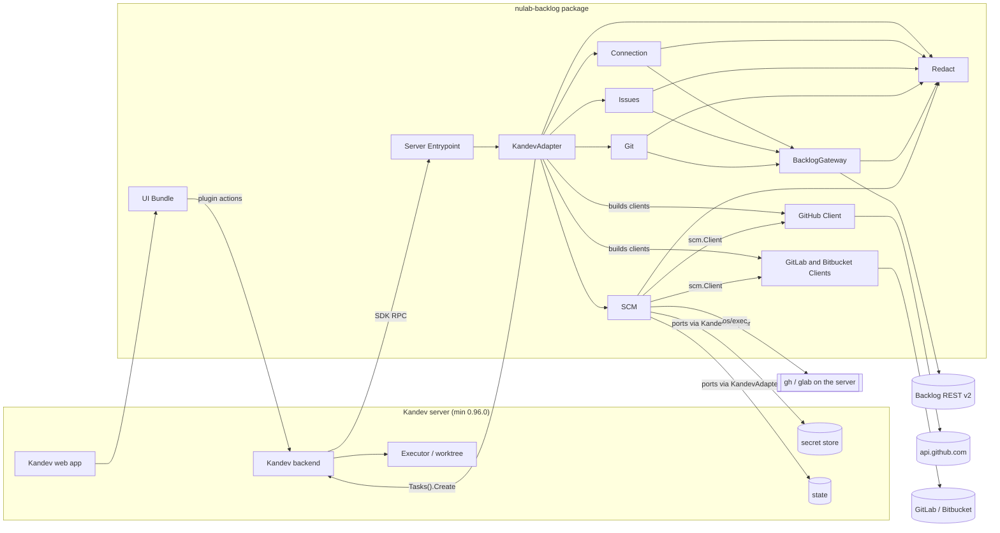
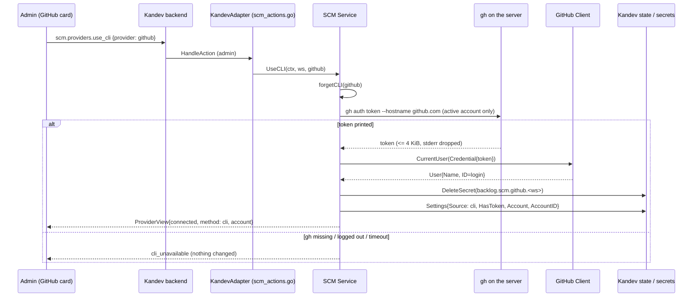
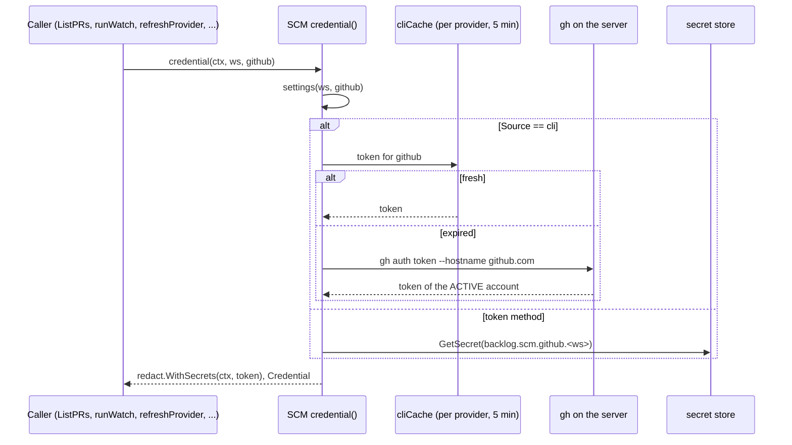
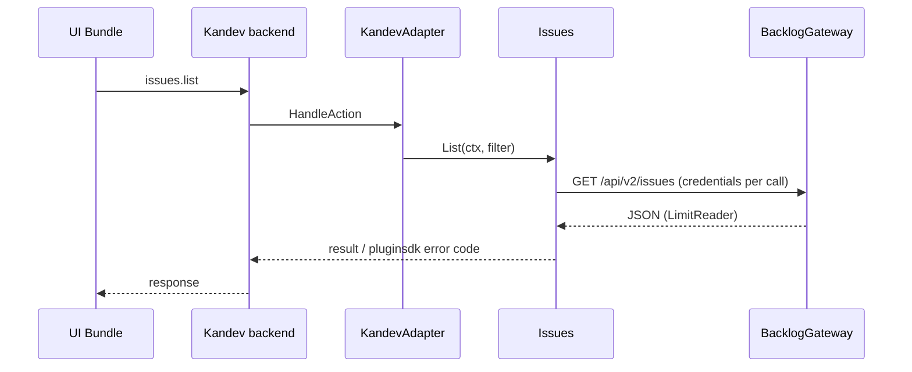

# Architecture — kandev-plugin-nulab-backlog

## System Overview

Two deliverables in one package: a Go server binary (per platform) that Kandev launches as a child process and talks to over the pluginsdk RPC (hashicorp go-plugin / gRPC), and an ESM UI bundle that the Kandev web app loads with the host's React. All Backlog and SCM traffic leaves from the Go binary; the UI calls plugin actions through the host.

The binary runs on the Kandev server host and inherits the Kandev process environment (`PATH`, `HOME`, `GH_TOKEN`, `GH_CONFIG_DIR`). So the `gh` / `glab` CLI the plugin runs is the server's CLI with the server user's logins — not the browser user's, and not the task worktree's.

## Architectural Style

Modular monolith inside a host-plugin architecture (ports and adapters). One binary (`server/main.go` calls `pluginsdk.Serve(plugin.NewRuntime())`), domain packages under `internal/`, and a single adapter package (`internal/plugin`) that alone imports `pluginsdk`. State and secrets live in the host; the plugin keeps no database. Component list: [component-inventory.md](component-inventory.md).

## Component Relationships



Text fallback: browser -> Kandev web -> UI Bundle -> Kandev backend -> RPC -> Server Entrypoint -> KandevAdapter -> Connection / Issues / Git / SCM. Backlog calls go through BacklogGateway. SCM calls providers through the `scm.Client` interface, reads secrets and state through ports implemented by KandevAdapter, and runs `gh` / `glab` with `os/exec` for the CLI method. Tasks are created through the Kandev Host API; Kandev alone prepares the worktree and its environment. Redact masks secrets on every outbound path.

## SCM Provider Connection and Credentials

As of v0.5.2 (analyzed deeply in this run):

- **Two methods.** `scm.Settings` (`internal/scm/store.go:42-50`, state key `scm.settings`, one document per workspace) holds per provider: `Source` (`""`/`token` or `cli`), `HasToken`, `Account` (display name), `AccountID` (GitHub login, from `GET /user` `login`, `internal/github/client.go:54-64`), `LastError`, `Mappings`.
  - **Token**: `SetToken` (`internal/scm/service.go`) validates with `CurrentUser`, stores `Credential` JSON in secret `backlog.scm.<provider>.<workspace>`, sets `Source=""`.
  - **CLI**: `UseCLI` (`service.go:250-271`) runs the CLI, validates with `CurrentUser`, deletes any stored token, sets `Source=cli` and the account. The CLI token is never persisted.
- **One credential read path.** `credential(ctx, ws, p)` (`service.go:276-298`): for `Source=cli` it calls `cliToken(p)`; otherwise it reads the secret. Every provider call (Test, SearchRepos, SetMapping, ListPRs, Link, runWatch, refreshProvider on the 1-minute watcher tick) goes through it and gets a `redact.WithSecrets` context.
- **CLI runner** (`internal/scm/cli_token.go`): `cliCommand` is fixed to `gh auth token --hostname github.com` and `glab config get token --host gitlab.com` — **no account selector**, so it returns the CLI's *active* account. `runCLI`: no shell, 10 s timeout, 4 KiB stdout cap, stderr discarded. `cliCache` keeps one token **per provider, server-wide** (not per workspace, not per account) for 5 minutes under one mutex. Every failure becomes `ErrCLIUnavailable` (`cli_unavailable`); CLI output is never echoed. `Service.CLI` is an injectable `CLIRunner` for tests.
- **Identity drift.** In CLI mode `Test` (`service.go:310-335`) forgets the cache and rewrites `Account`/`AccountID` with whoever is active now. After `gh auth switch` on the server, every CLI-mode workspace silently changes identity, and the PR "me" filter (`prs.go:61`, `watcher.go:58`, compares `AccountID`) follows it.
- **View.** `ProviderView` (`service.go:~101-130`) carries `state`, `account`, `method` (`token`/`cli`), `lastError`, `mappings`; never the token. Readable by all members (`scm.providers.list`).

Change shape for this intent: [code-quality-assessment.md](code-quality-assessment.md#intent-findings-261008-gh-cli-profile).

## Task Creation and the Worktree gh Environment

How a task tied to a Backlog issue comes to exist, and who controls `gh` in its worktree:

| Path | Code | Repositories / Launch passed |
|---|---|---|
| Start task from an issue (UI) | `ui/src/page/start-task.tsx:100-115` renders Kandev's own `TaskCreateDialog`; on success the plugin only calls `issues.link` | Decided by the user in Kandev's dialog |
| Issue watch creates a task | `issueHost.CreateTask` (`internal/plugin/host_port.go:120-130`) | none (workspace, workflow, step, title, description, priority) |
| PR watch creates a task | `scmHost.CreateTask` (`internal/plugin/scm_actions.go:268-275`) | none (adds metadata) |

The agent environment in the worktree (`GH_TOKEN` / `GITHUB_TOKEN`, host gh bridge) is set by Kandev's executor from Kandev's own workspace GitHub connection or the executor profile env (Kandev v0.96.0 `internal/orchestrator/executor/executor_credentials.go`, external reference). pluginsdk v0.96.0 gives the plugin **no way to inject environment**: `CreateTaskInput` has only `Repositories` and `Launch{AgentProfileID, ExecutorProfileID, Prompt, PlanMode}`; `ExecutorProfiles()` is read-only; the plugin Git credential handler serves only `nulab-backlog` repositories (`manifest.yaml` `repository_providers`). Options are listed in [code-quality-assessment.md](code-quality-assessment.md#intent-findings-261008-gh-cli-profile).

## External Reference: Kandev gh Account Handling (v0.96.0, read-only)

Kandev's own GitHub integration already supports picking a gh account (`~/repo/kandev/apps/backend/internal/github/gh_accounts.go`):

- `ListGHAccounts` parses `gh auth status --json hosts` into per-host logins with an active flag.
- `ResolveGHAccountToken(host, login)` runs `gh auth token --hostname <host> --user <login>` when `gh auth token --help` lists `--user`; otherwise it accepts the login only if it is the active one.
- It strips `GH_TOKEN` / `GITHUB_TOKEN` from the child environment (so the stored login is read, not an env override) and never runs `gh auth switch`.
- `gh` 2.97.0 on the scan host supports `--user`.

## Data Flow

- UI -> host -> plugin action (JSON, `max_body_bytes` 8-256 KiB; 16 KiB for `scm.*`) -> domain service -> client -> external API. Errors map to pluginsdk codes only in `internal/plugin` (`classify`, `classifySCM`).
- SCM settings and mappings in host state; tokens only in host secrets; CLI tokens only in process memory (`cliCache`).
- Issue links in host state, refreshed by the sync loop; the UI reads them via one `issues.links.list` per workspace (`LinksStore`).
- Host events in: `task.deleted`; webhook in: `oauth-callback`.

## Interaction Diagrams

### Connect GitHub with the gh CLI login (current; the transaction this intent changes)



Text fallback: the admin clicks "Use gh CLI login"; the service runs `gh auth token` for github.com with no `--user`, proves the token with `GET /user`, deletes any typed token and records `Source=cli` plus the account. A CLI failure changes nothing.

### Resolve the credential for any GitHub call (current)



Text fallback: every call reads the workspace settings; CLI-mode workspaces share one cached token per provider, so two workspaces cannot use different gh accounts today.

### Create a task from a Backlog issue (current)

```mermaid
sequenceDiagram
  participant U as User
  participant P as start-task.tsx
  participant D as Kandev TaskCreateDialog
  participant K as Kandev backend
  participant E as Kandev executor
  participant A as KandevAdapter
  U->>P: issue "Start task"
  P->>D: open (title, description from template)
  U->>D: choose repo, agent, executor profile; create
  D->>K: create task
  K->>E: prepare worktree, env GH_TOKEN from Kandev GitHub connection / executor profile
  D-->>P: onSuccess(task)
  P->>K: issues.link {taskId, issueKey}
  K->>A: HandleAction -> Issues.Link
```

Text fallback: the plugin hands task creation to Kandev's dialog and only links the issue afterwards; the worktree's gh environment is fully decided by Kandev.

### Plugin action (e.g. list issues)



Text fallback: UI -> host -> adapter -> service -> gateway -> Backlog, and back.

## Key Design Decisions

- Only `internal/plugin` and `server` import `pluginsdk`; domain packages stay host-agnostic.
- Clients are stateless about credentials (`Credential` per call); only `credential()` decides the source. A per-account CLI token therefore needs no client change.
- Tokens live only in the Kandev secret store or process memory; views carry account and method, never the token (NFR1).
- The CLI is run with fixed arguments, no shell, bounded time and output (`//nolint:gosec // G204`).
- Every manifest action key has a runtime handler and vice versa (`internal/plugin/manifest_test.go` parity test).

## Improvement Opportunities

- Per-workspace gh account: list accounts, store the chosen login, pass `--user`, key the cache by provider+login, and stop `Test` from drifting the identity ([code-quality-assessment.md](code-quality-assessment.md#intent-findings-261008-gh-cli-profile)).
- Worktree `gh` alignment needs either Kandev configuration (its GitHub integration on the same account) or a Kandev SDK capability the plugin lacks today.
