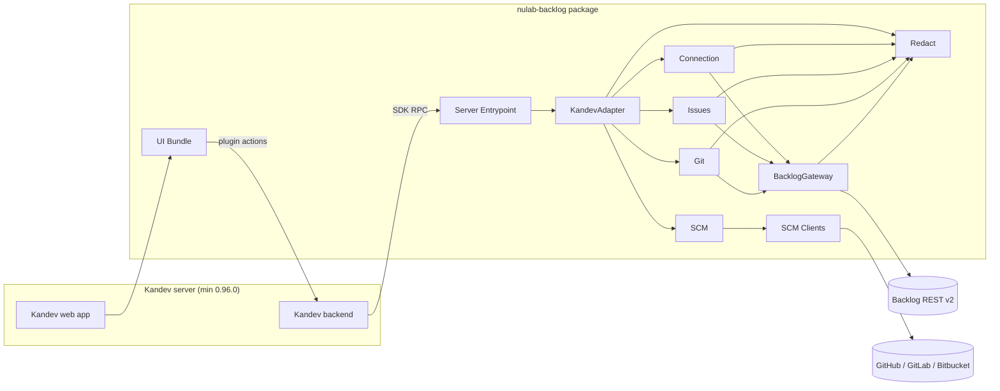
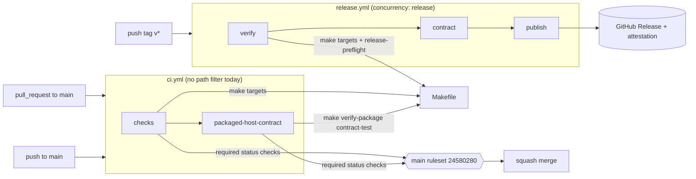
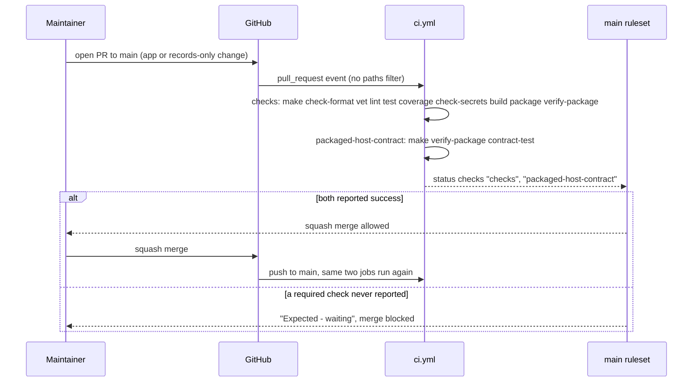
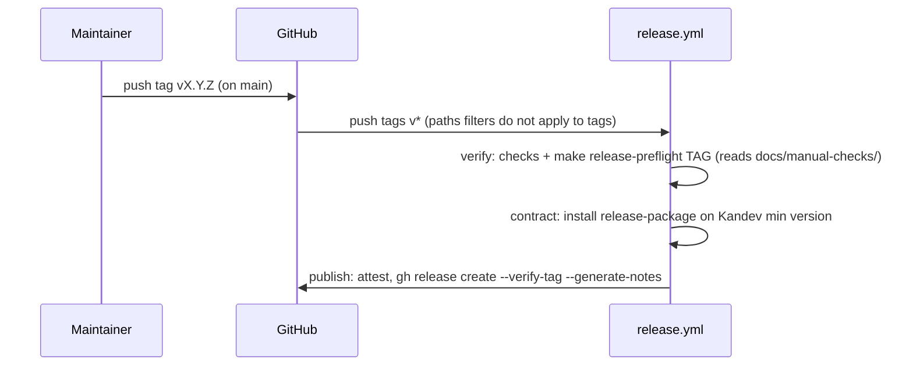
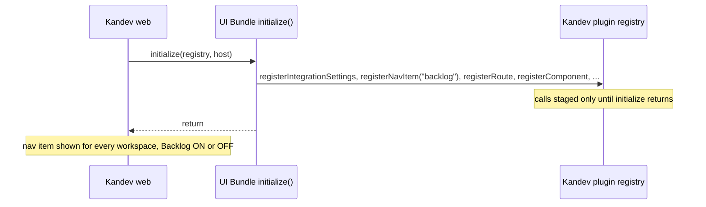
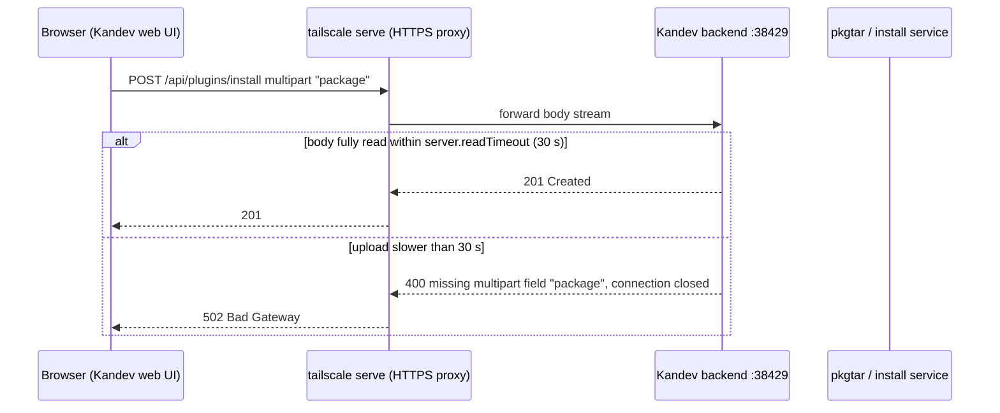
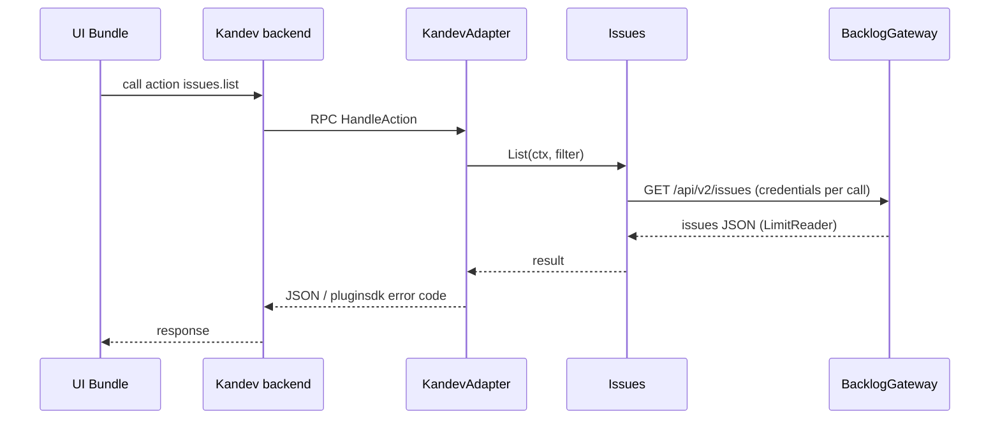

# Architecture — kandev-plugin-nulab-backlog

## System Overview

A Kandev plugin made of two deliverables packed into one archive: a Go server binary (one per platform) that Kandev launches as a child process and talks to over the plugin SDK RPC, and an ESM UI bundle that the Kandev web app loads and renders with the host's React. All Backlog and SCM traffic leaves from the Go binary; the UI calls plugin actions through the host.

Around the plugin sits a delivery pipeline: GitHub Actions workflows (`ci.yml`, `release.yml`) that call `Makefile` targets, gated by a repository ruleset on `main`.

## Architectural Style

Modular monolith inside a host-plugin architecture. Evidence: one binary (`server/main.go` calls `pluginsdk.Serve(plugin.NewRuntime())`), domain packages under `internal/`, a single adapter package (`internal/plugin`) that alone imports `pluginsdk` (ports-and-adapters). Deployment is "install a package on a Kandev server"; there is no service of its own.

## Component Relationships



Text fallback: browser -> Kandev web -> UI Bundle -> Kandev backend -> (RPC) -> Server Entrypoint -> KandevAdapter -> Connection / Issues / Git / SCM -> BacklogGateway or SCM Clients -> external REST APIs. Redact is used by every outbound path. Full list: [component-inventory.md](component-inventory.md).

Build-time components (CI Workflows, Build Makefile, CI Tooling, PackageVerify) are not in the runtime graph; see [CI and Release Pipeline](#ci-and-release-pipeline) and [code-structure.md](code-structure.md#build-and-packaging).

## CI and Release Pipeline



Text fallback: a pull request to `main` and a push to `main` both start `ci.yml`; job `checks` runs the Makefile quality and packaging targets, then `packaged-host-contract` installs the package on Kandev at the minimum version. The ruleset on `main` requires both job names as status checks before a squash merge. A `v*` tag push starts `release.yml`: `verify` (same checks plus `release-preflight`) -> `contract` -> `publish` (GitHub Release with attestation). Trigger and ruleset details: [api-documentation.md](api-documentation.md#github-actions-triggers-and-required-checks).

## UI Surfaces (Host Slots)

All registrations happen once, synchronously, in `initialize` (`ui/src/index.ts`). Kandev v0.96.0 stages registry calls only while `initialize` runs (`stagedGenerationRegistry`); later registration is ignored and there is no per-item unregister.

| Registration (`ui/src/index.ts`) | Kandev surface | Gated by the Backlog switch? |
|---|---|---|
| `registerIntegrationSettings` | Settings > Integrations card + per-workspace switch | Card always shown (needed to turn Backlog on) |
| `registerNavItem({ id: "backlog", section: "integrations", path: "/backlog" })` | Home > Integrations entry | No. Kandev `NavItem` has no `requires`/visibility field; plugin destinations are never availability-gated |
| `registerRoute("/backlog")` | Backlog page | Page shows the OFF state (`integration_disabled`) |
| `registerComponent("task-card-tags", IssueBadge)` | Kanban card only | Indirectly: the badge renders only when `issues.links.list` returns a link for the task (it does not subscribe to the switch bus) |
| (not registered) `task-row-metadata` | Home > Tasks rows (`surface: "task-list"`) and sidebar task list (`surface: "sidebar"`) | — |
| `registerTaskAction`, `registerTaskMenuAction`, `registerTaskPanel`, `registerRepositoryProvider`, `registerReviewProvider` | Task view, task menu, repository picker, review | Per handler |

Host facts (Kandev v0.96.0 reference checkout): Home > Tasks (`apps/web/app/tasks/rich-task-list-row.tsx`) renders first-party PR/MR icons and then `TaskRowMetadata`, which mounts the plugin slot `task-row-metadata` with props `{ taskId, workspaceId, workflowStepId, surface }`. GitHub's `PRTaskIcon` is a glyph with a hover/focus `Tooltip` that stops pointer propagation so the row does not open. The host UI kit exposes `Tooltip*` and `Popover*` to plugins. The Kandev registry's `setIntegrationEnabled`/`isIntegrationEnabled` drive only the Settings sidebar badge, not navigation.

## Data Flow

- UI -> host -> plugin action (JSON, `max_body_bytes` 8-256 KiB) -> domain service -> gateway -> external API; responses mapped back to `pluginsdk` error codes only in `internal/plugin`.
- Issue links: stored per workspace in host state (`Link`, `internal/issues/types.go`); the sync loop (`internal/issues/sync.go`) refreshes `LastKnownStatus`/`StatusUpdatedAt`. The UI reads them through one `issues.links.list` call per workspace, cached in `LinksStore` (`ui/src/issues/links-store.ts`) and shared by the badge, the page and the task panel. `Link` stores no issue summary; only the live `Detail` call returns it.
- State and secrets live in the host (`capabilities.state`, `secrets`); the plugin keeps no database.
- Host events in: `task.deleted`; webhook in: `oauth-callback` (public GET).
- CI: `checks` uploads the `plugin-package` artifact; `packaged-host-contract` downloads it and checks `sha256sum -c` before installing. Release does the same with `release-package`.

## Interaction Diagrams

### Pull request to merge (the transaction intent 261008-ci-path-filter changes)



Text fallback: every PR runs both jobs; the ruleset allows the squash merge only when `checks` and `packaged-host-contract` have reported. If a workflow does not start at all (for example because a `paths` filter excluded it), the required checks never report and the PR stays blocked.

### Release from a tag



Text fallback: a tag push runs verify, contract, publish in order; `release-preflight` checks tag format, tag equals manifest version, tag is on `origin/main`, no existing Release, and the first-release record in `docs/manual-checks/`.

### Issue badge on a task (current Kanban path)

```mermaid
sequenceDiagram
  participant KW as Kandev web (Kanban card)
  participant BD as IssueBadge (task-card-tags)
  participant LS as LinksStore
  participant K as Kandev backend
  participant I as Issues
  KW->>BD: render slot {taskId, workspaceId}
  BD->>LS: link for taskId
  alt workspace not loaded
    LS->>K: action issues.links.list (workspace)
    K->>I: Links(ctx, ws)
    I-->>K: LinkView[] (key, status, url, stale, unavailable)
    K-->>LS: { links }
  end
  LS-->>BD: LinkView or none
  BD-->>KW: key + status chip, title = updated time; click opens https://space/view/KEY (new tab)
```

Text fallback: the card mounts the badge, the badge asks the shared store, the store calls `issues.links.list` once per workspace, and the badge renders key and status with a link to the issue. The Home > Tasks row would need the same component registered for `task-row-metadata`; a hover summary needs `Summary` carried on `Link`/`LinkView`.

### Plugin startup and the Home > Integrations entry



Text fallback: every registration is unconditional and happens inside `initialize`; after it returns the registry no longer accepts registrations, so the nav entry cannot be hidden later.

### Install the package (intent 261007-plugin-install-502, history)



Text fallback: an upload slower than the 30 s read timeout is cut and the proxy reports 502; v0.4.2 shrank the package by dropping Windows.

### Plugin action (e.g. list issues)



Text fallback: UI -> host -> adapter -> domain service -> gateway -> Backlog, and back.

## Key Design Decisions

- Only `internal/plugin` and `server` import `pluginsdk`; domain packages stay host-agnostic.
- BacklogGateway is stateless about credentials (passed per call) to avoid a Connection-Gateway cycle.
- One package carries all supported platform binaries (`manifest.yaml` `runtime.executables`); since v0.4.2 the set is 4 (`linux-amd64 linux-arm64 darwin-amd64 darwin-arm64`), Windows dropped to shrink the upload. Kandev picks the host platform at install time.
- React is supplied by the host; the bundle fails the build if React is bundled. `@kandev/plugin-sdk` is imported as types only.
- UI registrations never depend on the switch (BR5.4, BR7.6, BR7.8; asserted in `ui/src/index.test.ts`). The plugin tracks the switch with its own event bus because Kandev v0.96.0 offers no way to read or observe it.
- One `issues.links.list` per workspace, shared through `LinksStore`, instead of a call per card.
- Package verification is done by an in-repo verifier because Kandev v0.96.0 ships no verify CLI.
- CI calls only `Makefile` targets, so local and CI results match; the workflows themselves are linted (`actionlint` plus `cmd/ci workflows` policy).
- Merge gating is a repository ruleset (not classic branch protection) that requires the job names `checks` and `packaged-host-contract`.

## Improvement Opportunities

- Install without a large browser upload: install by URL (`POST /api/plugins/install` JSON `{"url": ...}` to the GitHub Release asset; backend downloads it, 100 MiB cap), or document raising `KANDEV_SERVER_READTIMEOUT`.
- Skip the expensive CI work for non-app changes while still reporting the two required checks (see [code-quality-assessment.md](code-quality-assessment.md#ci-path-filter-constraints)). Choice of mechanism belongs to the intent's design, not here.
- Register the existing `IssueBadge` for `task-row-metadata` (decide `surface` filter) and carry the issue summary on links for a hover tooltip.
- Hiding the Home > Integrations entry while OFF needs a decision: register-only-if-ON at `initialize` (global, reload after toggle, startup latency), drop the entry, or an upstream Kandev change plus a `min_kandev_version` bump. Details: [code-quality-assessment.md](code-quality-assessment.md#intent-findings-261008-fix-uiux-backlog).
