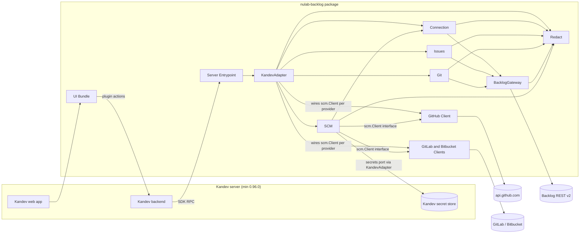
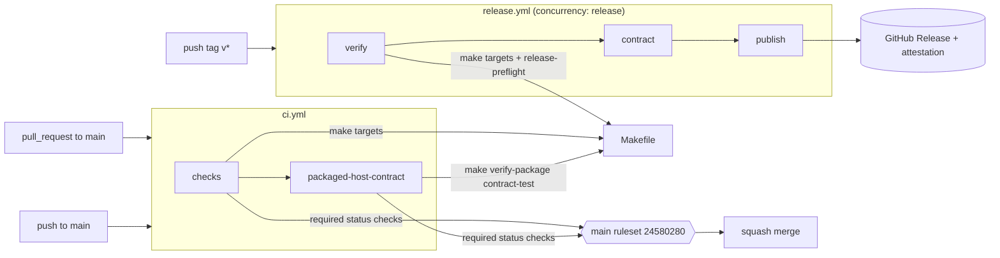
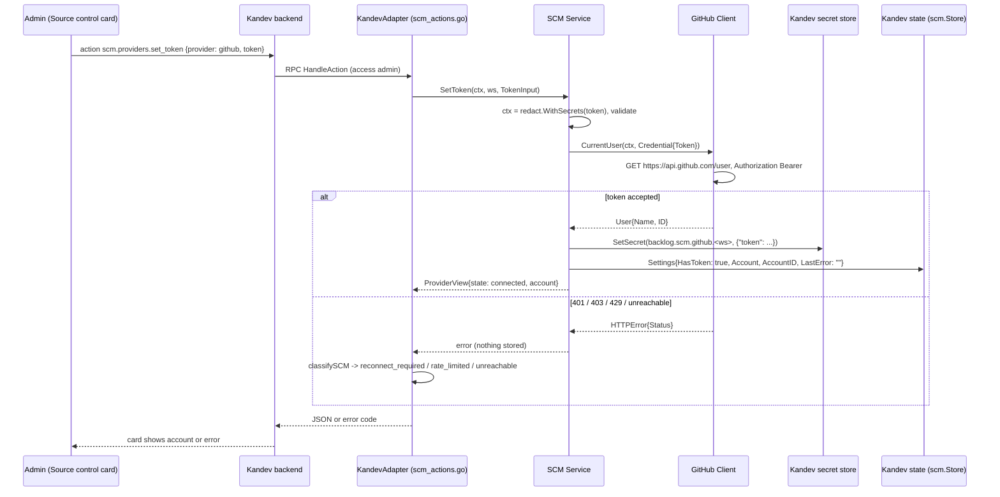
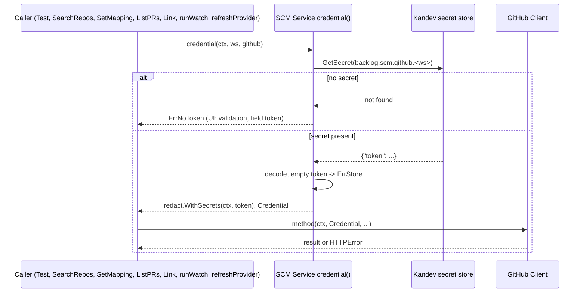
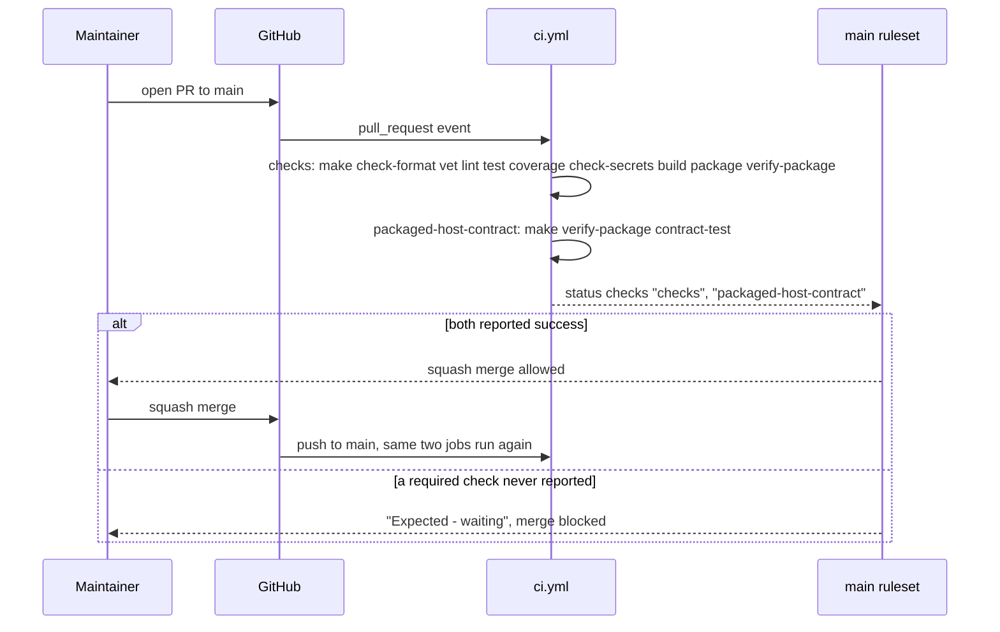
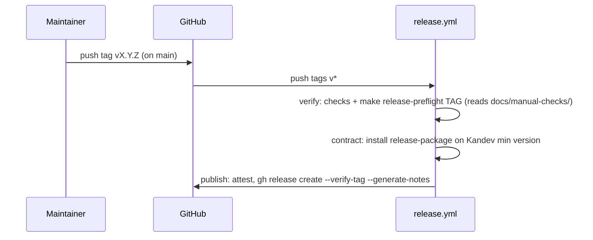
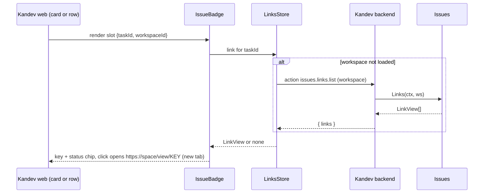
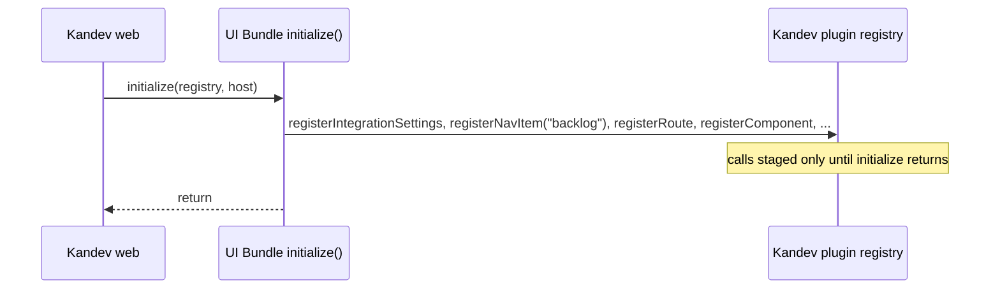
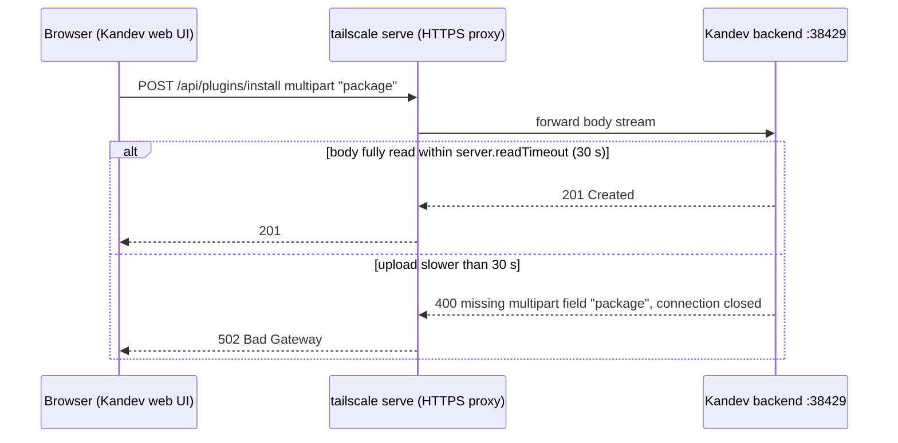
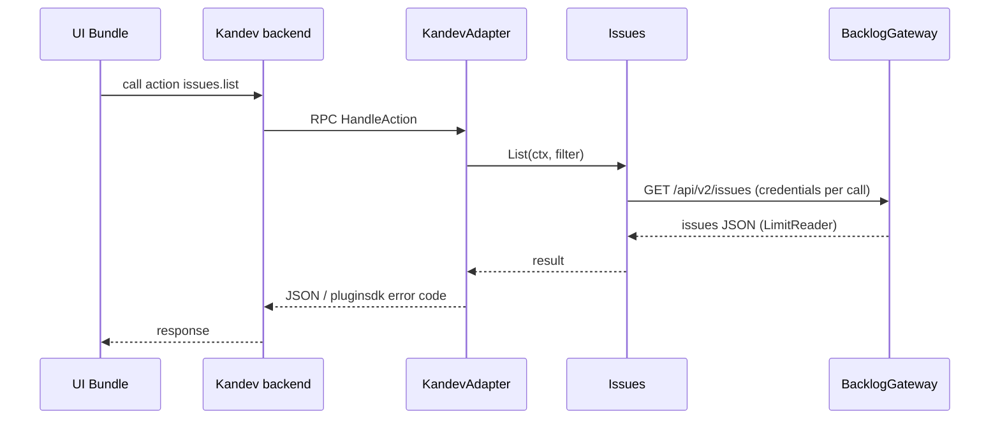

# Architecture — kandev-plugin-nulab-backlog

## System Overview

A Kandev plugin made of two deliverables packed into one archive: a Go server binary (one per platform) that Kandev launches as a child process and talks to over the plugin SDK RPC, and an ESM UI bundle that the Kandev web app loads and renders with the host's React. All Backlog and SCM traffic leaves from the Go binary; the UI calls plugin actions through the host.

The binary runs on the Kandev server host with the Kandev process's environment: Kandev v0.96.0 spawns it with `cmd.Env = append(os.Environ(), KANDEV_PLUGIN_DATA_DIR=...)` and `cmd.Dir = <install path>` (Kandev `internal/plugins/runtime/manager.go` lines 392-394, external reference). It therefore inherits the server user's `PATH`, `HOME`, `GH_TOKEN` and `GH_CONFIG_DIR`, and nothing in the plugin protocol restricts starting a subprocess.

Around the plugin sits a delivery pipeline: GitHub Actions workflows (`ci.yml`, `release.yml`) that call `Makefile` targets, gated by a repository ruleset on `main`.

## Architectural Style

Modular monolith inside a host-plugin architecture. Evidence: one binary (`server/main.go` calls `pluginsdk.Serve(plugin.NewRuntime())`), domain packages under `internal/`, a single adapter package (`internal/plugin`) that alone imports `pluginsdk` (ports-and-adapters). Deployment is "install a package on a Kandev server"; there is no service of its own.

## Component Relationships

Text fallback: browser -> Kandev web -> UI Bundle -> Kandev backend -> (RPC) -> Server Entrypoint -> KandevAdapter -> Connection / Issues / Git / SCM. Backlog paths go through BacklogGateway. SCM calls a provider through the `scm.Client` interface; KandevAdapter builds the GitHub, GitLab and Bitbucket clients (`scmClients`, `internal/plugin/scm_actions.go`) and hands them to SCM. SCM reads tokens from the Kandev secret store through a port that KandevAdapter implements, and reuses Connection's error and outcome types. Redact is used by every outbound path. Full list: [component-inventory.md](component-inventory.md).

Build-time components (CI Workflows, Build Makefile, CI Tooling, PackageVerify) are not in the runtime graph; see [CI and Release Pipeline](#ci-and-release-pipeline) and [code-structure.md](code-structure.md#build-and-packaging).

## SCM Provider Connection and Credentials

Current design (commit `d3d17e5`, v0.5.0), analyzed deeply in run 3:

- **One method today: access token.** `scm.providers.set_token` (admin) carries `scm.TokenInput{Provider, Token, Username}`. `(*scm.Service).SetToken` (`internal/scm/service.go:196`) validates the input, calls the provider's `CurrentUser` with the token, and only on success stores `scm.Credential{Token, Username}` as JSON in secret `backlog.scm.<provider>.<workspace>` (`SecretKey`, `service.go:99`), then records `HasToken`, `Account`, `AccountID` in the provider `Settings`.
- **Settings are not secrets.** `scm.Settings` (`internal/scm/store.go:41-48`: `Provider`, `HasToken`, `Account`, `AccountID`, `LastError`, `Mappings`) lives in host state (schema version 1). There is no field that records **how** a provider was connected.
- **One credential read path.** Every provider call gets its token from the private `(*scm.Service).credential(ctx, ws, p)` (`service.go:221-237`): read the secret, decode `Credential`, refuse an empty token, and return a context wrapped with `redact.WithSecrets(ctx, token)`. Its seven callers: `Test` (`service.go:242`), `SearchRepos` (`:294`), `checkRepos`/`SetMapping` (`:350`), `ListPRs` (`prs.go:53`), `Link` (`links.go:31`), `runWatch` (`watcher.go:50`) and the background `refreshProvider` (`watcher.go:170`, runs on the 1-minute watcher tick).
- **Clients are credential-agnostic.** The `scm.Client` interface (`internal/scm/client.go:83`) takes `cred scm.Credential` on each of its five methods. The GitHub client sends `Authorization: Bearer <cred.Token>` (`internal/github/client.go:20-23`), so a token obtained another way (for example `gh auth token`) works without client changes. `Credential` hides `Token` in every `fmt` verb (`client.go:15-22`).
- **State shown to the UI.** `ProviderView` (`service.go:101`) is derived from `Settings` by `view`: `not_configured` without `HasToken`, `error` when `LastError` is set, else `connected`. It never carries the token and is returned by the member-readable `scm.providers.list`.
- **Errors.** `ErrNoToken` (`internal/scm/errors.go`) says "add one under Source control"; `classifySCM` (`internal/plugin/scm_actions.go:178-200`) maps it to `validation` with field `token`, 401/403 to `reconnect_required`, 429 to `rate_limited` with the wait.
- **Removal.** `RemoveToken` deletes the secret and clears `HasToken`/account; mappings, links, queries and watches stay, disabled until a token exists again.
- **What the host does not offer.** The pluginsdk `Host` (v0.96.0) exposes state, config, secrets, events, tasks, sessions, workspaces, workflows, repositories, messages and a utility agent, but no access to Kandev's own GitHub credential and no process-exec API. Kandev itself resolves GitHub tokens with `gh auth token --hostname <host> [--user <login>]` (Kandev `internal/github/gh_accounts.go:201-215`, external reference).

Change points for intent `261008-gh-cli-auth`: [code-quality-assessment.md](code-quality-assessment.md#intent-findings-261008-gh-cli-auth).

## CI and Release Pipeline

Text fallback: a pull request to `main` and a push to `main` both start `ci.yml`; job `checks` runs the Makefile quality and packaging targets, then `packaged-host-contract` installs the package on Kandev at the minimum version. The ruleset on `main` requires both job names as status checks before a squash merge. A `v*` tag push starts `release.yml`: `verify` (same checks plus `release-preflight`) -> `contract` -> `publish` (GitHub Release with attestation). Trigger and ruleset details as recorded by run 1 (later CI path-filter changes, PR #14, not re-verified): [api-documentation.md](api-documentation.md#github-actions-triggers-and-required-checks).

## UI Surfaces (Host Slots)

All registrations happen once, synchronously, in `initialize` (`ui/src/index.ts`). Kandev v0.96.0 stages registry calls only while `initialize` runs (`stagedGenerationRegistry`); later registration is ignored and there is no per-item unregister.

| Registration (`ui/src/index.ts`) | Kandev surface | Gated by the Backlog switch? |
|---|---|---|
| `registerIntegrationSettings` | Settings > Integrations card + per-workspace switch | Card always shown (needed to turn Backlog on) |
| `registerNavItem({ id: "backlog", section: "integrations", path: "/backlog" })` | Home > Integrations entry | No. Kandev `NavItem` has no `requires`/visibility field; plugin destinations are never availability-gated |
| `registerRoute("/backlog")` | Backlog page | Page shows the OFF state (`integration_disabled`) |
| `registerComponent(slot, IssueBadge)` | Kanban card (`task-card-tags`); since v0.5.0 also `task-row-metadata` and `chat-top-bar` (seen in passing at `ui/src/index.ts:98` in run 3, not re-read deeply) | Indirectly: the badge renders only when `issues.links.list` returns a link for the task |
| `registerTaskAction`, `registerTaskMenuAction`, `registerTaskPanel`, `registerRepositoryProvider`, `registerReviewProvider` | Task view, task menu, repository picker, review | Per handler |

Host facts (Kandev v0.96.0 reference checkout): Home > Tasks (`apps/web/app/tasks/rich-task-list-row.tsx`) renders first-party PR/MR icons and then `TaskRowMetadata`, which mounts the plugin slot `task-row-metadata` with props `{ taskId, workspaceId, workflowStepId, surface }`. The host UI kit exposes `Tooltip*` and `Popover*` to plugins. The Kandev registry's `setIntegrationEnabled`/`isIntegrationEnabled` drive only the Settings sidebar badge, not navigation.

The Backlog settings page includes the **Source control** section (`ui/src/settings/source-control-section.tsx`, `createSourceControlSection`): one `ProviderCard` per provider with a token form (save/replace), Test, Remove, and the project-to-repository mappings. The card treats a provider as configured when `state !== "not_configured"`; PR lists elsewhere use only providers with `state === "connected"` (`usableProviders`, `ui/src/git/git-state.ts`).

## Data Flow

- UI -> host -> plugin action (JSON, `max_body_bytes` 8-256 KiB; 16 KiB for `scm.*`) -> domain service -> gateway or client -> external API; responses mapped back to `pluginsdk` error codes only in `internal/plugin`.
- Issue links: stored per workspace in host state (`Link`, `internal/issues/types.go`); the sync loop (`internal/issues/sync.go`) refreshes `LastKnownStatus`/`StatusUpdatedAt`. The UI reads them through one `issues.links.list` call per workspace, cached in `LinksStore` (`ui/src/issues/links-store.ts`).
- SCM: provider settings and mappings in host state (`scm.Store`); provider tokens only in host secrets (`backlog.scm.<provider>.<workspace>`), read per call by `credential()`.
- State and secrets live in the host (`capabilities.state`, `secrets`); the plugin keeps no database.
- Host events in: `task.deleted`; webhook in: `oauth-callback` (public GET).
- CI: `checks` uploads the `plugin-package` artifact; `packaged-host-contract` downloads it and checks `sha256sum -c` before installing. Release does the same with `release-package`.

## Interaction Diagrams

### Connect GitHub with a token (current, the transaction intent 261008-gh-cli-auth extends)

Text fallback: the admin pastes a token in the GitHub card; the action reaches `SetToken`, which first proves the token with `GET /user`. Only an accepted token is written to the secret store, and the provider settings record the account. A refused token stores nothing and returns a mapped error code.

### Resolve the credential for any GitHub call (current)

Text fallback: every GitHub call, including the background watcher every minute, goes through `credential()`, which reads the secret, refuses a missing or empty token, and returns a redacting context plus the `Credential` for the client. This single function is where a second credential source (the `gh` CLI) would plug in.

### Pull request to merge

Text fallback: the ruleset allows the squash merge only when `checks` and `packaged-host-contract` have reported. If a workflow does not start at all, the required checks never report and the PR stays blocked.

### Release from a tag

Text fallback: a tag push runs verify, contract, publish in order; `release-preflight` checks tag format, tag equals manifest version, tag is on `origin/main`, no existing Release, and the first-release record in `docs/manual-checks/`.

### Issue badge on a task

Text fallback: the slot mounts the badge, the badge asks the shared store, the store calls `issues.links.list` once per workspace, and the badge renders key and status with a link to the issue.

### Plugin startup and the Home > Integrations entry

Text fallback: every registration happens inside `initialize`; after it returns the registry no longer accepts registrations.

### Install the package (intent 261007-plugin-install-502, history)

Text fallback: an upload slower than the 30 s read timeout is cut and the proxy reports 502; v0.4.2 shrank the package by dropping Windows.

### Plugin action (e.g. list issues)

Text fallback: UI -> host -> adapter -> domain service -> gateway -> Backlog, and back.

## Key Design Decisions

- Only `internal/plugin` and `server` import `pluginsdk`; domain packages stay host-agnostic (`internal/scm/doc.go` states SCM never imports it).
- BacklogGateway is stateless about credentials (passed per call) to avoid a Connection-Gateway cycle. SCM follows the same rule: `scm.Client` methods take a `Credential` per call, and only `credential()` decides where it comes from.
- SCM tokens live only in the Kandev secret store; settings and views carry `HasToken` and the account, never the token (NFR1). A token is stored only after `CurrentUser` accepts it.
- One package carries all supported platform binaries (`manifest.yaml` `runtime.executables`); since v0.4.2 the set is 4 (`linux-amd64 linux-arm64 darwin-amd64 darwin-arm64`). Kandev picks the host platform at install time.
- React is supplied by the host; the bundle fails the build if React is bundled. `@kandev/plugin-sdk` is imported as types only.
- UI registrations never depend on the switch (BR5.4, BR7.6, BR7.8). The plugin tracks the switch with its own event bus because Kandev v0.96.0 offers no way to read or observe it.
- One `issues.links.list` per workspace, shared through `LinksStore`, instead of a call per card.
- Package verification is done by an in-repo verifier because Kandev v0.96.0 ships no verify CLI.
- CI calls only `Makefile` targets, so local and CI results match; the workflows themselves are linted (`actionlint` plus `cmd/ci workflows` policy).
- Merge gating is a repository ruleset (not classic branch protection) that requires the job names `checks` and `packaged-host-contract`.

## Improvement Opportunities

- GitHub CLI login as a second SCM credential source (intent `261008-gh-cli-auth`): a credential-source choice inside `credential()`, one new admin action, a source field in `Settings`/`ProviderView`, and a GitHub-only control on the card. Options and constraints: [code-quality-assessment.md](code-quality-assessment.md#intent-findings-261008-gh-cli-auth). The design choice (resolve per call vs import once) belongs to the intent's requirements and design, not here.
- Install without a large browser upload: install by URL (`POST /api/plugins/install` JSON `{"url": ...}` to the GitHub Release asset), or document raising `KANDEV_SERVER_READTIMEOUT`.
- Hiding the Home > Integrations entry while OFF needs a Kandev capability that v0.96.0 lacks. Details: [code-quality-assessment.md](code-quality-assessment.md#intent-findings-261008-fix-uiux-backlog).
