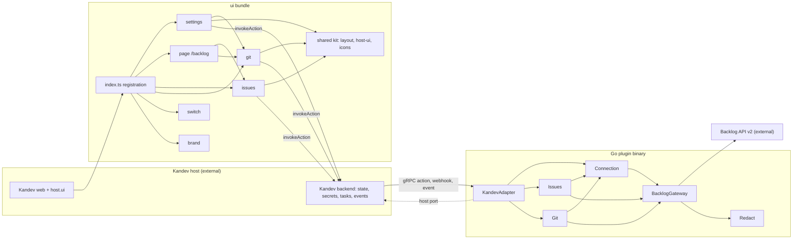
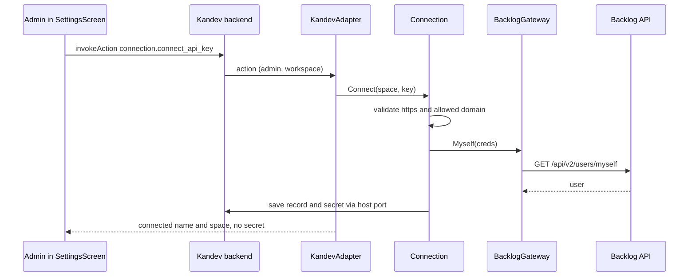
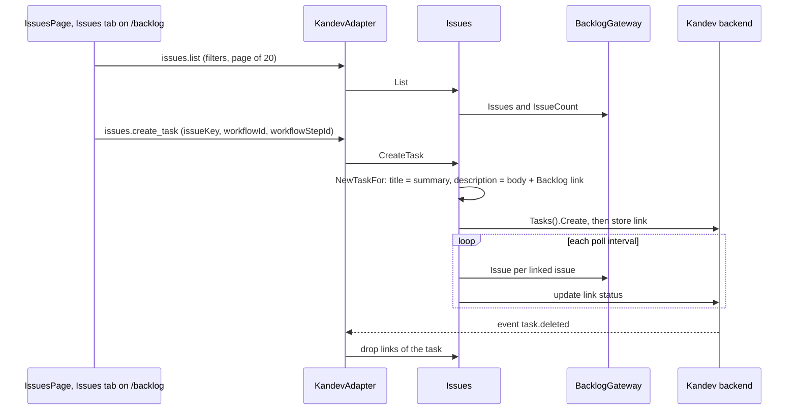
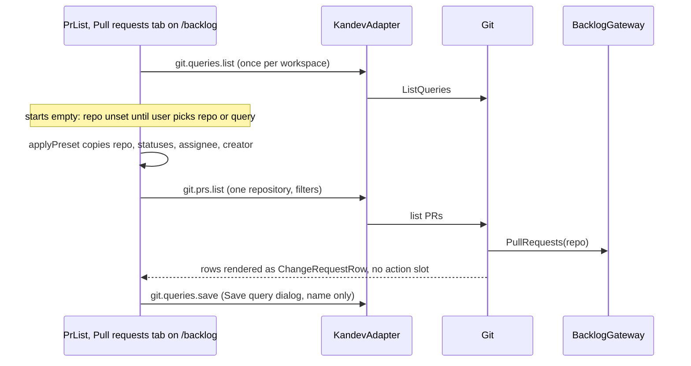

# Architecture — kandev-plugin-nulab-backlog

## System Overview

Two halves run inside the Kandev host:

- **Go backend** — a plugin binary served by `pluginsdk.Serve` (hashicorp go-plugin over gRPC). Handles 48 actions, the OAuth webhook, the `task.deleted` event and three background loops (issue status sync, issue watcher, PR watcher). All state and secrets go through the host.
- **UI bundle** — `build/ui/bundle.js` (esbuild, ES module) registers screens and extension points with Kandev web. React and every `host.ui` component come from the host; the bundle never contains React (`make ui-build` fails if it does).

Every outbound Backlog API v2 call goes through one gateway, `internal/backlog`.

## Architectural Style

Hexagonal (ports and adapters) modular monolith in one plugin binary, plus a host-rendered UI bundle:

- Inbound adapter: KandevAdapter (`internal/plugin`) — the only package besides `server/` that imports `pluginsdk`; one `handlers` map (`runtime.go`, merged from `issue_actions.go` and `git_actions.go` in `init()`); maps domain errors to `ActionError`; host port adapters (`hostPort`, `issueHost`, `host_port.go`) let the domain call back into Kandev.
- Domain services: Connection, Issues, Git — each with its own workspace-scoped state documents (`{schemaVersion, items}`).
- Outbound adapter: BacklogGateway, stateless about credentials (passed on every call).
- Cross-cutting: Redact.

Internal Go edges are acyclic ([dependencies.md](dependencies.md#internal-dependencies)).

## Component Relationships

Text fallback: Kandev web loads the bundle; `index.ts` registers the settings, page, issues, git, switch and brand modules. The `/backlog` page hosts the issues list and the git PR list in tabs; settings reuses the git save-query dialog. UI modules share class constants, the loose `host.ui` accessor and inline icons from the shared kit. Screens call plugin actions through `host.api.invokeAction`; the Kandev backend forwards them over gRPC to KandevAdapter, which dispatches to Connection, Issues and Git. Issues and Git read credentials from Connection. All three call BacklogGateway, the only Backlog API v2 client. KandevAdapter calls back into Kandev through the host port. Redact is used by the gateway and the domain services.

## Data Flow

- **Persistence**: connection record, issue-task links, issue settings and index, issue watches, PR links, PR watches and their ledger, saved PR queries (`git.queries`, max 50), poll interval live in the Kandev plugin state store (`capabilities.state`); API key, OAuth token and Git credential live in the secret store (`capabilities.secrets`). No database of its own. No store exists for quick actions or saved issue queries.
- **UI to backend**: UI modules keep light caches (`issues/links-store.ts`, `git/git-state.ts`, `settings/state.ts`, `settings/use-list.ts`); filter state lives in component memory only; every change is an action call.
- **Background**: `internal/issues/sync.go` (`Syncer`, 1-minute tick, per-workspace interval), `internal/issues/watcher.go` (1-minute tick, each watch on its own interval, at most one task per watch per run) and `internal/git/watcher.go` (`Watcher`, 5-minute ticker) call Backlog through the gateway's per-group rate limiter.

## Interaction Diagrams

### Connect with an API key

Text fallback: the admin submits space and key; Kandev forwards `connection.connect_api_key` to KandevAdapter; Connection validates the address and checks the key with `GET /users/myself` through the gateway; on success the record and secret are stored through the host and the UI receives only display data.

### Create a task from an issue and sync its status

Text fallback: IssuesPage lists issues through `issues.list`; the row menu "Create task" calls `issues.create_task` with the host task-creation context; Issues builds the task with `NewTaskFor` (no prompt, no agent launch), creates it through the host and stores the link (a duplicate triggers the "already linked" confirm); the sync loop updates link status on the poll interval; a `task.deleted` event removes that task's links.

### PR list with a saved query preset

Text fallback: the PR list loads saved queries once per workspace and shows them as a "Query" preset; nothing is applied on open, so the list is empty until a repository or query is chosen; applying a preset copies its filters and calls `git.prs.list` for one repository; rows use `ChangeRequestRow` without a start-task action; "Save query" stores the current filters under a name through `git.queries.save`.

### Watches

PR watches (`git.watches.*`) and issue watches (`issues.watches.*`) are saved from Settings sections; their watchers list Backlog on their tick and create review / issue tasks through the host, deduplicated by a ledger (PR) or index (issue).

## Key Design Decisions

- Only `internal/plugin` imports the SDK; the host is an external dependency behind a port, so domain code is tested with fakes.
- The gateway holds no credentials, avoiding a Connection-Gateway cycle; callers fetch credentials per call.
- The UI never bundles React and draws every control from `host.ui` (via `hostUi(host)` with loose props), so it is tied to SDK v0.96.0's `PluginUIShape`; the plugin ships no CSS, only Tailwind class strings (`ui/src/layout.ts`).
- Issue tasks are created server-side (`issues.create_task`) so the link is written right after the task, rather than by the host `TaskCreateDialog`.
- `PLUGIN_ICON` (`ui/src/brand/backlog-logo.tsx`) is the single icon selection point for the card, nav entry and topbar.

## External Reference: Kandev GitHub Integration (v0.96.0)

EXTERNAL REFERENCE — not part of this repo and not in the analyzed scope. Source: read-only checkout `/home/k_do_webfrontier/repo/kandev`, tag `v0.96.0`, commit `f099a46` (equal to `.kandev-sdk-ref` and `min_kandev_version`). Paths under `apps/web/`. Used as the model for intent 261007-github-parity-actions.

| Aspect | GitHub integration | This plugin today | Available to plugins at v0.96.0 |
|---|---|---|---|
| Quick actions | `components/github/my-github/action-presets.ts`: issue defaults Implement / Investigate / Reproduce, PR defaults Review / Address feedback / Fix CI; preset `{id, label, hint, icon, prompt_template}`; `{{url}}`/`{{title}}` interpolation; empty stored list falls back to defaults; defaults not translated. Edited in Settings "Quick actions" (`action-presets-section.tsx`, tabs PRs/Issues, Reset, Add action) | None; issue "Create task" in a "..." row menu, no prompt; PR rows have no task action | `host.ui.IntegrationStartTaskMenu` (outline "+ Task" dropdown, one item per preset), `host.ui.TaskCreateDialog` (prefilled title/description, `onSuccess(task)`); Go `CreateTaskInput.StartAgent` and `Launch.Prompt` |
| Default queries | Built-in preset pills per kind (Issues "Assigned" `assignee:@me is:open` first; PRs "Review requested" first); first preset selected on kind change; customizable defaults per workspace with reset; saved presets with at most one `isDefault` per kind (star toggle), opened on page load | PR saved queries only, no default flag, repository required; list opens empty; no issue saved queries; `issues.list` has no "me" assignee | `IntegrationScopeBar` (kind segment, preset pills, Saved menu with `onToggleSavedDefault`), `IntegrationSaveQueryDialog` |
| Layout | `github-page-client.tsx`: scope bar `px-4 py-2 sm:px-6`; toolbar `IntegrationListToolbar` `border-b px-4 py-2.5 sm:px-6` (title + count, repo filter, query input, last-updated, ghost refresh right); results `px-3 py-4 md:px-6` with `ChangeRequestRow`, start-task menu in the row `action` slot at the end; pagination footer | `BacklogPage` root `flex flex-col gap-4`, no padding (host `PageShell` adds none, `plugin-page.tsx:68-78`); host `Tabs` instead of scope bar; hand-made `PrToolbar`; issues use `Table` + own toolbar | `IntegrationListToolbar`, `IntegrationScopeBar`, `ChangeRequestRow` `action`, `IntegrationCursorPagination`, `PageTopbar` |

Exact props and file/line citations: `aidlc/spaces/default/intents/261007-github-parity-actions/inception/reverse-engineering/developer-scan.md` § "Reference: Kandev GitHub integration".

## Improvement Opportunities

- Add page padding matching GitHub (`px-4 sm:px-6` bars, `px-3 md:px-6` results) and move refresh/actions to the same positions; consider host `IntegrationListToolbar` / `IntegrationScopeBar` over the hand-made toolbar and tabs.
- Quick actions: a stored preset list per kind with defaults as fallback, launched from `IntegrationStartTaskMenu` in the row `action` slot.
- Default queries: a built-in (unstored) default per kind, or a default flag on saved queries; issue saved queries need a new store and actions.
- Constraints and test impact: [code-quality-assessment.md](code-quality-assessment.md#intent-261007-github-parity-actions-risks).
