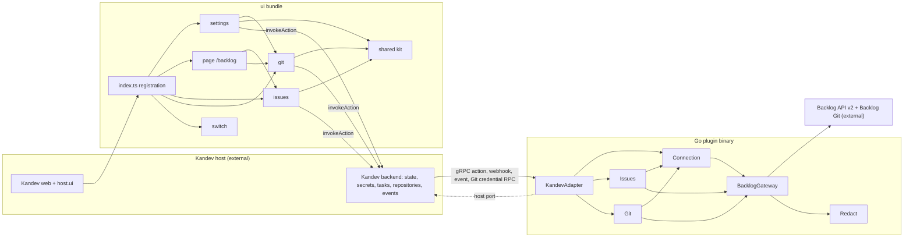
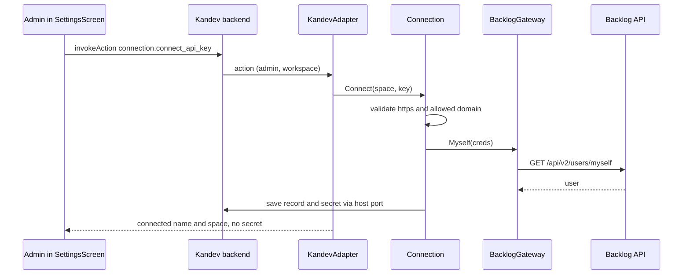
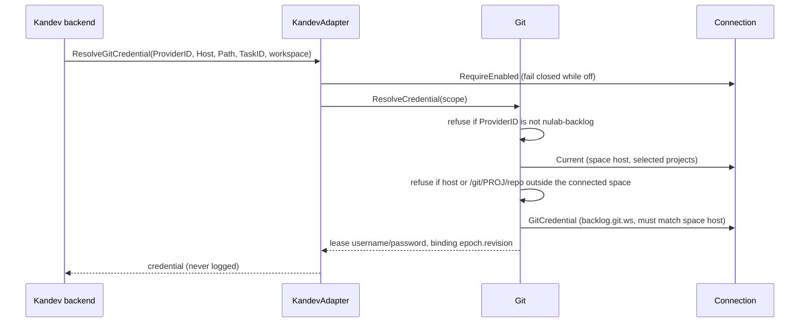
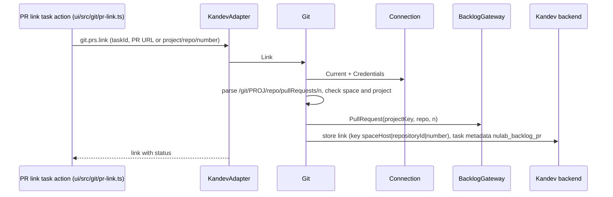

# Architecture — kandev-plugin-nulab-backlog

## System Overview

Two halves run inside the Kandev host:

- **Go backend** — a plugin binary served by `pluginsdk.Serve` (hashicorp go-plugin over gRPC). Handles 55 actions, the OAuth webhook, the `task.deleted` event, the Git credential gRPC extension (`ResolveGitCredential`, `GetGitCredentialBinding`) and three background loops (issue status sync, issue watcher, PR watcher). All state and secrets go through the host.
- **UI bundle** — `build/ui/bundle.js` (esbuild, ES module) registers screens and extension points with Kandev web. React and every `host.ui` component come from the host; the bundle never contains React.

Every outbound call (Backlog REST v2 and the Backlog Git smart-HTTP probe) goes through one gateway, `internal/backlog`.

## Architectural Style

Hexagonal (ports and adapters) modular monolith in one plugin binary, plus a host-rendered UI bundle:

- Inbound adapter: KandevAdapter (`internal/plugin`) — the only package besides `server/` that imports `pluginsdk`; one `handlers` map; maps domain errors to `ActionError`; implements `pluginsdk.GitCredentialHandler` (`credential.go`); host port adapters let the domain call back into Kandev.
- Domain services: Connection, Issues, Git — each with workspace-scoped state documents (`{schemaVersion, items}`).
- Outbound adapter: BacklogGateway, stateless about credentials (passed on every call). One `backlog.Client` satisfies the `connection`, `git` and `issues` gateway ports together (`internal/plugin/runtime.go:135-139`).
- Cross-cutting: Redact.

Internal Go edges are acyclic ([dependencies.md](dependencies.md#internal-dependencies)).

## Component Relationships

Text fallback: Kandev web loads the bundle; `index.ts` registers the settings, page, issues, git and switch modules (plus the repository and review providers from `git`). Screens call plugin actions through `host.api.invokeAction`; the Kandev backend forwards them over gRPC to KandevAdapter, which also receives the Git credential RPCs. KandevAdapter dispatches to Connection, Issues and Git. Issues and Git read the Backlog snapshot and credentials from Connection. All three call BacklogGateway, the only outbound client. KandevAdapter calls back into Kandev through the host port. Redact is used by the gateway and the domain services.

## Data Flow

- **Persistence**: plugin state store (`capabilities.state`) holds the connection record and switch, issue links/settings/index/watches/quick actions/queries, and Git documents `git.links` (max 500), `git.watches` (50) with ledger, `git.queries` (50), all `schemaVersion: 1` with **no provider field**. Secret store (`capabilities.secrets`) holds `backlog.connection.<ws>` (API key / OAuth token) and `backlog.git.<ws>` = `{username, password, spaceHost, revision}`. Task metadata key `nulab_backlog_pr` (`internal/git/host.go:9`) marks linked PRs on live tasks.
- **UI to backend**: UI modules keep light caches (`git/git-state.ts`, `settings/state.ts`, `settings/use-list.ts`); every change is an action call.
- **Background**: issue `Syncer` and issue watcher (1-minute ticks), `internal/git/watcher.go` (5-minute ticker) call Backlog through the gateway's per-group rate limiter.
- **Events in-process**: Connection publishes `ConnectionChanged`; Git and Issues subscribe and disable items whose host/project are no longer covered.

## Interaction Diagrams

### Connect with an API key

Text fallback: the admin submits space and key; Kandev forwards `connection.connect_api_key`; Connection validates the address and checks the key with `GET /users/myself` through the gateway; on success the record and secret are stored through the host and the UI receives only display data.

### Clone or push a Backlog Git repository (credential lease)

Text fallback: when Kandev clones or pushes a repository owned by provider `nulab-backlog`, it calls `ResolveGitCredential`. The adapter refuses while Backlog is off, then Git refuses any other provider id, any host other than the connected space host and any project not selected, and finally returns the single workspace Git credential bound to `<connectionEpoch>.<revision>`. `GetGitCredentialBinding` returns only the binding.

### Link a PR to a task

Text fallback: the task action sends the PR reference; Git parses the Backlog PR URL, checks it belongs to the connected space and a selected project, fetches the PR with the Backlog credentials, stores the link keyed by `spaceHost|repositoryId|number` and writes the `nulab_backlog_pr` task metadata.

### Create a task from an issue, PR list, watches

Unchanged from the previous store and not re-verified this run: `issues.create_task` builds the task server-side and stores the link; the issue sync loop updates link status; `task.deleted` drops links. The PR list loads saved queries (default applied on open since v0.2.0) and calls `git.prs.list` for one repository. PR and issue watchers list Backlog on their tick and create tasks deduplicated by a ledger/index.

## Source Control Coupling (intent 261007-source-control-agnostic)

The Kandev SDK side is provider-neutral; the plugin side is Backlog-only. Seams and couplings that the intent must move (evidence and file/line citations in the developer scan `aidlc/spaces/default/intents/261007-source-control-agnostic/inception/reverse-engineering/developer-scan.md` § Technical Debt Signals):

| Layer | Today | Host support at v0.96.0 |
|---|---|---|
| Provider identity | One id `nulab-backlog` for repository, review and credential provider (`internal/git/types.go:19`, `ui/src/switch/enabled-events.ts` `PLUGIN_ID`, `manifest.yaml:31`) | A plugin may declare several `repository_providers` and register one UI repository/review provider per declared id; ownership is exclusive across active plugins; `github`, `gitlab`, `azure_devops` are reserved for Kandev's native integrations |
| Credential RPC | `ResolveCredential` rejects `ProviderID != "nulab-backlog"` (`internal/git/service.go:612-614, 649`) | Each request carries `ProviderID`, `Host`, `Path`, so per-provider dispatch fits here; Kandev's native GitHub resolver runs before plugin resolvers |
| Domain model | `Link`/`Watch`/`Query`/`RepoRef` keyed by `SpaceHost` + Backlog `ProjectKey` + repo + Backlog numeric `RepositoryID`; Backlog-only regexes and URL shapes; PR state ids `1/2/3` | — |
| Gateway | `git.Gateway` takes `backlog.Credentials` and returns `backlog.*` types; one implementation | — |
| Scope and auth | Every Git call reads the Backlog connection (`Current`, `Credentials`) and is gated by the Backlog switch and `ConnectionChanged` | — |
| Settings | One admin "Git access" username/password section, shown only while Backlog is connected (`ui/src/settings/SettingsScreen.tsx:398-409`); repository picker built from Backlog selected projects | `config_schema` for operator-level app credentials; secrets need no manifest change |
| Actions | `git.*`, `repositories.inspect/branches` take no provider argument; Kandev calls `repositories.*` with a descriptor that already carries `provider_id` | — |

Natural extension seam (description of the current code, not a decision): the `provider_id` already present on credential RPCs and repository descriptors is the dispatch point; a per-provider port beside `git.Gateway` and a provider field on Git documents (defaulting to Backlog Git when absent) would let existing v0.3.0 data read unchanged. Whether new providers are owned by this plugin (plugin-prefixed ids such as `nulab-backlog-github`) or only referenced (Kandev's native `github` repositories as PR references) is an open requirements decision ([code-quality-assessment.md](code-quality-assessment.md#intent-261007-source-control-agnostic-risks)).

## Key Design Decisions

- Only `internal/plugin` imports the SDK; the host is an external dependency behind a port, so domain code is tested with fakes.
- The gateway holds no credentials, avoiding a Connection-Gateway cycle; callers fetch credentials per call.
- Git is a Backlog-only bounded context layered on the Backlog connection: it reuses the Backlog connection's credentials, scope and switch rather than owning a source-control connection of its own. This keeps U4 small but is the main obstacle for this intent.
- The Git credential is a separate secret from the API key/OAuth token, bound to the connection epoch so a space change invalidates every lease.
- The UI never bundles React and draws every control from `host.ui`; it is tied to SDK v0.96.0's `PluginUIShape`.

## External Reference: Kandev GitHub Integration (v0.96.0)

Recorded by intent 261007-github-parity-actions (not re-verified this run): the GitHub integration's quick actions, default query presets and page layout served as the model for v0.2.0; source `/home/k_do_webfrontier/repo/kandev`, tag `v0.96.0`, commit `f099a46`, paths under `apps/web/components/github/` and `apps/web/components/integrations/`. Provider-ownership facts for this intent are in [Source Control Coupling](#source-control-coupling-intent-261007-source-control-agnostic).

## Improvement Opportunities

- Introduce a source-control provider concept inside `internal/git` (provider id on documents and scopes, per-provider gateway and credential) instead of reading the Backlog connection directly.
- Separate a source-control connection/credential store from the Backlog issue-tracker connection, keeping Backlog Git as the default provider for existing data.
- Add a new outbound client package per external vendor (stdlib `net/http`, own error type mapped to the same `ActionError` codes); keep `internal/backlog` Backlog-only.
- Large files to split when touched: `internal/git/service.go`, `ui/src/settings/SettingsScreen.tsx`.
