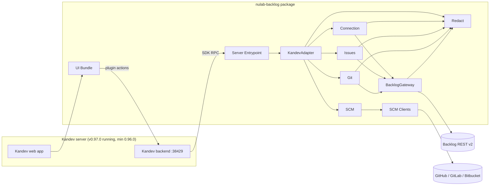
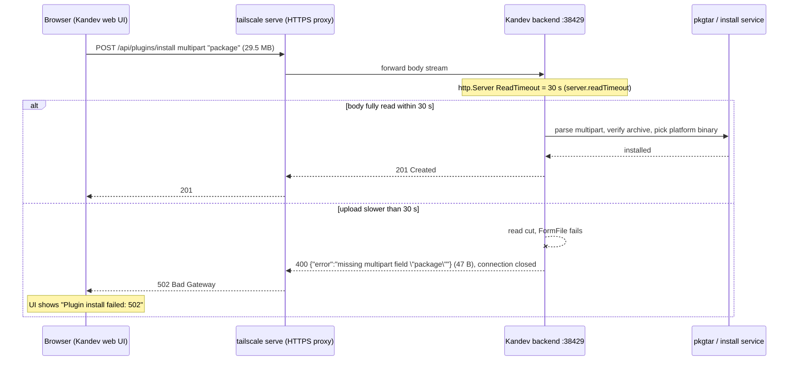
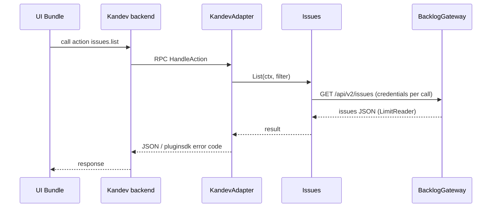

# Architecture — kandev-plugin-nulab-backlog

## System Overview

A Kandev plugin made of two deliverables packed into one archive: a Go server binary (one per platform) that Kandev launches as a child process and talks to over the plugin SDK RPC, and an ESM UI bundle that the Kandev web app loads and renders with the host's React. All Backlog and SCM traffic leaves from the Go binary; the UI calls plugin actions through the host.

## Architectural Style

Modular monolith inside a host-plugin architecture. Evidence: one binary (`server/main.go` calls `pluginsdk.Serve(plugin.NewRuntime())`), domain packages under `internal/`, a single adapter package (`internal/plugin`) that alone imports `pluginsdk` (ports-and-adapters). Deployment is "install a package on a Kandev server"; there is no service of its own.

## Component Relationships

Text fallback: browser -> Kandev web -> UI Bundle -> Kandev backend -> (RPC) -> Server Entrypoint -> KandevAdapter -> Connection / Issues / Git / SCM -> BacklogGateway or SCM Clients -> external REST APIs. Redact is used by every outbound path. Full list: [component-inventory.md](component-inventory.md).

Build-time components (CI Tooling, PackageVerify) are not in the runtime graph; see [code-structure.md](code-structure.md#build-and-packaging).

## Data Flow

- UI -> host -> plugin action (JSON, `max_body_bytes` 8-256 KiB) -> domain service -> gateway -> external API; responses mapped back to `pluginsdk` error codes only in `internal/plugin`.
- State and secrets live in the host (`capabilities.state`, `secrets`); the plugin keeps no database.
- Host events in: `task.deleted`; webhook in: `oauth-callback` (public GET).

## Interaction Diagrams

### Install the package (the failing transaction for this intent)

Text fallback: the browser uploads the whole package through `tailscale serve`; if the backend has not received the full body after 30 s, the read is cut, the backend answers 400 and drops the connection, and the proxy reports 502 to the browser.

### Plugin action (e.g. list issues)

Text fallback: UI -> host -> adapter -> domain service -> gateway -> Backlog, and back.

## Key Design Decisions

- Only `internal/plugin` and `server` import `pluginsdk`; domain packages stay host-agnostic.
- BacklogGateway is stateless about credentials (passed per call) to avoid a Connection-Gateway cycle.
- One package carries all 5 platform binaries (`manifest.yaml` `runtime.executables`); Kandev picks the host platform at install time and rejects a package missing it (`pkgtar.ErrPlatformNotSupported`). Consequence: a ~29.5 MB upload.
- React is supplied by the host; the bundle fails the build if React is bundled.
- Package verification is done by an in-repo verifier because Kandev v0.96.0 ships no verify CLI.

## Improvement Opportunities

- Install without a large browser upload: install by URL (`POST /api/plugins/install` JSON `{"url": ...}` to the GitHub Release asset; backend downloads it, 100 MiB cap), or document raising `KANDEV_SERVER_READTIMEOUT`.
- Shrink the package (fewer platforms or per-platform packages); requires coordinated change of `manifest.yaml`, `Makefile` `PLATFORMS`, `internal/pkgverify`. Trade-offs belong to the bugfix design, not here.
