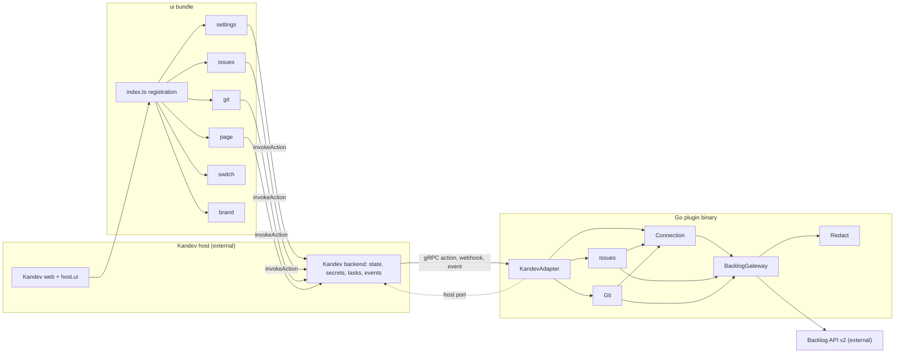
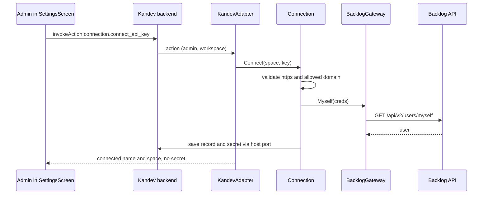
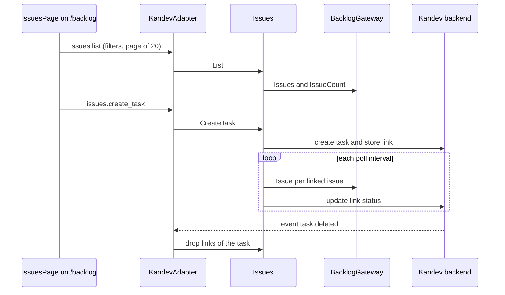
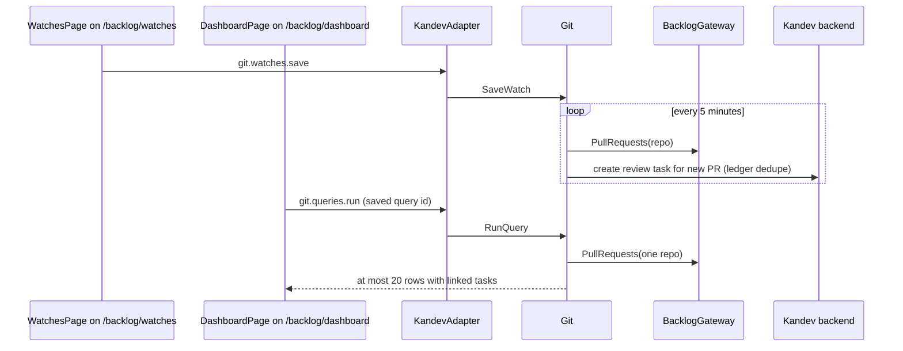

# Architecture — kandev-plugin-nulab-backlog

## System Overview

Two halves run inside the Kandev host:

- **Go backend** — a plugin binary served by `pluginsdk.Serve` (hashicorp go-plugin over gRPC). Handles 41 actions, the OAuth webhook, the `task.deleted` event and two background loops (issue status sync, PR watcher). All state and secrets go through the host.
- **UI bundle** — `build/ui/bundle.js` (esbuild, ES module) registers screens and extension points with Kandev web. React and every `host.ui` component come from the host; the bundle never contains React (`make ui-build` fails if it does).

Every outbound Backlog API v2 call goes through one gateway, `internal/backlog`.

## Architectural Style

Hexagonal (ports and adapters) modular monolith in one plugin binary, plus a host-rendered UI bundle:

- Inbound adapter: KandevAdapter (`internal/plugin`) — the only package besides `server/` that imports `pluginsdk`; maps domain errors to `ActionError`; a host port lets the domain call back into Kandev.
- Domain services: Connection, Issues, Git.
- Outbound adapter: BacklogGateway, stateless about credentials (passed on every call).
- Cross-cutting: Redact.

Internal Go edges are acyclic ([dependencies.md](dependencies.md#internal-dependencies)).

## Component Relationships

Text fallback: Kandev web loads the bundle; `index.ts` registers the settings, issues, git, page, switch and brand modules. Screens call plugin actions through `host.api.invokeAction`; the Kandev backend forwards them over gRPC to KandevAdapter, which dispatches to Connection, Issues and Git. Issues and Git read credentials from Connection. All three call BacklogGateway, the only Backlog API v2 client. KandevAdapter calls back into Kandev through the host port. Redact is used by the gateway and the domain services.

## Data Flow

- **Persistence**: connection record, issue-task links, PR links, PR watches and their ledger, saved queries, poll interval live in the Kandev plugin state store (`capabilities.state`); API key, OAuth token and Git credential live in the secret store (`capabilities.secrets`). No database of its own.
- **UI to backend**: UI modules keep light caches (`issues/links-store.ts`, `git/git-state.ts`, `settings/state.ts`); every change is an action call.
- **Background**: `internal/issues/sync.go` (`Syncer`, 1-minute tick, per-workspace interval) and `internal/git/watcher.go` (`Watcher`, fixed 5-minute ticker) call Backlog through the gateway's per-group rate limiter.

## Interaction Diagrams

### Connect with an API key

Text fallback: the admin submits space and key; Kandev forwards `connection.connect_api_key` to KandevAdapter; Connection validates the address and checks the key with `GET /users/myself` through the gateway; on success the record and secret are stored through the host and the UI receives only display data.

### Create a task from an issue and sync its status

Text fallback: IssuesPage lists issues through `issues.list`; `issues.create_task` creates a Kandev task and stores the link; the sync loop fetches each linked issue on the poll interval and updates the link; a `task.deleted` event removes that task's links.

### PR watch and saved query

Text fallback: WatchesPage saves a PR watch; the watcher lists pull requests every 5 minutes and creates a review task for each new PR, deduplicated by a ledger. DashboardPage runs a saved query, which returns at most 20 PRs of one repository with their linked tasks; there is no unfiltered PR list action.

## Key Design Decisions

- Only `internal/plugin` imports the SDK; the host is an external dependency behind a port, so domain code is tested with fakes.
- The gateway holds no credentials, avoiding a Connection-Gateway cycle; callers fetch credentials per call.
- The UI never bundles React and draws every control from `host.ui`, so it is tied to SDK v0.96.0's `PluginUIShape`.
- `PLUGIN_ICON` (`ui/src/brand/backlog-logo.tsx`) is the single icon selection point for the card, nav entries and topbars.

## External Reference: Kandev GitHub Integration UI

Source: read-only checkout `/home/k_do_webfrontier/repo/kandev`, tag `v0.96.0`, commit `f099a46` (equal to `.kandev-sdk-ref`). Outside the analyzed paths; used only as the model for intent 261007.

| Aspect | GitHub integration (first-party) | This plugin today | Reproducible with SDK v0.96.0? |
|---|---|---|---|
| Watch settings | `components/github/github-settings.tsx`: `WorkspaceScopedSection` > `PerWorkspaceSection` stacks framed `SettingsSection` blocks (`space-y-8`): Connection, Review watches, Issue watches, repo scope, presets, analytics, default queries. Header actions `Button size="sm" variant="outline"` (Clean up) and `Button size="sm"` (Add watch, `IconPlus h-4 w-4 mr-1`); body `Card > CardContent p-0` with a table; create/edit in a dialog | PR watches on `/backlog/watches` with an inline form; poll interval in `settings/connected-panel.tsx`; saved queries on `/backlog/dashboard` | Yes: the host wraps `SettingsScreen` in an unframed `SettingsSection` (label, description, `h-5 w-5` icon, switch) via `plugin-integration-settings-route.tsx`, so the screen can stack framed `host.ui.SettingsSection` + `Card` + `Table` + `Dialog`. No: GitHub's watch tables/dialogs, sub-routes under the plugin settings page |
| Home > Integrations | One `IntegrationRow` to `/github`; row active for any sub-path. Page: `PageShell` + `PresetsScopeBar` (PR / Issue, preset pills, saved queries) + `ListToolbar` (title, count, query box, last fetched, `Button variant="ghost" size="icon"` refresh) + `PRList`/`IssueList` + `ResultsPagination`; `Alert` with settings link when not configured | Three nav items and three routes (`index.ts:58-64,72-83`) | Yes: one `registerNavItem`; `/backlog` composed from `IntegrationScopeBar`, `IntegrationListToolbar`, `ChangeRequestList`/`ChangeRequestRow`, `Table*`, `IntegrationCursorPagination`/`Pagination*`, `IntegrationSaveQueryDialog`, `Empty*`, `Alert*`. No: `PageShell`, GitHub's own scope bar/toolbar, nested nav items, sidebar header shortcuts |
| Buttons and inputs | shadcn `Button` variants `default, outline, secondary, ghost, destructive, link`, sizes `default, xs, sm, lg, icon, icon-xs, icon-sm, icon-lg`; `className="cursor-pointer"`; `Input controlSize` | No `variant`/`size` anywhere; raw `<select>`, radio, checkbox, `<table>`, `
`, `<button>` | Yes: `Button`, `Input`, `Select*`, `Checkbox`, `Switch`, `Tabs*`, `Table*`, `Dialog*`, `Badge`, `Tooltip*` are in `host.ui`. No `AlertDialog` (use `Dialog`) |
| Icons | Tabler outline, `stroke="currentColor"`, no fill, sized by class (`h-4 w-4` nav, `h-5 w-5` settings) | Filled official Nulab mark (`#42CE9F` + `white`) | Yes: a plugin component taking `className`, or a curated name from `lib/plugins/icons.ts` (`bell, bolt, book, bug, calendar, chart, checklist, cloud, database, flask, globe, message, puzzle, robot, rocket, settings, ticket, users`; unknown names fall back to `IconPuzzle`). `@tabler/icons-react` cannot be imported (bundles React); `host.ui.IntegrationIcon` only offers `filter, merged, pull-request, pull-request-closed` |

Extension points in use: [api-documentation.md](api-documentation.md#kandev-ui-extension-points).

## Improvement Opportunities

- One nav entry; `/backlog` with an Issue / PR scope bar and list toolbar.
- Settings as stacked framed sections (Connection, PR watches as `Card` + `Table` + `Dialog`, Issue sync, Git access, Projects).
- `host.ui` controls with `variant`/`size`; one shared layout-class module instead of 12 copies.
- Constraints and test impact of each: [code-quality-assessment.md](code-quality-assessment.md#intent-261007-risks).
