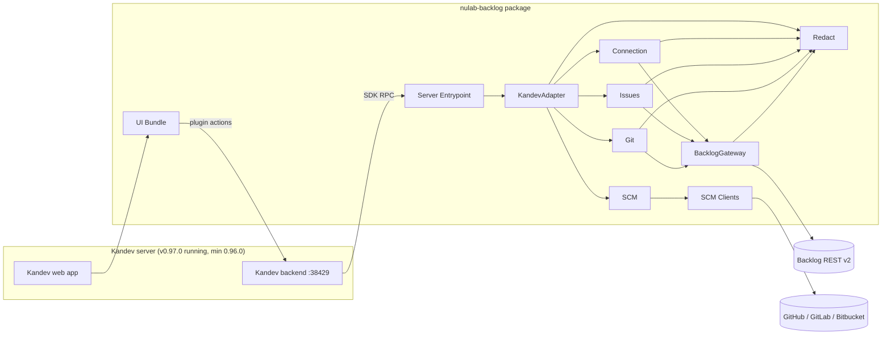
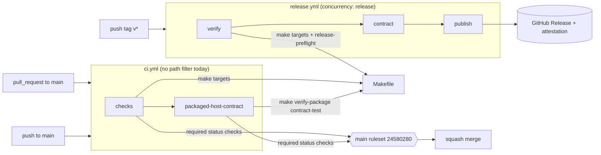
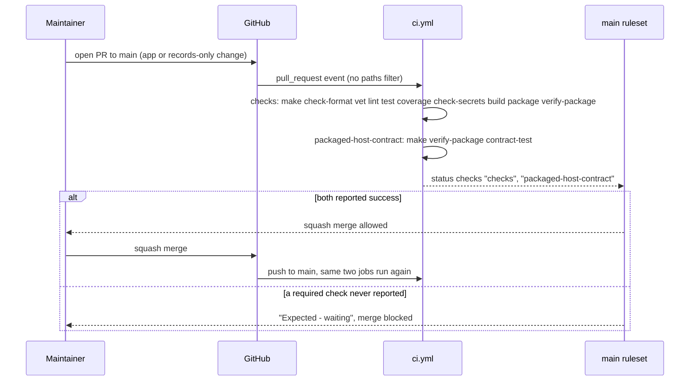
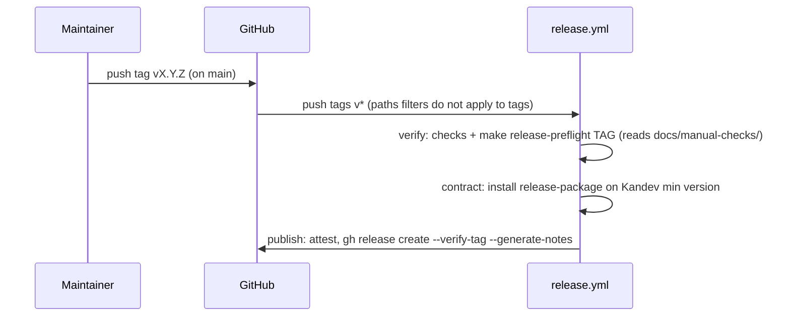
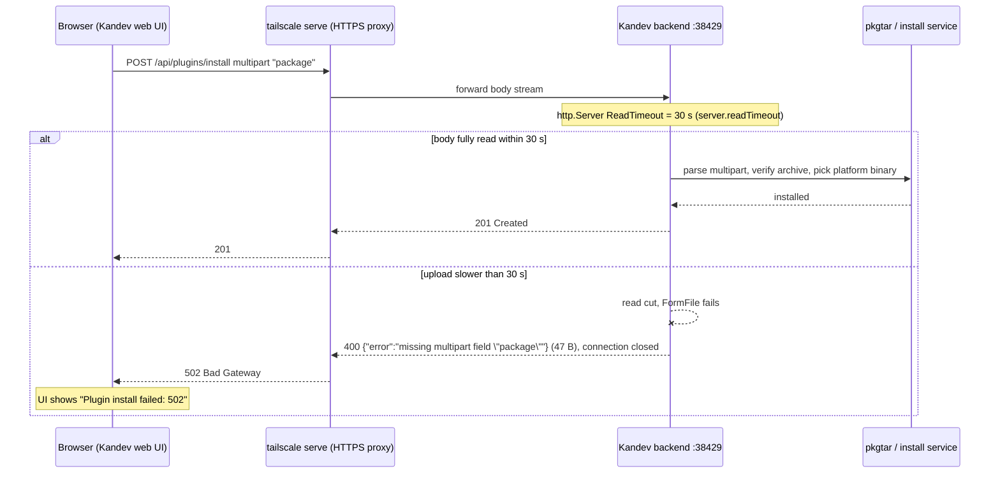
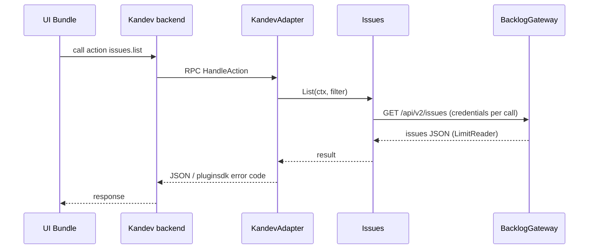

# Architecture — kandev-plugin-nulab-backlog

## System Overview

A Kandev plugin made of two deliverables packed into one archive: a Go server binary (one per platform) that Kandev launches as a child process and talks to over the plugin SDK RPC, and an ESM UI bundle that the Kandev web app loads and renders with the host's React. All Backlog and SCM traffic leaves from the Go binary; the UI calls plugin actions through the host.

Around the plugin sits a delivery pipeline: GitHub Actions workflows (`ci.yml`, `release.yml`) that call `Makefile` targets, gated by a repository ruleset on `main`.

## Architectural Style

Modular monolith inside a host-plugin architecture. Evidence: one binary (`server/main.go` calls `pluginsdk.Serve(plugin.NewRuntime())`), domain packages under `internal/`, a single adapter package (`internal/plugin`) that alone imports `pluginsdk` (ports-and-adapters). Deployment is "install a package on a Kandev server"; there is no service of its own.

## Component Relationships

Text fallback: browser -> Kandev web -> UI Bundle -> Kandev backend -> (RPC) -> Server Entrypoint -> KandevAdapter -> Connection / Issues / Git / SCM -> BacklogGateway or SCM Clients -> external REST APIs. Redact is used by every outbound path. Full list: [component-inventory.md](component-inventory.md).

Build-time components (CI Workflows, Build Makefile, CI Tooling, PackageVerify) are not in the runtime graph; see [CI and Release Pipeline](#ci-and-release-pipeline) and [code-structure.md](code-structure.md#build-and-packaging).

## CI and Release Pipeline

Text fallback: a pull request to `main` and a push to `main` both start `ci.yml`; job `checks` runs the Makefile quality and packaging targets, then `packaged-host-contract` installs the package on Kandev at the minimum version. The ruleset on `main` requires both job names as status checks before a squash merge. A `v*` tag push starts `release.yml`: `verify` (same checks plus `release-preflight`) -> `contract` -> `publish` (GitHub Release with attestation). Trigger and ruleset details: [api-documentation.md](api-documentation.md#github-actions-triggers-and-required-checks).

## Data Flow

- UI -> host -> plugin action (JSON, `max_body_bytes` 8-256 KiB) -> domain service -> gateway -> external API; responses mapped back to `pluginsdk` error codes only in `internal/plugin`.
- State and secrets live in the host (`capabilities.state`, `secrets`); the plugin keeps no database.
- Host events in: `task.deleted`; webhook in: `oauth-callback` (public GET).
- CI: `checks` uploads the `plugin-package` artifact; `packaged-host-contract` downloads it and checks `sha256sum -c` before installing. Release does the same with `release-package`.

## Interaction Diagrams

### Pull request to merge (the transaction this intent changes)

Text fallback: every PR runs both jobs; the ruleset allows the squash merge only when `checks` and `packaged-host-contract` have reported. If a workflow does not start at all (for example because a `paths` filter excluded it), the required checks never report and the PR stays blocked.

### Release from a tag

Text fallback: a tag push runs verify, contract, publish in order; `release-preflight` checks tag format, tag equals manifest version, tag is on `origin/main`, no existing Release, and the first-release record in `docs/manual-checks/`.

### Install the package (intent 261007-plugin-install-502)

Text fallback: the browser uploads the whole package through `tailscale serve`; if the backend has not received the full body after 30 s, the read is cut, the backend answers 400 and drops the connection, and the proxy reports 502 to the browser.

### Plugin action (e.g. list issues)

Text fallback: UI -> host -> adapter -> domain service -> gateway -> Backlog, and back.

## Key Design Decisions

- Only `internal/plugin` and `server` import `pluginsdk`; domain packages stay host-agnostic.
- BacklogGateway is stateless about credentials (passed per call) to avoid a Connection-Gateway cycle.
- One package carries all platform binaries (`manifest.yaml` `runtime.executables`); since v0.4.2 the set is 4 (`linux-amd64 linux-arm64 darwin-amd64 darwin-arm64`), Windows dropped to shrink the upload.
- React is supplied by the host; the bundle fails the build if React is bundled.
- Package verification is done by an in-repo verifier because Kandev v0.96.0 ships no verify CLI.
- CI calls only `Makefile` targets, so local and CI results match; the workflows themselves are linted (`actionlint` plus `cmd/ci workflows` policy).
- Merge gating is a repository ruleset (not classic branch protection) that requires the job names `checks` and `packaged-host-contract`.

## Improvement Opportunities

- Install without a large browser upload: install by URL (`POST /api/plugins/install` JSON `{"url": ...}` to the GitHub Release asset; backend downloads it, 100 MiB cap), or document raising `KANDEV_SERVER_READTIMEOUT`.
- Skip the expensive CI work for non-app changes while still reporting the two required checks (see [code-quality-assessment.md](code-quality-assessment.md#ci-path-filter-constraints)). Choice of mechanism belongs to the intent's design, not here.
