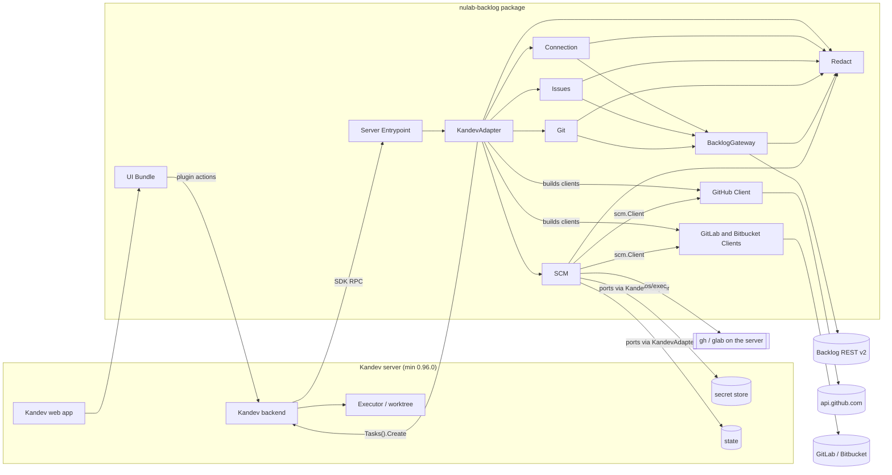
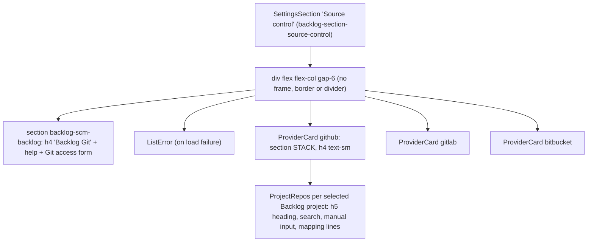
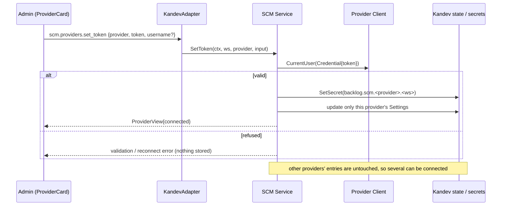
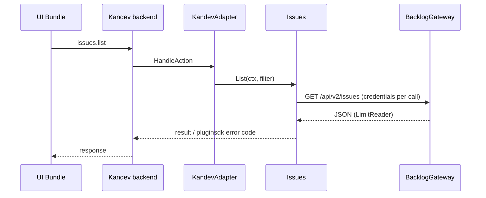

# Architecture — kandev-plugin-nulab-backlog

## System Overview

Two deliverables in one package: a Go server binary (per platform) that Kandev launches as a child process and talks to over the pluginsdk RPC (hashicorp go-plugin / gRPC), and an ESM UI bundle that the Kandev web app loads with the host's React. All Backlog and SCM traffic leaves from the Go binary; the UI calls plugin actions through the host.

The binary runs on the Kandev server host and inherits the Kandev process environment (`PATH`, `HOME`, `GH_TOKEN`, `GH_CONFIG_DIR`). So the `gh` / `glab` CLI the plugin runs is the server's CLI with the server user's logins — not the browser user's, and not the task worktree's.

## Architectural Style

Modular monolith inside a host-plugin architecture (ports and adapters). One binary (`server/main.go` calls `pluginsdk.Serve(plugin.NewRuntime())`), domain packages under `internal/`, and a single adapter package (`internal/plugin`) that alone imports `pluginsdk`. State and secrets live in the host; the plugin keeps no database. Component list: [component-inventory.md](component-inventory.md).

## Component Relationships



Text fallback: browser -> Kandev web -> UI Bundle -> Kandev backend -> RPC -> Server Entrypoint -> KandevAdapter -> Connection / Issues / Git / SCM. Backlog calls go through BacklogGateway. SCM calls providers through the `scm.Client` interface, reads secrets and state through ports implemented by KandevAdapter, and runs `gh` / `glab` with `os/exec` for the CLI method. Tasks are created through the Kandev Host API; Kandev alone prepares the worktree and its environment. Redact masks secrets on every outbound path.

## SCM Provider Model (multi-provider today)

As of v0.5.3 (analyzed deeply in this run):

- **One settings entry per provider.** `scm.Store` keeps one `Settings` per provider in the workspace state document `scm.settings` (`internal/scm/store.go:38-50`, `{schemaVersion: 1, items}`): `Provider`, `Source` (`""`/`token` or `cli`), `HasToken`, `Account`, `AccountID`, `LastError`, `Mappings` (`{projectKey, repos[]}`). There is **no workspace-level field naming an active provider.**
- **All three always listed.** `Service.Providers` (`internal/scm/service.go:165-175`) returns GitHub, GitLab and Bitbucket every time, `not_configured` when nothing is stored. `TestProviders_ListsAllThreeNotConfigured` pins this.
- **Independent connect / disconnect.** `SetToken`, `UseCLI` and `RemoveToken` (`service.go:227-406`) change only their own provider's entry and secret (`backlog.scm.<provider>.<workspace>`). Connecting GitHub never touches GitLab. `RemoveToken` keeps mappings, queries, watches and links and only disables them (FR2.2, `service.go:392-406`).
- **Every downstream feature is per provider.** Links, saved queries and watches each carry a `provider` field; the watcher's link refresh loops over `Providers` (`internal/scm/watcher.go:137`); the PR list and watch form offer `"backlog"` plus every connected provider (`usableProviders` in `ui/src/git/git-state.ts`; `ui/src/git/pr-list.tsx:127-132,217`; `ui/src/git/watch-form.tsx:91-115`).
- **Credentials.** `credential(ctx, ws, p)` reads the CLI token (CLI mode, per provider + gh login since v0.5.3, `cliKey` in `cli_token.go`) or the stored secret, and returns a `redact.WithSecrets` context. `ProviderView` carries `state`, `method`, `account`, `lastError`, `mappings`; never the token.

Consequence for this intent: "one service at a time" is a new invariant. Nothing in the store, service, actions or UI enforces or expresses it today. Options and constraints: [code-quality-assessment.md](code-quality-assessment.md#intent-findings-261008-source-control-settings).

## Source Control Settings Page Layout

`createSourceControlSection` (`ui/src/settings/source-control-section.tsx:460-485`), mounted by `SettingsScreen.tsx`:



Text fallback: one `SettingsSection` holds a single column with four sibling `<section>` blocks (Backlog Git, then one `ProviderCard` per provider). None has a card frame; the provider name is an `h4 text-sm font-medium` (line 367), the same visual weight as the `h5` repo heading inside it (line 424). Each `ProviderCard` holds status badge, token form or CLI login, Test / Remove, and a `ProjectRepos` block per selected Backlog project whose labels are provider-neutral (see [code-quality-assessment.md](code-quality-assessment.md#intent-findings-261008-source-control-settings), finding 2).

## Task Creation and the Worktree gh Environment

How a task tied to a Backlog issue comes to exist, and who controls `gh` in its worktree:

| Path | Code | Repositories / Launch passed |
|---|---|---|
| Start task from an issue (UI) | `ui/src/page/start-task.tsx:100-115` renders Kandev's own `TaskCreateDialog`; on success the plugin only calls `issues.link` | Decided by the user in Kandev's dialog |
| Issue watch creates a task | `issueHost.CreateTask` (`internal/plugin/host_port.go:120-130`) | none |
| PR watch creates a task | `scmHost.CreateTask` (`internal/plugin/scm_actions.go`) | none (adds metadata) |

The worktree's `GH_TOKEN` is set by Kandev's executor from Kandev's own GitHub connection or the executor profile env. pluginsdk v0.96.0 gives the plugin no way to inject environment (not re-verified in this run).

## Data Flow

- UI -> host -> plugin action (JSON, `max_body_bytes` 8-256 KiB; 16 KiB for `scm.*`) -> domain service -> client -> external API. Errors map to pluginsdk codes only in `internal/plugin` (`classify`, `classifySCM`).
- SCM settings and mappings in host state (`scm.settings`); links, dismissed, queries, watches, ledger in their own workspace state keys; instance key `scm.index`. Tokens only in host secrets; CLI tokens only in process memory.
- Issue links in host state, refreshed by the sync loop; the UI reads them via one `issues.links.list` per workspace (`LinksStore`).
- Host events in: `task.deleted`; webhook in: `oauth-callback`.

## Interaction Diagrams

### Load the Source Control section (current)

```mermaid
sequenceDiagram
  participant U as Member or admin
  participant SC as source-control-section.tsx
  participant K as Kandev backend
  participant A as KandevAdapter (scm_actions.go)
  participant S as SCM Service
  participant ST as Kandev state
  U->>SC: open Settings
  SC->>K: scm.providers.list
  K->>A: HandleAction (authenticated; allowed even while Backlog is off)
  A->>S: Providers(ctx, ws)
  S->>ST: load scm.settings
  S-->>SC: {providers: [github, gitlab, bitbucket]} (always three)
  SC->>SC: render Backlog Git block + one ProviderCard per entry
```

Text fallback: the section asks for the provider list once; the service always returns three views, and the UI renders one unframed card per view below the Backlog Git block.

### Connect a provider with a token (current; no exclusivity)



Text fallback: connecting one provider validates and stores its own token and settings entry only; any other connected provider stays connected.

### Map Backlog projects to repositories (current)

```mermaid
sequenceDiagram
  participant U as Admin (ProjectRepos in a ProviderCard)
  participant A as KandevAdapter
  participant S as SCM Service
  participant C as Provider Client
  U->>A: scm.repos.search {provider, query}
  A->>S: SearchRepos
  S->>C: SearchRepos(credential)
  C-->>U: {repos: [{fullName, url}]}
  U->>A: scm.mappings.set {provider, projectKey, repos[]}
  A->>S: SetMapping (max 20, each repo checked with the provider; empty list removes)
  S-->>U: ProviderView{mappings}
```

Text fallback: the admin searches repos of the card's provider and saves the list per Backlog project; the provider is carried in the request but never named in the UI labels.

### Plugin action (e.g. list issues)



Text fallback: UI -> host -> adapter -> service -> gateway -> Backlog, and back.

## Key Design Decisions

- Only `internal/plugin` and `server` import `pluginsdk`; domain packages stay host-agnostic.
- Clients are stateless about credentials (`Credential` per call); only `credential()` decides the source.
- Tokens live only in the Kandev secret store or process memory; views carry account and method, never the token (NFR1).
- The CLI is run with fixed arguments, no shell, bounded time and output (`//nolint:gosec // G204`).
- Every manifest action key has a runtime handler and vice versa (`internal/plugin/manifest_test.go`, `TestSCM_Manifest_Actions`).
- SCM state documents are `schemaVersion: 1`; `load` refuses any other version and never overwrites it (`store.go:229-233`), so changes should be additive JSON fields.
- Disconnecting a provider keeps its data disabled rather than deleting it (FR2.2).

## Improvement Opportunities

- Frame each service as its own card with a clear heading, and name the service in the repo-mapping labels (UI + `en.ts` only).
- Express "one service at a time" either as a UI rule or as a backend invariant (e.g. an additive `activeProvider` in `scm.settings`); see the open decisions in [code-quality-assessment.md](code-quality-assessment.md#intent-findings-261008-source-control-settings).
- Worktree `gh` alignment still needs Kandev configuration or an SDK capability the plugin lacks.
