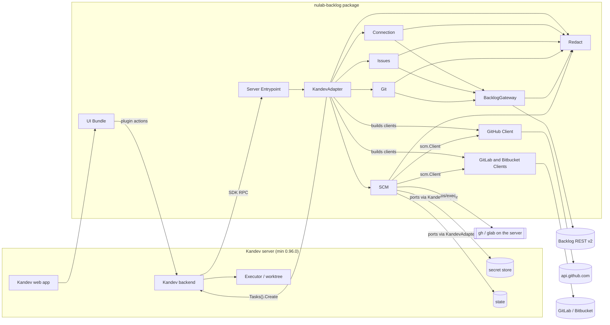
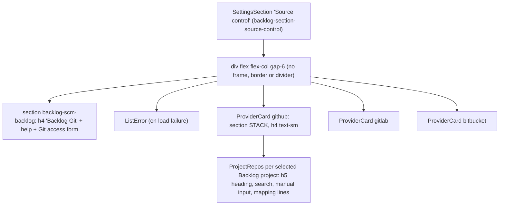
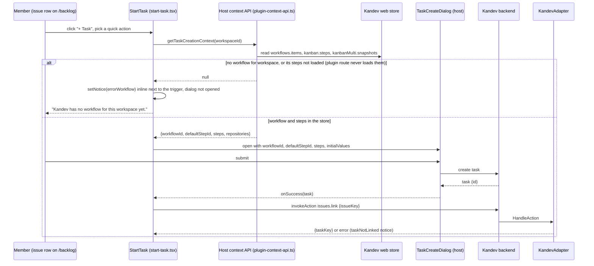
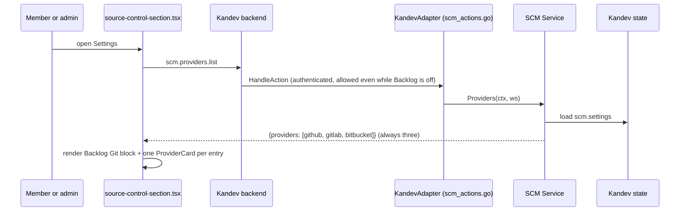
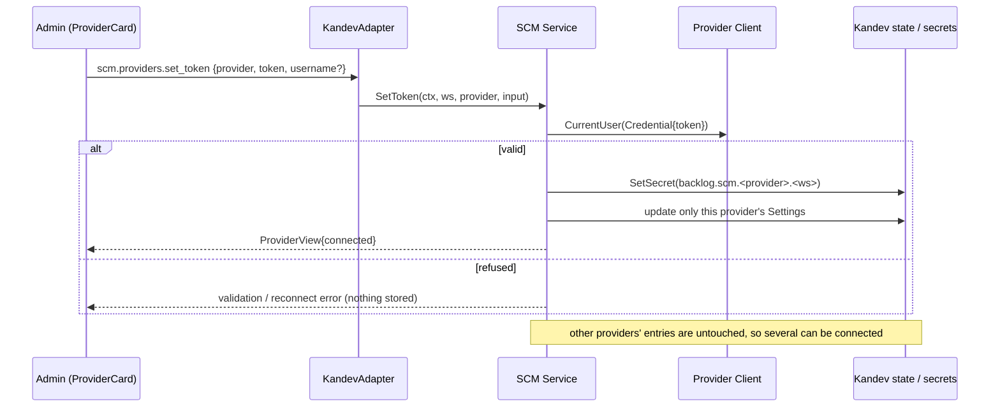
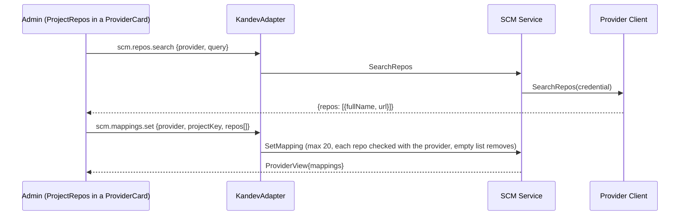
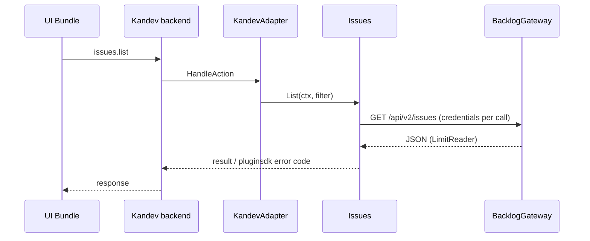

# Architecture — kandev-plugin-nulab-backlog

## System Overview

Two deliverables in one package: a Go server binary (per platform) that Kandev launches as a child process and talks to over the pluginsdk RPC (hashicorp go-plugin / gRPC), and an ESM UI bundle that the Kandev web app loads with the host's React. All Backlog and SCM traffic leaves from the Go binary; the UI calls plugin actions through the host.

The binary runs on the Kandev server host and inherits the Kandev process environment (`PATH`, `HOME`, `GH_TOKEN`, `GH_CONFIG_DIR`). So the `gh` / `glab` CLI the plugin runs is the server's CLI with the server user's logins — not the browser user's, and not the task worktree's.

## Architectural Style

Modular monolith inside a host-plugin architecture (ports and adapters). One binary (`server/main.go` calls `pluginsdk.Serve(plugin.NewRuntime())`), domain packages under `internal/`, and a single adapter package (`internal/plugin`) that alone imports `pluginsdk`. State and secrets live in the host; the plugin keeps no database. Component list: [component-inventory.md](component-inventory.md).

## Component Relationships

Text fallback: browser -> Kandev web -> UI Bundle -> Kandev backend -> RPC -> Server Entrypoint -> KandevAdapter -> Connection / Issues / Git / SCM. Backlog calls go through BacklogGateway. SCM calls providers through the `scm.Client` interface, reads secrets and state through ports implemented by KandevAdapter, and runs `gh` / `glab` with `os/exec` for the CLI method. Tasks are created through the Kandev Host API; Kandev alone prepares the worktree and its environment. Redact masks secrets on every outbound path.

## SCM Provider Model (multi-provider today)

As of v0.5.3 (analyzed deeply by intent `261008-source-control-settings`; **superseded by v0.6.0**, which adds a per-workspace active source control service — README "0.6.0" notes; not re-read since, so this section and the next are shallow):

- **One settings entry per provider.** `scm.Store` keeps one `Settings` per provider in the workspace state document `scm.settings` (`internal/scm/store.go:38-50`, `{schemaVersion: 1, items}`): `Provider`, `Source` (`""`/`token` or `cli`), `HasToken`, `Account`, `AccountID`, `LastError`, `Mappings` (`{projectKey, repos[]}`). There is **no workspace-level field naming an active provider.**
- **All three always listed.** `Service.Providers` (`internal/scm/service.go:165-175`) returns GitHub, GitLab and Bitbucket every time, `not_configured` when nothing is stored. `TestProviders_ListsAllThreeNotConfigured` pins this.
- **Independent connect / disconnect.** `SetToken`, `UseCLI` and `RemoveToken` (`service.go:227-406`) change only their own provider's entry and secret (`backlog.scm.<provider>.<workspace>`). Connecting GitHub never touches GitLab. `RemoveToken` keeps mappings, queries, watches and links and only disables them (FR2.2, `service.go:392-406`).
- **Every downstream feature is per provider.** Links, saved queries and watches each carry a `provider` field; the watcher's link refresh loops over `Providers` (`internal/scm/watcher.go:137`); the PR list and watch form offer `"backlog"` plus every connected provider (`usableProviders` in `ui/src/git/git-state.ts`; `ui/src/git/pr-list.tsx:127-132,217`; `ui/src/git/watch-form.tsx:91-115`).
- **Credentials.** `credential(ctx, ws, p)` reads the CLI token (CLI mode, per provider + gh login since v0.5.3, `cliKey` in `cli_token.go`) or the stored secret, and returns a `redact.WithSecrets` context. `ProviderView` carries `state`, `method`, `account`, `lastError`, `mappings`; never the token.

Consequence for this intent: "one service at a time" is a new invariant. Nothing in the store, service, actions or UI enforces or expresses it today. Options and constraints: [code-quality-assessment.md](code-quality-assessment.md#intent-findings-261008-source-control-settings).

## Source Control Settings Page Layout

`createSourceControlSection` (`ui/src/settings/source-control-section.tsx:460-485`), mounted by `SettingsScreen.tsx`:

Text fallback: one `SettingsSection` holds a single column with four sibling `<section>` blocks (Backlog Git, then one `ProviderCard` per provider). None has a card frame; the provider name is an `h4 text-sm font-medium` (line 367), the same visual weight as the `h5` repo heading inside it (line 424). Each `ProviderCard` holds status badge, token form or CLI login, Test / Remove, and a `ProjectRepos` block per selected Backlog project whose labels are provider-neutral (see [code-quality-assessment.md](code-quality-assessment.md#intent-findings-261008-source-control-settings), finding 2).

## Task Creation and the Worktree gh Environment

How a task tied to a Backlog issue comes to exist, and who controls `gh` in its worktree:

| Path | Code | Repositories / Launch passed |
|---|---|---|
| Start task from an issue or PR row (UI) | `ui/src/page/start-task.tsx:51-57` reads the host task-creation context, `:93-110` renders Kandev's own `TaskCreateDialog`; on success the plugin only calls `issues.link` / `git.prs.link` / `scm.prs.link` | Decided by the user in Kandev's dialog |
| Issue watch creates a task | `issueHost.CreateTask` (`internal/plugin/host_port.go:120-130`) with the watch's stored `workflowId` / `workflowStepId` (`internal/issues/watch.go:109`) | none |
| PR watch creates a task | `scmHost.CreateTask` (`internal/plugin/scm_actions.go`) | none (adds metadata) |

The worktree's `GH_TOKEN` is set by Kandev's executor from Kandev's own GitHub connection or the executor profile env. pluginsdk v0.96.0 gives the plugin no way to inject environment (not re-verified in this run).

## Task Creation Context (host-derived, Kandev v0.96.0)

The plugin cannot list workflows or steps itself; its only source is the host context API (`PluginContextApi`, `plugin-sdk/src/index.ts:166-180`): `getTaskCreationContext(workspaceId)` and `subscribeTaskCreationContext(workspaceId, listener)`. The plugin uses only the synchronous getter, at click time (`start-task.tsx:54`), and never subscribes.

The host computes the context from its web-app store, not from the backend (`web/lib/plugins/plugin-context-api.ts:6-36`):

1. Workflow: the active workflow if it belongs to the workspace, else the **first** workflow of the workspace (workflows are loaded with `includeHidden: true`, so this can be a hidden one). None -> `null`.
2. Steps: `state.kanban.steps` when the board's workflow matches, else `state.kanbanMulti.snapshots[workflow.id].steps`. No steps -> `null`.

Workflows are loaded globally by the layout (`useEnsureWorkspaceWorkflows`), but steps are loaded only by the Kanban board, the task page and first-party integration pages (GitHub/GitLab). The plugin route renderer (`PluginRoute`, `web/src/spa-routes.tsx:369-380`) hydrates nothing. So on `/backlog` opened directly (reload, bookmark, mobile) the context is `null` although the workspace has a workflow, and it "works" only after the board was visited in the same SPA session. The plugin backend is not involved: the error is raised client-side before any action call.

Host fallback available: `TaskCreateDialog` accepts `workflowId: null`, `defaultStepId: null`, `steps: []` (`task-create-dialog-types.ts:60-74`), resolves its own workflow (manual -> last used per workspace -> context -> workspace workflows, `task-create-dialog-computed.ts:62-93`) and fetches steps itself when the effective workflow differs from the prop (`task-create-dialog-effects.ts:32-57`). The three watch dialogs cannot use this fallback: they persist a concrete `workflowId` + `workflowStepId` (`internal/issues/watch.go:109`; `watch.go:74-75` notes "the plugin cannot read workflows").

## Data Flow

- UI -> host -> plugin action (JSON, `max_body_bytes` 8-256 KiB; 16 KiB for `scm.*`) -> domain service -> client -> external API. Errors map to pluginsdk codes only in `internal/plugin` (`classify`, `classifySCM`).
- SCM settings and mappings in host state (`scm.settings`); links, dismissed, queries, watches, ledger in their own workspace state keys; instance key `scm.index`. Tokens only in host secrets; CLI tokens only in process memory.
- Issue links in host state, refreshed by the sync loop; the UI reads them via one `issues.links.list` per workspace (`LinksStore`).
- Host events in: `task.deleted`; webhook in: `oauth-callback`.

## Interaction Diagrams

### Start a task from an issue row (current; where "no workflow" arises)

Text fallback: the click reads the host's store-derived context once; when the workflow or its steps are missing from the web-app store (the normal case on a directly opened `/backlog`), the plugin shows the `errorWorkflow` notice inline in the row's action slot and never opens the dialog. Otherwise the host dialog creates the task and the plugin links it with `issues.link`. Background: [Task Creation Context](#task-creation-context-host-derived-kandev-v0960).

### Load the Source Control section (current)

Text fallback: the section asks for the provider list once; the service always returns three views, and the UI renders one unframed card per view below the Backlog Git block.

### Connect a provider with a token (current; no exclusivity)

Text fallback: connecting one provider validates and stores its own token and settings entry only; any other connected provider stays connected.

### Map Backlog projects to repositories (current)

Text fallback: the admin searches repos of the card's provider and saves the list per Backlog project; the provider is carried in the request but never named in the UI labels.

### Plugin action (e.g. list issues)

Text fallback: UI -> host -> adapter -> service -> gateway -> Backlog, and back.

## Key Design Decisions

- Only `internal/plugin` and `server` import `pluginsdk`; domain packages stay host-agnostic.
- Clients are stateless about credentials (`Credential` per call); only `credential()` decides the source.
- Tokens live only in the Kandev secret store or process memory; views carry account and method, never the token (NFR1).
- The CLI is run with fixed arguments, no shell, bounded time and output (`//nolint:gosec // G204`).
- Every manifest action key has a runtime handler and vice versa (`internal/plugin/manifest_test.go`, `TestSCM_Manifest_Actions`).
- SCM state documents are `schemaVersion: 1`; `load` refuses any other version and never overwrites it (`store.go:229-233`), so changes should be additive JSON fields.
- Disconnecting a provider keeps its data disabled rather than deleting it (FR2.2).

## Improvement Opportunities

- Start-task: do not treat a `null` context as "no workflow"; open `TaskCreateDialog` with `workflowId: null` and let the host resolve the workflow and steps (to be confirmed against the real host). Watch dialogs need a different answer (subscribe, or a notice with a next step). See [code-quality-assessment.md](code-quality-assessment.md#intent-findings-261009-no-workflow-error).
- Move error notices out of the row's non-shrinking action slot (e.g. `host.toast.error`) and use one notice style across the plugin.

- Frame each service as its own card with a clear heading, and name the service in the repo-mapping labels (UI + `en.ts` only).
- Express "one service at a time" either as a UI rule or as a backend invariant (e.g. an additive `activeProvider` in `scm.settings`); see the open decisions in [code-quality-assessment.md](code-quality-assessment.md#intent-findings-261008-source-control-settings).
- Worktree `gh` alignment still needs Kandev configuration or an SDK capability the plugin lacks.
