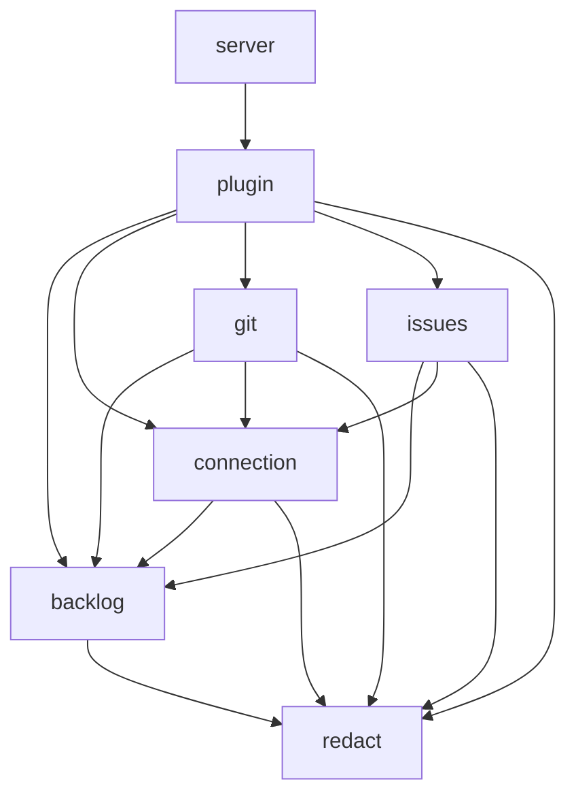

# Dependencies — kandev-plugin-nulab-backlog

## External Dependencies

### Go (`go.mod`)

| Module | Version | Purpose |
|---|---|---|
| `github.com/kandev/kandev` | `replace => ../kandev/apps/backend` at `.kandev-sdk-ref` | `pkg/pluginsdk` |
| `github.com/hashicorp/go-plugin` | v1.8.0 (indirect) | Plugin protocol |
| `google.golang.org/grpc` | v1.83.1 (indirect) | Transport |
| `github.com/stretchr/testify` | v1.12.1 | Tests |
| `gopkg.in/yaml.v3` | v3.0.1 | Manifest and workflow reading in CI tooling |

### UI (`ui/package.json`, devDependencies only)

`@kandev/plugin-sdk` (path map to `../../kandev/apps/packages/plugin-sdk/src/index.ts`), typescript ~6.0.3, esbuild ^0.28.2, vitest ^5.0.3, jsdom, axe-core, eslint ^10.12.0, typescript-eslint, prettier ^3.9.9, react / react-dom ^19 + types (tests only).

### External Systems

- **Kandev host** (SDK v0.96.0): state and secret store, tasks, repositories, events, `host.ui`, Git credential RPCs. Provider-ownership rules that constrain this intent (external, `/home/k_do_webfrontier/repo/kandev`): reserved ids `github`, `gitlab`, `azure_devops` (`apps/web/lib/plugins/registry-provider-ownership.ts:6`); activation refused when another active plugin declares the same provider id (`internal/plugins/service_lifecycle.go:117-121`); native GitHub credential resolver runs before plugin resolvers (`internal/backendapp/git_credentials.go:42-48`); several `repository_providers` per plugin allowed (`internal/plugins/manifest/validate.go:664`).
- **Backlog API v2 and Backlog Git** at `https://<space>.backlog.com|backlog.jp|backlogtool.com`; Nulab OAuth2. The only source-control service reachable today.
- **Sibling checkout `../kandev`** at `.kandev-sdk-ref`: needed by `go build`, `tsc` and every `make` target. Absent in this worktree; a v0.96.0 checkout exists at `/home/k_do_webfrontier/repo/kandev`.

## Internal Dependencies

Text fallback: server → plugin; plugin → backlog, connection, git, issues, redact; git → backlog, connection, redact; issues → backlog, connection, redact; connection → backlog, redact; backlog → redact. Acyclic; only `plugin` and `server` import `pluginsdk`. `issues` and `git` do not import each other. The `git → connection` and `git → backlog` edges are the source-control coupling to the Backlog issue tracker ([architecture.md](architecture.md#source-control-coupling-intent-261007-source-control-agnostic)).

UI: `index.ts` → `brand`, `page`, `settings`, `issues`, `git`, `switch`, `messages`; `page` → `issues`, `git`; `settings` → `git` (`GitAccess`, save-query dialog) and `issues`; `git` and `switch` share `PLUGIN_ID`; every module → `@kandev/plugin-sdk` (types) and the host object.
