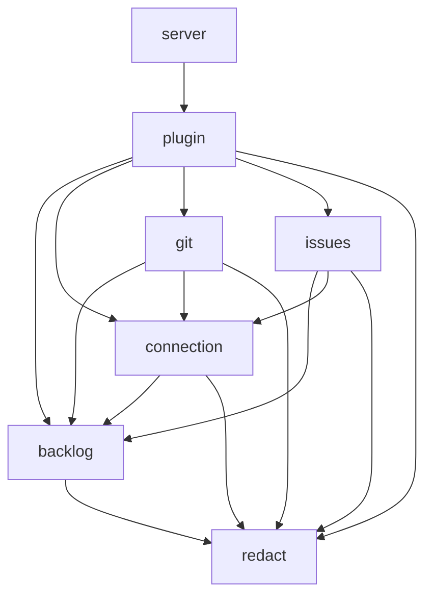

# Dependencies — kandev-plugin-nulab-backlog

## External Dependencies

### Go (`go.mod`)

| Module | Version | Purpose |
|---|---|---|
| `github.com/kandev/kandev` | `replace => ../kandev/apps/backend` at `.kandev-sdk-ref` | `pkg/pluginsdk` |
| `github.com/hashicorp/go-plugin` | v1.8.0 (indirect) | Plugin protocol |
| `google.golang.org/grpc` | v1.83.1 (indirect) | Transport |
| `github.com/stretchr/testify` | v1.12.1 | Tests |
| `gopkg.in/yaml.v3` | v3.0.1 | Manifest and workflow reading in CI tooling |

### UI (`ui/package.json`, devDependencies only)

`@kandev/plugin-sdk` (path map to `../../kandev/apps/packages/plugin-sdk/src/index.ts`), typescript ~6.0.3, esbuild ^0.28.2, vitest ^5.0.3, jsdom ^30.1.2, axe-core ^4.14.0, eslint ^10.12.0, typescript-eslint ^8.71.1, @eslint/js ^10.0.1, prettier ^3.9.9, react / react-dom ^19.3.0 + `@types/*` (tests only).

### External Systems

- **Kandev host**: state and secret store, task API, events, `host.ui`. Coupled to SDK v0.96.0.
- **Backlog API v2** at `https://<space>.backlog.com|backlog.jp|backlogtool.com/api/v2`; Nulab OAuth2.
- **Sibling checkout `../kandev`** at `.kandev-sdk-ref`: needed by `go build`, `tsc` and every `make` target (`make check-sdk`). CI checks it out; locally it must be provided (in this worktree a symlink to `/home/k_do_webfrontier/repo/kandev` at `v0.96.0`).

## Internal Dependencies

Text fallback: server → plugin; plugin → backlog, connection, git, issues, redact; git → backlog, connection, redact; issues → backlog, connection, redact; connection → backlog, redact; backlog → redact. Acyclic; only `plugin` and `server` import `pluginsdk`.

UI: `index.ts` → `brand`, `page`, `settings`, `issues`, `git`, `switch`, `messages`; `page` → `issues` (`IssuesPage`); `settings` → `issues` (`PollInterval`) and `git` (`GitAccess`); every module → `@kandev/plugin-sdk` (types) and the host object.
