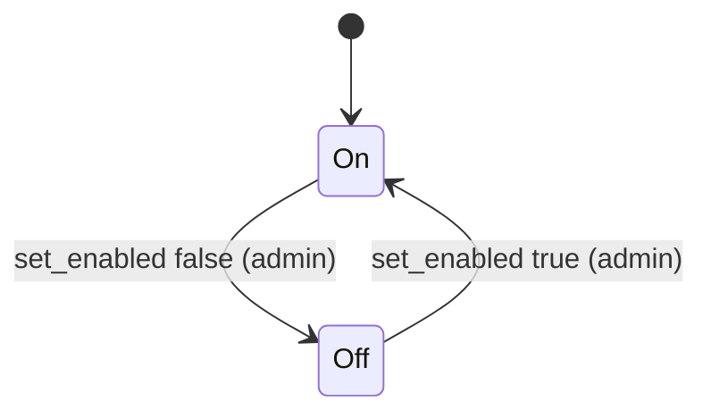
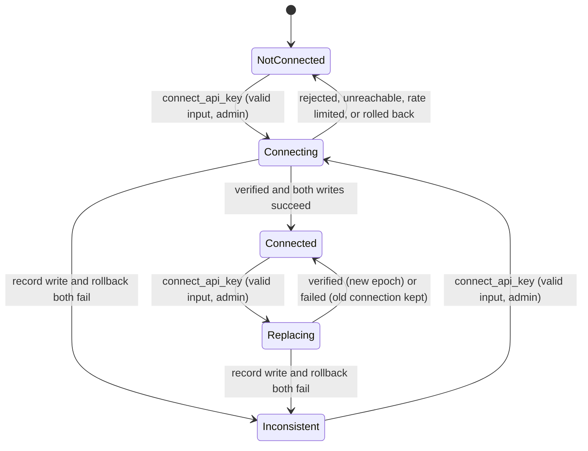
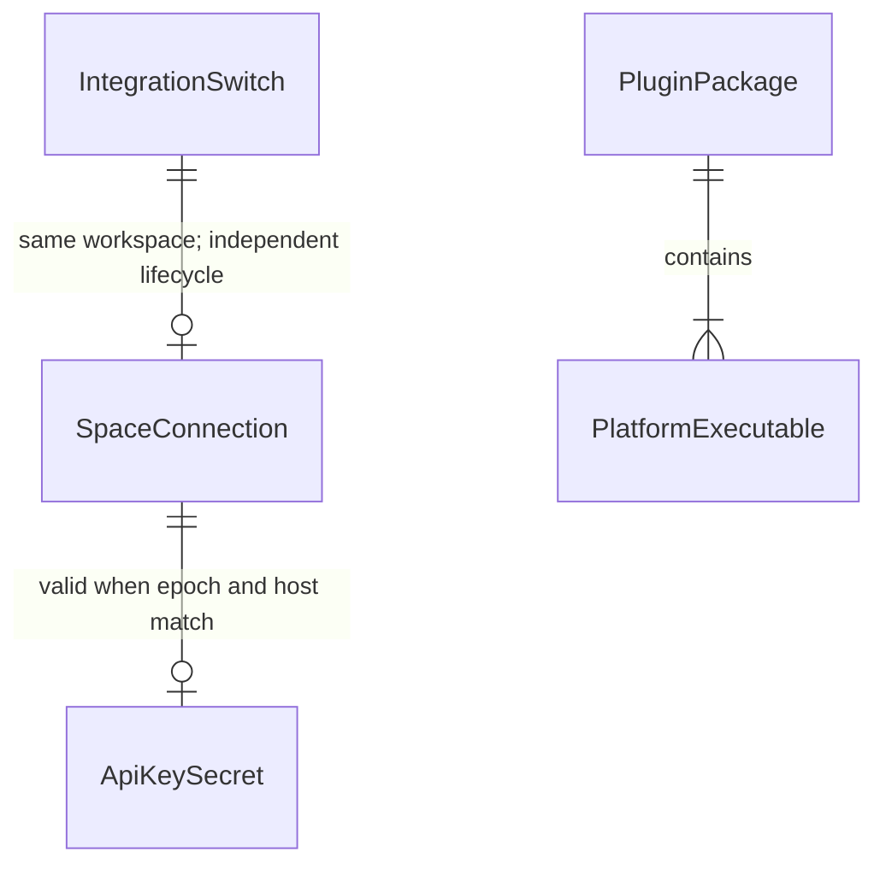

# Functional Specification — walking-skeleton (U1)

Inputs:

- `unit-of-work`: the U1 boundary.
- `unit-of-work-story-map`: US7.1, US1.2, US1.1, US7.2.
- `components`: Connection, BacklogGateway, KandevAdapter, PluginUI.
- `requirements`.
- `contract-summary`: C1 `backlog.Client`, C2 `HostPort`, C4 Makefile targets, C5 actions, C8 host.
- `entities.md` and `rules.md` in this folder.
- Answers Q1–Q9 in `functional-design-questions.md`. Q6–Q9 came from the change request after the first manual check.

This file is the source of truth for the U1 workflows and state transitions. The data shapes are in `entities.md`, and the decision logic is in `rules.md`.

## Scope

U1 proves the chain: package → install on self-hosted Kandev → connect with an API key → one real Backlog call.

It contains:

- **Plugin start and registrations** (KandevAdapter): the settings card with the Backlog logo and the on/off switch, the home Integrations entry, and the `/backlog` page.
- **The per-workspace on/off switch** (Connection), on by default, enforced by the backend.
- **Address and key validation, and API-key connect** (Connection). Connect includes replace-after-verify.
- **One gateway call, Myself** (BacklogGateway). The call has redaction, a time limit and a size limit, and never follows redirects. U1 also fixes the C1 types (`Credentials`, `User`, `Error`, `CallClass`).
- **The reduced settings screen M1** (PluginUI), with consistent spacing.
- **The U1 Backlog page** (PluginUI): connection status, on/off, and a link to settings. U3 adds the issue list.
- **The SDK pin mechanism and every standard Makefile target** from C4.
- **The manual check record template.**

It does not contain:

- OAuth, Test connection, Disconnect, project selection, the poll interval, or rate-limit queues and retries. These come in U2.
- C2 `HostPort`. No U1 workflow creates tasks, sets labels or resolves Git credentials, so it is deferred to U3, the first unit that creates tasks.

## Workflows

### WF1 — Plugin start

1. Kandev starts the executable that matches the host platform (`runtime.executables`, BR5.1).
2. The plugin serves the Kandev plugin protocol.
3. The UI bundle registers (BR5.4, BR7.6, BR7.8):
   - the Backlog card under Settings > Integrations, with the Backlog logo, the settings screen as its page and the on/off switch as its action;
   - the Backlog entry in the home Integrations menu (`registerNavItem`, id `backlog`, path `/backlog`, section `integrations`, Backlog logo);
   - the `/backlog` route, with the Backlog logo in its title bar.

   These registrations do not depend on the switch, so Backlog can always be turned back on.
4. The UI then loads the switch value of every workspace from `connection.get` and publishes it to Kandev with `setIntegrationEnabled`. It does this again whenever the workspace list changes (BR7.5).
5. The backend declares:
   - the `connection.get` action (authenticated access);
   - the `connection.connect_api_key` action (admin access);
   - the `connection.set_enabled` action (admin access);
   - the `secrets` and `state` capabilities (C5, C8).
6. It holds no connection data in memory. Every action reads the record and the secret when it needs them.

### WF2 — Read the connection (`connection.get`)

1. Any authenticated workspace member opens the Backlog settings screen (BR2.7).
2. The plugin reads the SpaceConnection record (plugin state, workspace scope, key `connection`).
3. It reads the ApiKeySecret, but only to compare `connectionEpoch` and `spaceHost`. The key value is never used here.
4. It reads the IntegrationSwitch record (key `integration`); no record means on (BR7.1). `connection.get` works whether Backlog is on or off.
5. It decides the state (BR2.11):
   - **No record**: `not_connected`.
   - **Record and a matching secret**: `connected`.
   - **Record, but the secret is missing or does not match**: `error`.
6. It returns the `ConnectionView` (C5). The fields U1 fills are:
   - `connected` (true only in state `connected`)
   - `enabled` (the switch value)
   - `state` (`not_connected`, `connected`, or `error`)
   - `spaceHost`
   - `authMethod` = `api_key`
   - `connectedUserName`
   - `hasApiKey` (derived: a matching secret exists)
   - `hasOAuthToken` = false
   - `hasGitCredential` = false
   - `connectionEpoch`

   The U2 fields `selectedProjects` and `pollMinutes` are left out. The key value is never in the view (BR3.2).
7. If reading the state store or the secret store fails, it returns `internal`.

### WF3 — Connect with an API key (`connection.connect_api_key`)

Actor: a Kandev admin (BR2.1). The workspace is taken from the verified action context. Input: `spaceUrl`, `apiKey`.

1. The UI locks the Connect button and shows "Connecting..." (BR6.1).
2. The plugin reads the IntegrationSwitch. If Backlog is off for the workspace, it returns `integration_disabled` at once, with no other read, write or call (BR7.3).
3. The plugin normalises and validates `spaceUrl` into a SpaceAddress (BR1.2, then BR1.1). If it is rejected, it returns `validation` on `spaceUrl` with the expected format.
4. It trims and checks `apiKey` (BR3.5). If it is invalid, it returns `validation` on `apiKey`. Steps 3 and 4 make no network call (BR1.3).
5. It acquires the workspace's ConnectAttempt. If one exists, it returns `conflict` (BR2.6). From here on, every exit releases the ConnectAttempt.
6. It calls `Myself` on `https://<host>` with `CallClass Interactive`. The call:
   - carries the key as the query-encoded `apiKey` parameter (BR3.4);
   - has a 10-second limit (BR4.1) and a 1 MiB body limit (BR4.2);
   - never follows a redirect (BR1.4).
7. It maps the outcome. This list covers every result:

   | Backlog outcome | `Error.Kind` | Action result | Rule |
   |-----------------|--------------|---------------|------|
   | 200, body maps to `User` (numeric `id`, non-empty `name`) | — | continue to step 8 | BR2.2 |
   | 200, body empty, unparsable, or missing `id`/`name` | Unreachable | `unreachable` | BR2.4 |
   | 401 | Unauthorized | `validation` on `apiKey` | BR2.3 |
   | 403 | Forbidden | `validation` on `apiKey` | BR2.3 |
   | 404 | NotFound | `validation` on `spaceUrl` ("space not found") | BR2.9 |
   | 429 | RateLimited | `rate_limited` with `retryAfterSeconds`, no retry | BR2.10 |
   | 400, 422 | Invalid | `unreachable` | BR2.4 |
   | 409 | Conflict | `unreachable` | BR2.4 |
   | Any other 4xx | Unreachable | `unreachable` | BR2.4 |
   | 3xx | Unreachable | `unreachable` | BR1.4, BR2.4 |
   | 5xx | Unreachable | `unreachable` | BR2.4 |
   | Timeout or network error | Unreachable | `unreachable` | BR4.1, BR2.4 |
   | Body over 1 MiB | Unreachable | `unreachable` | BR4.2, BR2.4 |
   | Action context cancelled | — | cancellation returned unchanged; nothing written | BR4.1 |

   On every non-success row, nothing is written and any existing connection stays as it was.
8. It reads the IntegrationSwitch again. If Backlog was turned off while Myself ran, it returns `integration_disabled` and writes nothing (BR7.3). Otherwise it stores the connection in a fixed order (BR2.8):
   1. GetSecret the previous ApiKeySecret, if any.
   2. SetSecret the new ApiKeySecret {key, host, epoch = previous + 1, or 1}.
   3. Write the SpaceConnection record with the same host and epoch, the user name and id, and `connectedAt`.
   4. If step 2 fails in a way that may have written the secret, or step 3 fails, roll back on a fresh context with a 2-second limit (NFR1.4): restore the previous secret, or delete the new one when there was none. Then return `internal`.
   5. If the rollback fails, log a redacted `connection_inconsistent` event and return `internal`. The next `connection.get` reports `error` (BR2.11).
9. It returns the connection view from WF2.
10. The UI clears the key input (BR6.3) and unlocks the button. It shows the result according to the M1 state table and announces it (BR6.4).

All UI text comes from English message keys (BR6.2). Every log line and error passes through redaction first (BR3.3).

During a replace there is a short window after step 8.2 when the new secret carries the new epoch and the record still has the old one. In that window `connection.get` reports `error`. U1 never uses the stored key outside WF3, so nothing calls Backlog with a mismatched host. From U2 on, every reader must load the record and the secret together and apply BR2.11 before calling Backlog.

### Address examples (BR1.1, BR1.2; AC1.2.1, AC1.2.2)

| Input | Result | Reason |
|-------|--------|--------|
| `myteam.backlog.com` | accepted as `myteam.backlog.com` | scheme added |
| `MyTeam.Backlog.com` | accepted as `myteam.backlog.com` | lower-cased |
| `myteam.backlog.jp`, `x.backlogtool.com` | accepted | allowed suffixes |
| `  https://myteam.backlog.com/  ` | accepted | trimmed; path `/` allowed |
| `http://myteam.backlog.com` | rejected | scheme is not `https` |
| `evil.example.com` | rejected | suffix not allowed |
| `192.168.1.10` | rejected | IP address |
| `myteam.backlog.com.evil.io` | rejected | suffix not allowed |
| `https://myteam.backlog.com/path` | rejected | path present |
| `myteam.backlog.com:8443` | rejected | port present (after `https://` is added) |
| `https://a@evil.io` | rejected | userinfo present, and suffix not allowed |
| `backlog.com` | rejected | no space label |
| `myteam.backlog.com.` | rejected | trailing dot |
| `a.b.backlog.com` | rejected | more than one label |
| `tëam.backlog.com` | rejected | non-ASCII |

### WF6 — Turn Backlog on or off (`connection.set_enabled`)

Actor: a Kandev admin (BR7.2). Input: `enabled`. The workspace is taken from the verified action context Kandev passes to the plugin, never from the request body.

1. The admin flips the switch on the Backlog card in Settings > Integrations. The switch is the host's drafted integration switch (`IntegrationEnabledControl`, id `nulab-backlog`), rendered by the card's action for the routed workspace (BR7.5). Flipping only marks the settings page as changed.
2. When the admin clicks Save in the host's settings bar, the host calls the switch's persist step, which calls `connection.set_enabled`. If `enabled` is not a boolean, the plugin returns `validation` on `enabled`.
3. The plugin writes the IntegrationSwitch record {enabled, changedAt}. It does not touch the SpaceConnection or the ApiKeySecret (BR7.4).
4. It returns the ConnectionView (WF2).
5. Only after the call succeeds, the UI publishes the new value with `setIntegrationEnabled("nulab-backlog", workspaceId, enabled)`, so every Kandev surface shows it.
6. If the call fails, persist rejects with a message from the error code. The host keeps the change unsaved and reports the failed save; the stored value and the published value stay as they were. A non-admin is refused with 403 by Kandev in the same way.

A Connect that started before the switch was turned off checks the switch again just before it stores anything (WF3 step 8). If Backlog is now off, it returns `integration_disabled` and writes nothing, so a connection is never written while Backlog is off.

While Backlog is off, every action except `connection.get` and `connection.set_enabled` returns `integration_disabled` (BR7.3). This covers Connect in U1 and every action later units add.

### WF7 — Open the Backlog page (`/backlog`)

1. A member clicks Backlog in the Integrations menu on the Kandev home page (BR7.6).
2. Kandev opens `/backlog` with the Backlog logo and label in the title bar.
3. The page calls `connection.get` for the active workspace (BR7.7).
4. It shows the P1 states below.
5. U3 adds the issue list to this page. U1 adds nothing else.

### WF4 — Build, package and verify (C4)

1. Every Go-compiling target first checks the SDK pin. If `../kandev` is missing, or its HEAD commit differs from `.kandev-sdk-ref`, the build stops and names the expected commit (BR5.5).
2. `make build` builds the 5 executables named in BR5.1.
3. `make package` writes `dist/<pluginId>-<version>.tar.gz` and `dist/checksums.txt`:
   - the version is read from the manifest;
   - the package also stores a checksum for every file inside it.
4. `make verify-package` runs all the checks in BR5.2: package checksum, per-file checksums, all 5 executables, the manifest and its executables list, and the UI bundle.
5. The remaining targets (`check-format`, `vet`, `lint`, `test`, `coverage`) behave as BR5.6 states.
6. Together these form the verification command recorded for the skeleton checkpoint (delivery planning).

### WF5 — First manual check (AC7.2.1)

1. An admin installs the package through Kandev Settings > Plugins, on the self-hosted server at `min_kandev_version`.
2. The admin opens Settings > Integrations > Backlog and runs WF3 with a real space and key.
3. The admin confirms "Connected as <name> @ <host>".
4. The admin copies `docs/manual-checks/TEMPLATE.md` to `docs/manual-checks/<YYYY-MM-DD>-walking-skeleton.md` and fills in the fields from BR5.3. The space domain is recorded without the key.

## M1 Settings Screen States

| State | When | What the screen shows |
|-------|------|-----------------------|
| Loading | `connection.get` in progress | A loading indicator. The form is not shown yet |
| Load failed | `connection.get` returned `internal` or Kandev failed | "Could not load the Backlog settings" with Retry |
| Not connected (admin) | `state: not_connected` | Space address and API key inputs (key input empty) and a Connect button |
| Not connected (member) | `state: not_connected`, not an admin | "Backlog is not connected. Ask a Kandev admin to connect it." No form |
| Connected (admin) | `state: connected` | "Connected as <name> @ <host>", plus the same form below it under "Replace connection" (key input empty) |
| Connected (member) | `state: connected`, not an admin | "Connected as <name> @ <host>". No form |
| Error (record and secret disagree) | `state: error` | "The Backlog connection is incomplete. Connect again." Admins see the form |
| Connecting | WF3 running | Button reads "Connecting..." and is locked (BR6.1) |
| Field error | `validation` on `spaceUrl` or `apiKey` | Message under that input, linked to it and marking it invalid (BR6.4) |
| Unreachable | `unreachable` | "Could not reach Backlog" with Retry. The key is not called wrong |
| Rate limited | `rate_limited` | "Backlog is limiting requests. Try again in <n> s" |
| Busy | `conflict` | "Another connection is being set up. Try again shortly" |

Layout (BR6.5): the screen is one vertical stack. Status, form, buttons and messages are separated by one consistent gap, with a smaller gap between each label and its input. Only the host UI kit and host styles are used.

When Backlog is off for the workspace, the screen shows "Backlog is turned off for this workspace. Turn it on with the switch above to connect." and no Connect form. The current connection, if any, is still shown.

The screen knows whether the viewer is an admin from Kandev's viewer context. If it cannot tell, it shows the form, and Kandev's admin check (BR2.1) refuses non-admins with 403. The screen then shows the member message.

## P1 Backlog Page States (U1)

| State | When | What the page shows |
|-------|------|---------------------|
| No workspace | no active workspace | "Select a workspace to use Backlog." |
| Loading | `connection.get` in progress | A loading indicator |
| Load failed | `connection.get` failed | "Could not load Backlog" with Retry |
| Off | `enabled: false` | "Backlog is turned off for this workspace", plus a link to the Backlog settings |
| Not connected | `enabled: true`, `state: not_connected` | "Backlog is not connected", plus a link to the Backlog settings |
| Connected | `enabled: true`, `state: connected` | "Connected as <name> @ <host>", plus a link to the Backlog settings |
| Incomplete | `enabled: true`, `state: error` | "The Backlog connection is incomplete. Connect again.", plus a link to the Backlog settings |

The settings link opens Kandev's integration settings page for id `nulab-backlog` in the same workspace.

## State Machine — workspace integration switch

<!-- Text fallback: A workspace starts with Backlog On. An admin can turn it Off and back On with set_enabled. The switch is independent of the connection state machine below: turning it off keeps the connection, and while it is Off every action except connection.get and connection.set_enabled is refused with integration_disabled. -->

## State Machine — workspace connection

<!-- Text fallback: A workspace starts NotConnected. A valid Connect by an admin moves it to Connecting. Success with both writes moves it to Connected. A rejected key, unreachable Backlog, rate limit or a rolled-back write returns it to NotConnected. If the record write and its rollback both fail, it becomes Inconsistent. From Connected, a new Connect moves it to Replacing, which returns to Connected with a new epoch on success, or with the old connection on failure, or becomes Inconsistent if the write and rollback both fail. From Inconsistent, a new Connect starts again. Inconsistent is shown as state error by connection.get. -->

Connecting and Replacing exist only while a ConnectAttempt is held. Disconnected and "Sign in again" states arrive in U2.

## Entity Relationships (derived from `entities.md`)

<!-- Text fallback: Each SpaceConnection pairs with zero or one ApiKeySecret, and is valid only when the epoch and host match. Each PluginPackage contains one or more PlatformExecutable entries (exactly five, per BR5.1). SpaceAddress is a value inside SpaceConnection and ApiKeySecret; the Backlog user is copied into SpaceConnection fields. IntegrationSwitch belongs to the same workspace as the SpaceConnection but has its own lifecycle. ConnectAttempt and ManualCheckRecord stand alone. -->

## Error Outcomes (derived from `rules.md` and contract-summary)

| Situation | Error code | HTTP status | Rule |
|-----------|------------|-------------|------|
| Address is not a Backlog space host | `validation` (field `spaceUrl`) | 400 | BR1.1, BR1.2 |
| Key empty, too long or with invalid characters | `validation` (field `apiKey`) | 400 | BR3.5 |
| Backlog rejects the key (401, 403) | `validation` (field `apiKey`) | 400 | BR2.3 |
| Space not found (404) | `validation` (field `spaceUrl`) | 400 | BR2.9 |
| Backlog rate limit (429) | `rate_limited` + `retryAfterSeconds` | 429 + `Retry-After` | BR2.10 |
| Unreachable, timeout, 5xx, 3xx, unexpected 4xx, bad or oversized body | `unreachable` | 503 | BR2.4 |
| Another Connect is running | `conflict` | 409 | BR2.6 |
| Store write failed (rolled back or not) | `internal` | 500 | BR2.8 |
| Not an admin | (refused by Kandev) | 403 | BR2.1, BR7.2 |
| Backlog is off for the workspace | `integration_disabled` | 409 | BR7.3 |
| `enabled` is not a boolean | `validation` (field `enabled`) | 400 | BR7.2 |

During Connect, a rejected key returns `validation`, not `reconnect_required`. Nothing is connected yet, and AC1.1.2 puts the error on the key field.

## Decisions That Change Upstream Wording

These are recorded here and tracked as upstream changes. The upstream documents are not edited in this stage.

| Upstream text | Decision in U1 | Upstream change to make | Closed by |
|---------------|----------------|-------------------------|-----------|
| AC1.1.7: key "sent to Backlog in a header rather than a URL parameter" | Q1: documented `apiKey` query parameter, with full URL redaction (BR3.3, BR3.4). AC1.1.7 is read as "the API key is stored through Kandev's encrypted secret mechanism and never appears in logs, errors or UI responses" | `stories.md` AC1.1.7 | Amend with this wording |
| NFR3: "send the API key in a header instead of the URL" | Same as above | `requirements.md` NFR3 | Amend to "never exposed in URLs that are logged or returned" |
| `components.md` BacklogGateway behaviour: "Sends the API key via a header" | Same as above | `components.md` | Amend to "Sends the API key as the documented query parameter and redacts URLs" |
| `contract-summary` C7 open question on the header | Answered: query parameter | `contract-summary.md` | Close the question |
| FR1.1: replacing a connection "after the user confirms" | Q2: in U1, a verified Connect replaces without a confirmation dialog | — | U2 adds the confirmation (US1.6) |
| C1 `Error.Kind` list | Adds `Forbidden` (BR2.3, entities.md) | `contract-summary.md` C1 | Additive change; resolves contract finding R-06 for 403 |
| C5 `ConnectionView` | Adds `enabled` (the switch value, BR7.1) | `contract-summary.md` C5 | Additive field |
| `unit-of-work.md` U1 boundary; `stories.md`, `requirements.md` | U1 now also owns the switch, the home Integrations entry and the `/backlog` page (Q6–Q9, user change request after the first manual check); U3 adds the issue list to `/backlog` | `unit-of-work.md` (U1, U3), `requirements.md`, `stories.md` | Add the items with this origin |
| C5 action keys `connection.connectApiKey` and the error code list | Kandev only accepts keys matching `^[a-z0-9][a-z0-9._-]*$`: `connection.connect_api_key`, plus the new `connection.set_enabled`; adds `integration_disabled` (BR7.3) | `contract-summary.md` C5 | Amend the keys and the error list |
| C2 `HostPort` owned by walking-skeleton | Deferred: no U1 workflow needs it | — | U3 defines it |

## Rules Summary (derived from `rules.md`)

| Area | Rules |
|------|-------|
| Address | BR1.1 to BR1.4 |
| Connect | BR2.1 to BR2.11 |
| Secrets and key input | BR3.1 to BR3.5 |
| Calls | BR4.1, BR4.2 |
| Build, package and manual checks | BR5.1 to BR5.6 |
| Settings screen | BR6.1 to BR6.5 |
| Switch, home entry, page and logo | BR7.1 to BR7.8 |

## Sources

- [desc] Initial description: Kandev plugin for Nulab Backlog.
- [scope] Workflow-selected scope: `feature`.
- [Q1]–[Q9]: answers in `functional-design-questions.md`.
- Kandev v0.96.0 web app: plugin routes match the exact path (`src/spa-routes.tsx`); first-party home Integrations entries open their own page (`lib/navigation/core-destinations.ts`).
- `unit-of-work.md`, `unit-of-work-story-map.md`, `components.md`, `requirements.md`, `contract-summary.md`, `stories.md`, `team-practices.md`.

## Assumptions & Open Questions

- [assumption] Validation of `spaceUrl` and `apiKey` happens in the plugin. Kandev does not check action input schemas (`contract-summary`, C5).
- [assumption] The settings screen can tell from Kandev's viewer context whether the viewer is an admin. If it cannot, the fallback in the M1 section applies.
- [assumption] HTTP 409 is the status for `integration_disabled`, the same family as `conflict`, because the request conflicts with the workspace's current setting.
