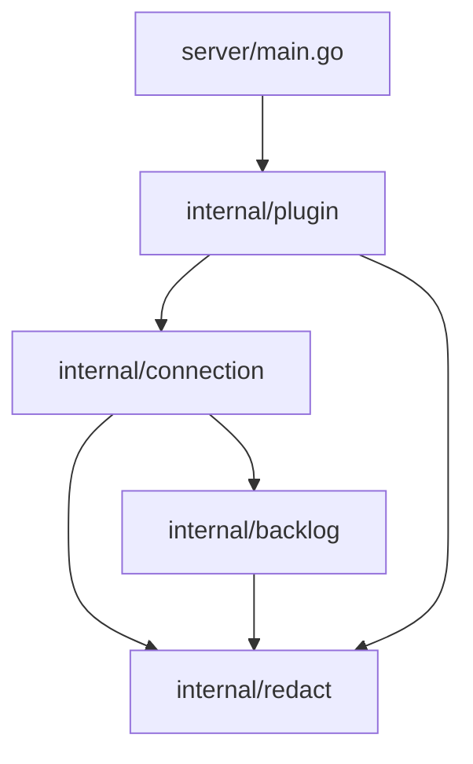

# Logical Components — walking-skeleton (U1)

Inputs:

- U1 NFR requirements: `performance-requirements`, `security-requirements`, `scalability-requirements`, `reliability-requirements`, `observability-requirements`, `tech-stack-decisions`.
- `functional-spec` (U1).
- `contract-summary`: C1, C4, C5, C8.
- `team-practices`: Code Style layout.

## Components

| Component | Go package / path | Responsibility in U1 | NFR patterns applied | Failure domain |
|-----------|-------------------|----------------------|----------------------|----------------|
| Entry point | `server/main.go` | Only calls `pluginsdk.Serve(plugin.NewRuntime())` | — (excluded from coverage) | Process |
| KandevAdapter | `internal/plugin` | Manifest actions (`connection.get`, `connection.connect_api_key`, `connection.set_enabled`, all `scope: workspace`), action handlers, the disabled-switch guard, error-code mapping, `requestId`, workspace from Kandev's verified context | NFR3.5, NFR3.8, NFR3.9, NFR5.3, NFR11.1, NFR11.6 | Per action |
| Connection | `internal/connection` | Validation (BR1.x, BR3.5), Connect lock and time budget, epoch-linked writes, rollback, the IntegrationSwitch read and write, view building | NFR1.4, NFR3.1, NFR3.2, NFR3.7, NFR5.4, NFR5.6, NFR5.8, NFR5.9, NFR5.10 | Per workspace |
| BacklogGateway | `internal/backlog` | C1 types, `Myself`, status-to-Kind mapping, no redirects, size limit, sub-deadlines | NFR3.4, NFR3.6, NFR5.1, NFR5.2, NFR2.1 | Per call |
| Redaction | `internal/redact` | Secret masking, URL query masking, `slog` handler wrapper | NFR3.3, NFR11.5 | — |
| PluginUI | `ui/` | M1 settings screen (spacing per BR6.5), settings card registration with the logo and the drafted switch action, home Integrations nav item, `/backlog` page (P1), inline Backlog logo, switch publishing per workspace, English message catalogue | NFR1.1, NFR3.10, NFR9.1, NFR10.1 | Browser |
| Build | `Makefile`, `.kandev-sdk-ref`, `go.mod` replace | C4 targets, SDK pin, packaging, verification | NFR7.1, NFR8.1, BR5.5 | CI / local |
| Manual checks | `docs/manual-checks/` | Template and records | NFR4.2 | — |

## Dependencies

<!-- Text fallback: server/main.go depends on internal/plugin. internal/plugin depends on internal/connection and internal/redact. internal/connection depends on internal/backlog and internal/redact. internal/backlog depends on internal/redact. Only internal/plugin and server/main.go import the Kandev SDK. -->

Only `server/main.go` and `internal/plugin` import `pluginsdk` (team-practices, Code Style). `internal/connection` reaches Kandev's state and secret stores through two small interfaces declared on its own side (`SecretStore`, `StateStore`). `internal/plugin` implements them, and tests use in-memory fakes. These interfaces are needed: there are two implementations, the real one and the test fake.

## Blast Radius

| Fault | Affects | Does not affect |
|-------|---------|-----------------|
| A bad Backlog response | One Connect in one workspace | Other workspaces; the existing connection |
| A store failure | Connect and settings read in the affected workspace | Plugin start |
| A panic in a handler | The current action. KandevAdapter recovers from it at the boundary and returns `internal` | Other actions and the process |

## Sources

- [desc] Initial description: Kandev plugin for Nulab Backlog.
- [scope] Workflow-selected scope: `feature`.
- U1 NFR requirements (all six files); `functional-spec.md` (U1); `contract-summary.md`; `team-practices.md`.

## Assumptions & Open Questions

None.
