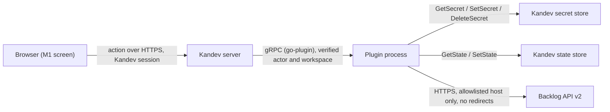

# Security Design — walking-skeleton (U1)

Inputs:

- `security-requirements`: NFR3.1–NFR3.10, NFR4.1, NFR4.2.
- `observability-requirements`: NFR11.5.
- `functional-spec` and `rules` for U1.
- `contract-summary`: C1, C5, C8.
- `tech-stack-decisions`.
- Answer Q1 in `nfr-design-questions.md`.

## Trust Boundaries

<!-- Text fallback: The browser calls a plugin action through the Kandev server over HTTPS with the user's Kandev session. Kandev passes the verified actor and workspace to the plugin process over gRPC. The plugin reads and writes the secret store and the state store inside Kandev, and calls the Backlog API over HTTPS only to an allowlisted host, without following redirects. -->

## Design

| ID | Requirement | Design |
|----|-------------|--------|
| NFR3.1 | Key only in the secret store | The `connection` package has one write path for the key: `SetSecret` with the plugin-owned key `backlog.connection.<workspaceId>`. The value is a JSON object `{apiKey, spaceHost, connectionEpoch}` (BR2.8). The state store holds only the public record. No other package receives the key, except the gateway call that uses it |
| NFR3.2 | Key never in UI responses | The view is built only from the record plus a boolean that says whether the secret matches. The view type has no field that can hold the key. The `apiKey` input is a write-only field of the request type and is never copied into a response |
| NFR3.3 | Redaction of key and URLs | 1. `internal/redact` holds a per-request set of secret values to mask, and replaces every Backlog URL's query string with `?REDACTED`. 2. The gateway never returns a Go `*url.Error` or any error built from one: transport errors are mapped to `backlog.Error{Kind: Unreachable}`, with only an error class (`timeout`, `dns`, `tls`, `connection`). 3. A custom `slog` handler runs every log attribute through `redact` before writing. 4. `backlog.Error.Error()` returns only Kind and Status |
| NFR3.4 | HTTPS, allowlisted host, no redirects | The request URL is built only from `SpaceAddress.baseUrl` plus a fixed path. The HTTP client's `CheckRedirect` returns an error for any redirect. The transport refuses non-`https` schemes. The gateway checks the request host against `SpaceAddress.host` before sending |
| NFR3.5 | Admin-only Connect and switch | The manifest declares `access: admin` for `connection.connect_api_key` and `connection.set_enabled`, and `authenticated` for `connection.get`. In U1, a unit test parses the packaged manifest and asserts these values. The live 403 check runs in the U5 contract test |
| NFR3.6 | No Backlog body echoed | The gateway reads the body only to decode `User` on 200. For non-200 responses the body is drained up to 1 MiB and discarded. It never appears in an error or log |
| NFR3.7 | Validate before calling | The action handler validates `spaceUrl` (BR1.1, BR1.2) and `apiKey` (BR3.5) before it acquires the Connect lock or creates a gateway request |
| NFR3.8 | Workspace from the verified context | The manifest declares `scope: workspace` for all three actions. KandevAdapter reads the workspace only from the verified action context and passes it to `connection`; request body types have no workspace field, so a body value is never read |
| NFR3.9 | Refuse actions while off | KandevAdapter wraps every action except `connection.get` and `connection.set_enabled` in one guard that reads the IntegrationSwitch first and returns `integration_disabled` (409) before anything else runs. If the switch read fails or the stored value cannot be decoded, the guard fails closed and returns `internal`; it never runs the action. `connection.Connect` reads the switch again in its store step, before GetSecret. A switch change that lands between that second read and SetSecret can still let one Connect store its connection; this window is at most the 2 s store budget, the stored connection stays unused while Backlog is off, and it is an accepted limit |
| NFR3.10 | Safe inline logo | The logo is a TypeScript component that returns `svg` and `path` elements built with `host.jsx`, with fixed attribute values and `aria-hidden`. It has no `script`, `foreignObject`, `href` or `on*` attribute. A Vitest test renders it and asserts this; the `verify-package` bundle check (infrastructure-design `cicd-pipeline.md`) fails on any asset load from a Nulab or Backlog domain. The logo file sits next to `docs/brand/backlog-logo.md`, which records its source URL and terms. The UI takes the icon from one constant, so the pre-release fallback to a host built-in icon (security-requirements, Q6) is a one-line change |
| NFR4.1 | No real credentials in the repo | Test keys come from a helper that returns `test-api-key-` plus 32 random hex characters per test run, so no fixed key is committed. The leak scan in NFR3.2/NFR3.3 tests searches for the full key and for every 8-character window of its random part, which cannot match the shared prefix |
| NFR4.2 | Manual check record without secrets | `docs/manual-checks/TEMPLATE.md` has fields for the date, Kandev version, plugin commit, space domain, steps and result, and no key field. It starts with a reminder not to paste keys or URLs with a query |

## Input Validation Summary

| Input | Where | Checks |
|-------|-------|--------|
| `spaceUrl` | action handler | BR1.2 normalisation, then BR1.1 on the parsed host |
| `apiKey` | action handler | BR3.5: trimmed, 1–256 printable ASCII characters, no spaces |
| `workspaceId` | KandevAdapter | Taken only from Kandev's verified action context, never from the request body |
| `enabled` | `connection.set_enabled` handler | Must be a JSON boolean; anything else is `validation` on field `enabled` |
| Backlog `User` | gateway | Numeric `id`, non-empty `name`, at most 1 MiB body |

## Sources

- [desc] Initial description: Kandev plugin for Nulab Backlog.
- [scope] Workflow-selected scope: `feature`.
- [Q1]: answer, superseded by NFR requirements Q4, in `nfr-design-questions.md`.
- `security-requirements.md`, `observability-requirements.md`, `tech-stack-decisions.md` (U1 NFR requirements); `functional-spec.md` (U1); `contract-summary.md`.

## Assumptions & Open Questions

None.
