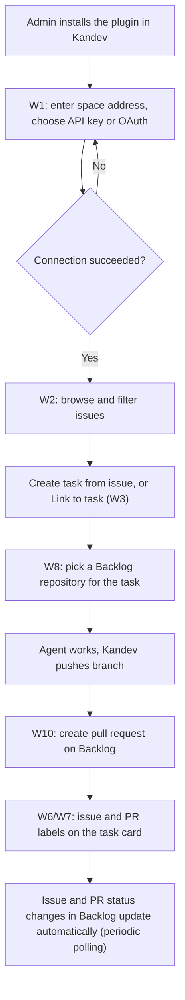

# User Flow — Kandev Plugin for Nulab Backlog

Inputs: `intent-statement` (the end-to-end main flow is a success criterion), `scope-document` (value chain), `intent-backlog` (IB-1 to IB-14). Screens W1–W10 are in `wireframes.md`.

## Main flow (happy path)

<!-- Text fallback: Admin installs the plugin. The user connects a space in W1; on error, back to W1. Once connected, the user browses issues in W2, creates a task or links a task (W3), picks a Backlog repository for the task (W8). The agent works and Kandev pushes the branch, the user creates a pull request in W10. The task card shows issue and PR labels (W6/W7). Status changes in Backlog update Kandev automatically by periodic polling. -->

## Detailed flows

### F1. Connect a space (IB-2, IB-3)

- **Actor**: a Kandev user with a Backlog account.
- **Starts when**: opening Settings > Integrations > Backlog.

Steps:

1. W1 → enter the space address → the plugin checks the address format (accepts `.backlog.com`, `.backlog.jp`, `.backlogtool.com`).
2. Choose sign-in with API key → paste the API key → click Connect → the plugin tries a call to Backlog → shows "Connected as ...".
3. Or choose OAuth → click "Sign in with Nulab" → Backlog sign-in page → allow → back to W1 → shows "Connected as ...".

**Result**: the space is connected; the entries under Integrations > Backlog are usable.

Error paths:

- Wrong space address → message under the address field → fix and retry.
- API key wrong or revoked → message under the API key field, with a link on how to create a new key.
- User cancels on the OAuth page → back to W1 with the message "Sign-in was cancelled".
- OAuth token expired and cannot be refreshed → W1 shows "Sign in again".

### F2. Create a task from an issue (IB-9, IB-10)

- **Starts when**: opening Integrations > Backlog > Issues.

Steps:

1. W2 → filter by project, status, assignee, or search `PROJ-120`.
2. Click "Create task" on a row → Kandev creates a task with the title and description taken from the issue, already linked to the issue.

**Result**: the new task appears on the board, with the label `PROJ-120`.

Error paths:

- API rate limit hit → W2 says it is waiting and retries automatically.
- Issue already linked to another task → that row shows the task key instead of the button. [assumption: one issue is linked to at most one task in the first release]

### F3. Link an existing issue to a task (IB-10)

Steps:

1. W2 → click "Link to task".
2. W3 → search for and pick a task → click Link → the issue row shows the task key, the task card shows the issue label.

Error path: no task found → W3 shows "No tasks found".

### F4. Pick a repository and create a pull request (IB-5, IB-6, IB-7)

Steps:

1. Create a task → W8 → pick a Backlog repository.
2. Agent works → Kandev pushes the task branch.
3. Task menu → "Create Backlog pull request" → W10 with title, description and related issue pre-filled → click Create PR.
4. The task card shows the label `PR #42 Open`.

Alternative: the pull request was already created on Backlog → task menu → "Link Backlog pull request".

Error paths:

- Branch not pushed yet → the menu entry is disabled, with the reason.
- Backlog refuses to create the pull request (for example, a PR already exists for this branch) → show the reason and suggest linking the existing PR.

### F5. Status tracking (IB-8, IB-12)

1. The plugin polls Backlog periodically, within the API rate limit.
2. When an issue or pull request status changes in Backlog, the label on the task card updates automatically.
3. There is no reverse direction: changing status in Kandev does not change status in Backlog (per `scope-document`).

### F6. Automatic PR watch and dashboard (IB-13)

1. W4 → New watch → set a name, pick a repository, filters → save → the watch is Active.
2. Run, Pause, Resume, Edit, Delete each watch. Delete needs confirmation.
3. W5 → save a query → pick a query to see the list of pull requests and linked tasks.

### F7. `#` reference (IB-11)

1. In the task compose box, type `#PROJ-12` → issue suggestions appear → pick with the arrow keys and Enter → a reference to the issue is inserted.

## Sources

- [desc] Initial description: Kandev plugin for Nulab Backlog, similar to the Bitbucket plugin.
- [scope] Workflow-selected scope: `feature`.
- [Q1]–[Q8]: answers in `rough-mockups-questions.md`.
- IB-…: items in `ideation/scope-definition/intent-backlog.md`.

## Assumptions & Open Questions

- [assumption] In the first release, one issue is linked to at most one task. Needs confirmation in the Requirements Analysis step.
- [assumption] The polling frequency is not set yet; it will be decided at the requirements step, based on Backlog API rate limits.
