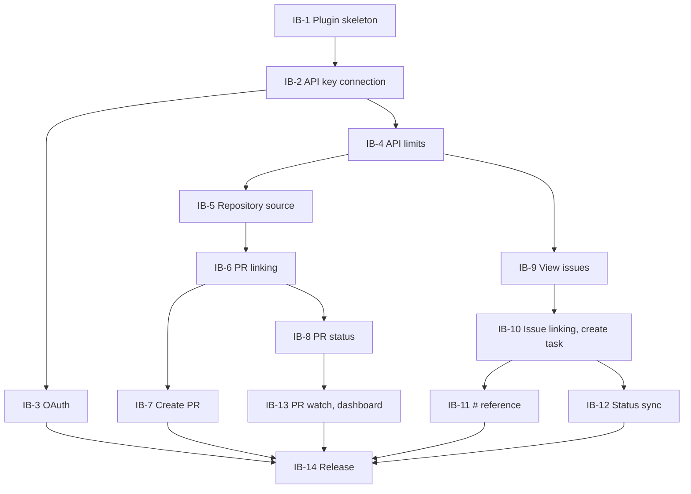

# Intent Backlog — Kandev Plugin for Nulab Backlog

Inputs: `intent-statement`, `feasibility-assessment`, `constraint-register`, and the boundaries in `scope-document.md`.

## How priorities are set

- **MoSCoW**:
  - **Must**: items needed for the "end-to-end main flow" and the same checks as the Bitbucket plugin, taken from the success criteria in `intent-statement`.
  - **Should**: items you chose to include in the first release.
  - **Won't**: items you excluded from this release.
- **Order**: risk first [Q6]. The "Order" column is an initial proposal; the final order will be set by the Delivery Planning step.
- **WSJF score** = (value + urgency + risk reduction) ÷ size, each factor scored 1–10. This is a relative estimate [assumption].

## Backlog

| ID | Item (proto-Unit) | MoSCoW | Value | Urgency | Risk reduction | Size | WSJF | Order | Source |
|----|-----------------------|--------|---------|-----|-------------|--------|------|--------|-------|
| IB-1 | Plugin skeleton: installable in Kandev, with build, test, packaging, package verification, version checks and a release process | Must | 5 | 8 | 10 | 5 | 4.6 | 1 | intent-statement; C-T1, C-T2 |
| IB-2 | Connect a space with an API key, on every Backlog domain. Secrets are encrypted and deleted on disconnect | Must | 8 | 8 | 8 | 3 | 8.0 | 2 | [Q3, Q4, Q7 feasibility]; C-T5, C-R3 |
| IB-3 | Sign in with OAuth 2.0, refresh tokens automatically | Must | 6 | 5 | 8 | 5 | 3.8 | 3 | [Q4 feasibility]; C-T6, C-O7 |
| IB-4 | Respect API rate limits (wait on 429, read the limit information) | Must | 5 | 5 | 8 | 3 | 6.0 | 4 | C-T3, C-T4 |
| IB-5 | Backlog as a repository source: view and pick a Backlog Git repository for a task | Must | 9 | 6 | 6 | 5 | 4.2 | 5 | [Q2 market-research]; [Q2] |
| IB-6 | Link Backlog pull requests to Kandev tasks | Must | 8 | 5 | 4 | 3 | 5.7 | 6 | [Q2 market-research] |
| IB-7 | Create a pull request on Backlog after Kandev pushes the task branch | Should | 8 | 4 | 4 | 3 | 5.3 | 7 | [Q2] |
| IB-8 | Show pull request status on the task list | Should | 6 | 3 | 2 | 3 | 3.7 | 8 | [Q2] |
| IB-9 | View and search the space's issues | Must | 8 | 5 | 4 | 3 | 5.7 | 9 | [Q2 market-research] |
| IB-10 | Link issues to tasks, and create a task from an issue | Must (link) / Should (create task) | 9 | 5 | 3 | 3 | 5.7 | 10 | [Q2 market-research]; [Q1] |
| IB-11 | Type `#` to insert a Backlog issue reference | Should | 5 | 2 | 2 | 2 | 4.5 | 11 | [Q1] |
| IB-12 | One-way status sync from Backlog to Kandev by periodic polling | Should | 6 | 3 | 3 | 5 | 2.4 | 12 | [Q3] [Q7] [Q8] |
| IB-13 | Automatic pull request watching (PR watch) and saved dashboard queries | Should | 5 | 2 | 2 | 8 | 1.1 | 13 | [Q2] |
| IB-14 | Publish a GitHub Release and submit a proposal to the Kandev marketplace | Should | 7 | 3 | 3 | 2 | 6.5 | 14 (last) | [Q8 feasibility] |

The order does not follow pure WSJF, because the items depend on each other:

- IB-1 comes before everything.
- IB-2 must exist before any API call.
- IB-14 can only happen once the release has enough features.

## Won't (this release)

| ID | Item | Source |
|----|----------|-------|
| W-1 | Wiki, file sharing | [Q5] |
| W-2 | Subversion | [Q5] |
| W-3 | Gantt, burndown, milestone | [Q5] |
| W-4 | Backlog notifications in Kandev | [Q5] |
| W-5 | Receive updates via webhook | [Q8] |
| W-6 | Update issue status from Kandev | [Q7] |
| W-7 | Create new issues, comment on issues from Kandev | [Q1] |
| W-8 | Pull request review panel | [Q2] |
| W-9 | Multiple spaces in one workspace | [Q4] |

## Dependencies between items

<!-- Text fallback: IB-1 plugin skeleton comes before IB-2 API key connection. IB-2 comes before IB-3 OAuth and IB-4 API limits. IB-4 comes before IB-5 repository source and IB-9 view issues. IB-5 leads to IB-6 pull request linking, then to IB-7 create pull request and IB-8 pull request status. IB-8 leads to IB-13 PR watch. IB-9 leads to IB-10 issue linking and create task, then to IB-11 # reference and IB-12 status sync. IB-14 release comes after all other items. -->

## Sources

- [desc] Initial description: Kandev plugin for Nulab Backlog.
- [scope] Workflow-selected scope: `feature`.
- [Q1]–[Q8]: answers in `scope-definition-questions.md`. Labels with the suffix "market-research" or "feasibility" are answers from those steps.
- C-…: items in `ideation/feasibility/constraint-register.md`.

## Assumptions & Open Questions

- [assumption] WSJF scores are only relative estimates for discussion, not based on data.
- [assumption] IB-13 (PR watch) is the largest item, and may be postponed if the first release runs long. The decision is yours in later steps.
