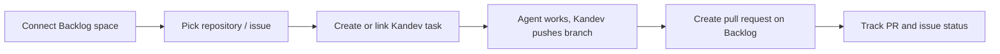

# Scope Document — Kandev Plugin for Nulab Backlog

Inputs: `intent-statement` (problem, users, success criteria), `feasibility-assessment` (conditionally feasible), `constraint-register` (technical, organisational and legal constraints).

## Goal of the first release

A Kandev plugin installable from the marketplace or a GitHub Release. The plugin lets Kandev users:

- connect a Backlog space;
- work with Backlog issues and Git/pull requests right inside Kandev;
- pass checks equivalent to the Bitbucket plugin.

[intent-statement] [Q8 feasibility]

## In scope

| Group | Capability | Source |
|------|----------|-------|
| Connection | Connect **one** Backlog space per Kandev workspace, on any domain (`backlog.com`, `backlog.jp`, `backlogtool.com`) | [Q4] [Q3 feasibility] |
| Connection | Sign in with an API key and with OAuth 2.0. Secrets are encrypted, never shown again after saving, and deleted on disconnect | [Q4 feasibility] [Q7 feasibility] |
| Issue | View and search issues of the connected space | [Q2 market-research] |
| Issue | Link Backlog issues to Kandev tasks | [Q2 market-research] |
| Issue | Create a Kandev task from a Backlog issue | [Q1] |
| Issue | Type `#` to insert a reference to a Backlog issue | [Q1] |
| Issue | Issue status changes in Backlog show up in Kandev automatically (one-way, by periodic polling) | [Q3] [Q7] [Q8] |
| Git/PR | Backlog as a Kandev repository source: view and pick Backlog Git repositories | [Q2 market-research] [Q2] |
| Git/PR | Link Backlog pull requests to Kandev tasks | [Q2 market-research] |
| Git/PR | Create a pull request on Backlog after Kandev pushes the task branch | [Q2] |
| Git/PR | Show pull request status on the task list | [Q2] |
| Git/PR | Automatic pull request watching (PR watch) and saved dashboard queries | [Q2] |
| Quality | Respect Backlog API rate limits | [constraint-register C-T3, C-T4] |
| Release | Build, test, packaging, package verification and version checks like the Bitbucket plugin. Release via GitHub Release and submit a proposal to the Kandev marketplace | [intent-statement] [Q8 feasibility] |

## Out of scope (this release)

| Capability | Reason | Source |
|----------|-------|-------|
| Wiki, file sharing | Does not serve the issue–task–PR flow | [Q5] |
| Subversion | Git only | [Q5] |
| Gantt, burndown, milestone | Not needed for the first release | [Q5] |
| Backlog notifications in Kandev | Not needed for the first release | [Q5] |
| Receive updates via webhook | Needs a Kandev server with a public address; use periodic polling instead | [Q8] [feasibility-assessment] |
| Update issue status from Kandev | Sync only goes one way, from Backlog to Kandev | [Q7] |
| Create new Backlog issues, comment on issues from Kandev | Not chosen for the first release | [Q1] |
| Pull request review panel in Kandev | Not chosen for the first release | [Q2] |
| Multiple Backlog spaces in one workspace | One space per workspace | [Q4] |

## Priority order

Go **risk first** [Q6]. The first step is to build a working plugin skeleton, covering sign-in, space connection and packaging. This skeleton validates early the two biggest risks in `feasibility-assessment`: the backend written in Go (the developer only knows TypeScript) and OAuth. Git/PR and issues come after that.

## Value chain

<!-- Text fallback: Connect Backlog space -> pick repository or issue -> create or link Kandev task -> agent works and Kandev pushes branch -> create pull request on Backlog -> track pull request and issue status. -->

## Done criteria for the first release

Three criteria taken from `intent-statement`:

- The flow above runs end to end with a real Backlog space.
- Passes checks equivalent to the Bitbucket plugin.
- There is an installable release.

## Sources

- [desc] Initial description: Kandev plugin for Nulab Backlog, similar to the Bitbucket plugin.
- [scope] Workflow-selected scope: `feature`.
- [Q1]–[Q8]: answers in `scope-definition-questions.md`.
- [Q2 market-research]: answer in `ideation/market-research/market-research-questions.md`.
- [Q3 feasibility], [Q4 feasibility], [Q7 feasibility], [Q8 feasibility]: answers in `ideation/feasibility/feasibility-questions.md`.
- [intent-statement]: `ideation/intent-capture/intent-statement.md`.
- [feasibility-assessment], [constraint-register]: `ideation/feasibility/`.

## Assumptions & Open Questions

- [assumption] Periodic polling for status updates must stay within Backlog API rate limits. The exact frequency will be decided at the requirements step.
- [assumption] The plugin licence has not been chosen yet (constraint-register C-R4).
