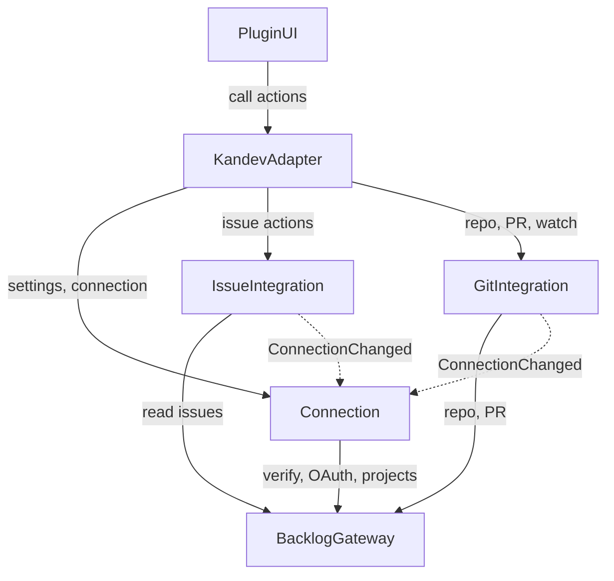

# Component Catalogue — Kandev Plugin for Nulab Backlog

Inputs:

- `requirements` (FR1–FR7, NFR1–NFR11)
- `stories` (US1.1–US8.5)
- `team-practices` (Code Style: only `internal/plugin` uses the Kandev toolkit; the Backlog client and the secret-masking part are separate)
- Answers Q1–Q5 in `domain-design-questions.md`

The project is built from scratch (greenfield), so there is no old architecture or existing component list to compare against.

A component is code the team will write. The Backlog API, the Kandev server and Kandev's secret store are external dependencies, not components.

```yaml
components:
  - name: Connection
    summary: Manages the workspace's single connection to one Backlog space, with sign-in credentials, selected projects and the update interval.
    behaviour: >
      Only accepts https addresses whose host belongs to *.backlog.com, *.backlog.jp or *.backlogtool.com,
      converted to lowercase, with no port, path or userinfo.
      Verifies credentials with a test call before saving.
      If verification fails, the old connection is kept.
      Secrets (API key, OAuth token, Git password) are only stored through Kandev's encrypted secret store
      and are never returned to the UI; the UI only receives hasX flags.
      OAuth uses a signed, single-use, expiring state, and PKCE.
      Tokens are refreshed before they expire; many concurrent calls cause exactly one refresh.
      Every space change, disconnect or project change increments the connection version marker (connectionEpoch)
      and emits a ConnectionChanged event.
      Reconnecting to the same old space emits the event with a restore flag.
      The update interval defaults to 5 minutes, minimum 1 minute.
    responsibilities:
      - Connect, test, replace credentials, disconnect, change space (US1.1–US1.6, US1.8)
      - OAuth sign-in and automatic token refresh (US1.3, US1.4)
      - Store Git credentials (US5.5)
      - Select and deselect projects (US1.7, US1.9)
      - Configure the update interval (US4.2)
      - Emit the ConnectionChanged event with the version marker (Q4)
    depends_on:
      - component: BacklogGateway
        interaction: Verify credentials, exchange the OAuth code for a token, fetch the project list
        style: sync
    dependents:
      - component: IssueIntegration
        interaction: Read the current connection and receive ConnectionChanged events
      - component: GitIntegration
        interaction: Read the connection, Git credentials and receive ConnectionChanged events
      - component: KandevAdapter
        interaction: Forward settings actions from the UI
    external_dependencies:
      - name: Kandev's encrypted secret store
        kind: other
        purpose: Store the API key, OAuth token, Git password
    entities:
      - name: SpaceConnection
        identifier: workspaceId
        attributes: [spaceHost, authMethod, connectedUserName, connectionEpoch, connectedAt, pollMinutes, hasApiKey, hasOAuthToken, hasGitCredential]
      - name: ProjectSelection
        identifier: projectKey
        attributes: [projectId, projectName, selectedAt, spaceHost]
        references:
          - entity: SpaceConnection
            owned_by: Connection
            relationship: each selected project belongs to the workspace's current connection
      - name: OAuthPendingState
        identifier: state
        attributes: [codeVerifier, spaceHost, expiresAt, used]

  - name: BacklogGateway
    summary: The single anti-corruption layer that calls Backlog API v2. All limits, waits, retries and secret masking live here.
    behaviour: >
      Only calls hosts that have been checked, and does not follow redirects to other hosts.
      Sends the API key via a header.
      Every call has a time limit and takes a context so it can be cancelled.
      Calls in the update and search groups run sequentially, at least 1 second apart.
      On 429: wait per X-RateLimit-Reset, if absent then per Retry-After,
      if that is also absent then wait 60 seconds; stop after N attempts.
      Converts HTTP errors into fixed error kinds (reconnect needed, rate limited,
      unreachable, not found), without carrying the response body.
      Masks secrets in every error and log, including URLs in network errors.
      Limits the size of responses read in.
      Holds no credentials: the caller passes them in on every call.
    responsibilities:
      - Call the Backlog API for users, projects, issues, comments, attachments, repositories, pull requests
      - Respect the API rate limit (US8.4)
      - Mask secrets and normalise errors (US7.3, NFR3, NFR5)
      - Write structured logs for errors and waits (US8.3)
    depends_on: []
    dependents:
      - component: Connection
        interaction: Verify credentials, OAuth, project list
      - component: IssueIntegration
        interaction: Read issues, search issues, comments, attachments, statuses
      - component: GitIntegration
        interaction: Repositories, pull requests, create pull requests
    external_dependencies:
      - name: Nulab Backlog API v2
        kind: third-party-api
        purpose: All Backlog data
    entities:
      - name: RateLimitWindow
        identifier: category
        attributes: [limit, remaining, resetAt, lastRequestAt]

  - name: IssueIntegration
    summary: Browse and search issues, create tasks from issues, link issues to tasks, `#` references, view issue info live, and one-way issue status sync.
    behaviour: >
      One issue can be linked to many tasks; each task is linked to at most one issue.
      Never writes to an issue on Backlog.
      Creating a task from an issue includes the title, description, link, labels and mapped priority.
      If task creation fails, no orphan link is left behind.
      Has its own timer running on Connection's interval, only updating issue statuses.
      One failing link does not stop the whole cycle.
      On ConnectionChanged: mark links belonging to a disabled space or project as "no longer connected";
      restore them when there is a restore flag matching the space and project;
      ignore every result carrying an old version marker.
      An exactly matching issue key is put at the top of the search results.
    responsibilities:
      - List, filter, search issues (US2.1, US2.2)
      - Create tasks from issues, link and unlink (US3.1, US3.3, US2.3)
      - Live issue info, comments, attachments (US3.2, US3.5)
      - `#` reference source (US3.4)
      - Periodic issue status sync (US4.1, US4.2)
    depends_on:
      - component: BacklogGateway
        interaction: Read issue data
        style: sync
      - component: Connection
        interaction: Read the connection and selected projects; receive ConnectionChanged
        style: event
    dependents:
      - component: KandevAdapter
        interaction: Forward issue actions, `#` search, sidebar data and labels
    external_dependencies:
      - name: Kandev server (via the host port provided by KandevAdapter)
        kind: other
        purpose: Create tasks, set labels, check that a task exists
      - name: The plugin's own data store
        kind: database
        purpose: Store issue–task links and cycle state
    entities:
      - name: IssueLink
        identifier: linkId
        attributes: [issueKey, issueId, projectKey, spaceHost, taskId, linkState, lastKnownStatus, statusUpdatedAt, connectionEpoch, createdAt]
        references:
          - entity: ProjectSelection
            owned_by: Connection
            relationship: each link belongs to a selected project; deselecting the project disables the link
      - name: IssueSyncRun
        identifier: runId
        attributes: [startedAt, finishedAt, updatedCount, errorCount, rateLimitWaits, connectionEpoch]

  - name: GitIntegration
    summary: Optional part for Backlog repositories, pull requests, PR watches and saved queries.
    behaviour: >
      The repository source only works when Git credentials exist.
      Git credentials are only given to Kandev when needed, never in the remote URL or in command-line arguments.
      PR linking accepts a PR number (with repository) or a PR link from the same space.
      Does not create a second PR for the same branch if an open PR already exists.
      The PR description does not use keywords that could close the issue automatically.
      PR status on the card is refreshed by Kandev itself through the review source; the plugin has no poller of its own for this.
      PR watches have their own timer: each cycle creates at most 10 tasks, oldest PR first;
      deduplication uses a durably stored key (spaceHost, repositoryId, prNumber);
      tasks that were deleted are not recreated; it can resume after a restart.
      On ConnectionChanged: disable or restore PR links and watches according to the marker and restore flag;
      restored watches return to the Paused state.
    responsibilities:
      - Repository source and supplying Git credentials (US5.1, US5.6)
      - Link, unlink, create pull requests (US5.2, US5.3)
      - PR status data for labels (US5.4)
      - PR watches that create tasks automatically (US6.1, US6.2)
      - Saved queries and dashboard (US6.3)
    depends_on:
      - component: BacklogGateway
        interaction: Read repositories, PRs; create PRs
        style: sync
      - component: Connection
        interaction: Read the connection and Git credentials; receive ConnectionChanged
        style: event
    dependents:
      - component: KandevAdapter
        interaction: Forward repository, PR, watch, query actions and PR status refresh requests
    external_dependencies:
      - name: Kandev server (via the host port provided by KandevAdapter)
        kind: other
        purpose: Create tasks for PR watches, supply Git credentials, labels
      - name: The plugin's own data store
        kind: database
        purpose: Store PR links, watches, the deduplication ledger, queries
    entities:
      - name: PullRequestLink
        identifier: linkId
        attributes: [repositoryId, repositoryName, prNumber, projectKey, spaceHost, taskId, linkState, connectionEpoch, createdAt]
        references:
          - entity: ProjectSelection
            owned_by: Connection
            relationship: each PR link belongs to a repository of a selected project
      - name: PullRequestWatch
        identifier: watchId
        attributes: [name, repositoryId, filterStatus, filterAssignee, filterIssue, filterCreator, watchState, lastRunAt, createdCount, pendingCount, connectionEpoch]
        references:
          - entity: ProjectSelection
            owned_by: Connection
            relationship: each watch tracks a repository of a selected project
      - name: WatchLedgerEntry
        identifier: ledgerKey
        attributes: [spaceHost, repositoryId, prNumber, watchId, taskId, createdAt]
        references:
          - entity: PullRequestWatch
            owned_by: GitIntegration
            relationship: each ledger entry records a PR that produced a task from a watch
      - name: SavedQuery
        identifier: queryId
        attributes: [name, repositoryId, filterStatus, filterAssignee, createdAt]

  - name: KandevAdapter
    summary: The single layer that talks to Kandev's plugin toolkit. Receives actions from the host, forwards them to the business components, registers the mount points, and provides the host port to the other components.
    behaviour: >
      The only place that imports pluginsdk.
      Registers the settings page, the entry under Integrations, the repository source, the `#` reference source,
      the review source for PR status, card labels and the sidebar block.
      Maps business errors to Kandev error codes (429 to Unavailable, 401 to a reconnect request).
      Does not put Backlog response bodies or secrets into responses.
      Provides IssueIntegration and GitIntegration with a host port to create tasks, set labels,
      and supply Git credentials; these components do not depend directly on the toolkit.
    responsibilities:
      - Plugin lifecycle, mount point registration (US7.1)
      - Route actions to Connection, IssueIntegration, GitIntegration
      - Implement the Kandev host port
      - Map errors and mask sensitive data at the boundary
    depends_on:
      - component: Connection
        interaction: Settings, connection, project selection actions
        style: sync
      - component: IssueIntegration
        interaction: Issue actions, `#` search, sidebar data, issue labels
        style: sync
      - component: GitIntegration
        interaction: Repositories, PRs, watches, queries, PR status
        style: sync
    dependents:
      - component: PluginUI
        interaction: Call plugin actions from the UI
    external_dependencies:
      - name: Kandev plugin toolkit (gRPC, go-plugin)
        kind: other
        purpose: Communicate with the Kandev server
    entities: []

  - name: PluginUI
    summary: A single TypeScript UI package for every plugin screen (M1–M12), using Kandev's components and tokens.
    behaviour: >
      Never displays or stores secrets.
      Every button that sends a request is disabled until there is a result.
      Search fields wait for the user to stop typing before sending.
      All five states for every list.
      Meets baseline WCAG 2.1 AA; at 320px width switches to card form.
      Display text follows Kandev's language, falling back to English when a translation is missing.
    responsibilities:
      - Settings and connection screen (M1)
      - Issues, PR watches, Dashboard (M2–M5)
      - Link task and PR dialogs, watch and query forms (M3, M4, M5, M7)
      - Sidebar block (M8), restore message (M12)
    depends_on:
      - component: KandevAdapter
        interaction: Call plugin actions through the Kandev server
        style: sync
    dependents: []
    external_dependencies:
      - name: Kandev plugin UI toolkit (@kandev/plugin-sdk)
        kind: other
        purpose: Register screens, use Kandev's components and tokens
    entities: []
```

## Component Diagram



<!-- Text fallback: PluginUI calls KandevAdapter. KandevAdapter calls Connection, IssueIntegration and GitIntegration. IssueIntegration and GitIntegration call BacklogGateway, and also read Connection and receive ConnectionChanged events from it (dashed lines). Connection calls BacklogGateway to verify credentials, handle OAuth and fetch the project list. The graph has no cycles. -->

## Component Summary

| Component | Purpose | Depends On | Dependents | Entities Owned |
|-----------|---------|------------|------------|----------------|
| Connection | Space connection, credentials, projects, interval | BacklogGateway | IssueIntegration, GitIntegration, KandevAdapter | SpaceConnection, ProjectSelection, OAuthPendingState |
| BacklogGateway | Call the Backlog API, rate limits, secret masking | — | Connection, IssueIntegration, GitIntegration | RateLimitWindow |
| IssueIntegration | Issues, task links, `#`, status sync | BacklogGateway, Connection | KandevAdapter | IssueLink, IssueSyncRun |
| GitIntegration | Repositories, PRs, PR watches, queries (optional) | BacklogGateway, Connection | KandevAdapter | PullRequestLink, PullRequestWatch, WatchLedgerEntry, SavedQuery |
| KandevAdapter | Connect to Kandev, register mount points, host port | Connection, IssueIntegration, GitIntegration | PluginUI | — |
| PluginUI | UI for M1–M12 | KandevAdapter | — | — |

## Entity Ownership

| Entity | Owning Component | Identifier | Attributes | References |
|--------|------------------|------------|------------|------------|
| SpaceConnection | Connection | workspaceId | spaceHost, authMethod, connectedUserName, connectionEpoch, connectedAt, pollMinutes, hasApiKey, hasOAuthToken, hasGitCredential | — |
| ProjectSelection | Connection | projectKey | projectId, projectName, selectedAt, spaceHost | SpaceConnection |
| OAuthPendingState | Connection | state | codeVerifier, spaceHost, expiresAt, used | — |
| RateLimitWindow | BacklogGateway | category | limit, remaining, resetAt, lastRequestAt | — |
| IssueLink | IssueIntegration | linkId | issueKey, issueId, projectKey, spaceHost, taskId, linkState, lastKnownStatus, statusUpdatedAt, connectionEpoch, createdAt | ProjectSelection |
| IssueSyncRun | IssueIntegration | runId | startedAt, finishedAt, updatedCount, errorCount, rateLimitWaits, connectionEpoch | — |
| PullRequestLink | GitIntegration | linkId | repositoryId, repositoryName, prNumber, projectKey, spaceHost, taskId, linkState, connectionEpoch, createdAt | ProjectSelection |
| PullRequestWatch | GitIntegration | watchId | name, repositoryId, filterStatus, filterAssignee, filterIssue, filterCreator, watchState, lastRunAt, createdCount, pendingCount, connectionEpoch | ProjectSelection |
| WatchLedgerEntry | GitIntegration | ledgerKey | spaceHost, repositoryId, prNumber, watchId, taskId, createdAt | PullRequestWatch |
| SavedQuery | GitIntegration | queryId | name, repositoryId, filterStatus, filterAssignee, createdAt | — |

## External Dependencies

| Component | Dependency | Kind | Purpose |
|-----------|-----------|------|---------|
| Connection | Kandev's encrypted secret store | other | API key, OAuth token, Git password |
| BacklogGateway | Nulab Backlog API v2 | third-party-api | All Backlog data |
| IssueIntegration | Kandev server (via the host port) | other | Create tasks, set labels |
| IssueIntegration | The plugin's own data store | database | Issue links and cycle state |
| GitIntegration | Kandev server (via the host port) | other | Create tasks, supply Git credentials |
| GitIntegration | The plugin's own data store | database | PR links, watches, deduplication ledger, queries |
| KandevAdapter | Kandev plugin toolkit | other | Communicate with the Kandev server |
| PluginUI | Kandev plugin UI toolkit | other | Register screens, components, tokens |

## Rationale

| Component | Why it is a separate component |
|-----------|--------------------------|
| Connection | Owns the most sensitive data (secrets) and the connection lifecycle. Changes with the authentication flow, not with features. |
| BacklogGateway | It is the anti-corruption layer: Backlog's model does not leak into the business components. A single place enforces the API rate limit and secret masking, so it is easy to test with a fake server. |
| IssueIntegration | The Must part of the product. Changes with issue needs and is independent of Git. |
| GitIntegration | The optional part (Q8 at the story step). Separated so it can be dropped or done later without affecting the issue part. Groups repositories, PRs, watches and queries into one component (Q1). |
| KandevAdapter | Isolates the dependency on the Kandev toolkit (Code Style convention), so the business components can be tested without Kandev. |
| PluginUI | Code that runs in the browser in a different language (TypeScript). There is a single package (Q5). |

**Alternatives Rejected**: splitting into 8 components, with Sync and PR watch as separate components (Q1-A). Details in ADR-001 in `decisions.md`.

## Sources

- [desc] Initial description: a Kandev plugin for Nulab Backlog, similar to the Bitbucket plugin.
- [scope] Workflow-selected scope: `feature`.
- [Q1]–[Q5]: answers in `domain-design-questions.md`.
- `requirements`, `stories`, `team-practices`; the Kandev mount points are taken from the developer's contribution at the story step.

## Assumptions & Open Questions

- [assumption] "The plugin's own data store" is the state store that Kandev gives the plugin (state or a data directory). The specific choice is made at the infrastructure design step.
- [assumption] Kandev has a way to receive an event when a task is deleted, or lets the plugin check whether a task still exists (needed for US2.3 and watch deduplication). This will be checked at the Contract Design step.
