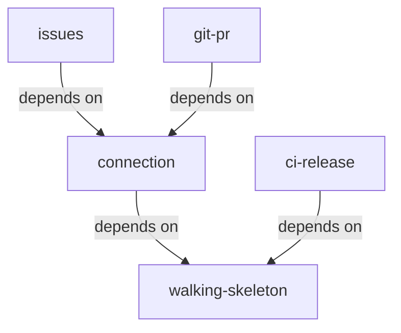

# Unit Dependencies — Kandev Plugin for Nulab Backlog

Inputs: `components` and `decisions` (Domain Design), `requirements`, `stories`, `unit-of-work.md`.

This document only describes the dependency structure. The build order and the critical path are decided by the Delivery Planning step.

## Dependency Graph

```yaml
units:
  - name: walking-skeleton
    kind: service
    depends_on: []
  - name: connection
    kind: service
    depends_on: [walking-skeleton]
  - name: issues
    kind: service
    depends_on: [connection]
  - name: git-pr
    kind: service
    depends_on: [connection]
  - name: ci-release
    kind: packaging
    depends_on: [walking-skeleton]
```



<!-- Text fallback: connection depends on walking-skeleton. issues and git-pr both depend on connection. ci-release depends on walking-skeleton. The graph has no cycle. -->

## Integration Points

| From | To | How they integrate |
|----|-----|---------------|
| connection | walking-skeleton | Extends the Connection component, BacklogGateway and the settings page that the thin slice built |
| issues | connection | Reads the connection and the selected project; receives the ConnectionChanged event (ADR-005); calls Backlog through BacklogGateway (ADR-002) |
| git-pr | connection | Same as issues, plus Git credentials; receives ConnectionChanged |
| ci-release | walking-skeleton | Uses the `build`, `package`, `verify-package` targets in the Makefile that the thin slice created |

No unit writes to another unit's data. Issue links belong to `issues`; PR links, watches and queries belong to `git-pr` (ADR-004).

## Parallel Work Opportunities

You allowed independent units to be built in parallel [Q3].

- After `walking-skeleton`: `connection` and `ci-release` can be built in parallel.
- After `connection`: `issues` and `git-pr` can be built in parallel. `ci-release` can also run in parallel with both if it is not done yet.

The graph allows several valid orders. The Delivery Planning step picks the order by economic value.

## Thin Slice

`walking-skeleton` is the first unit in every valid order. It depends on no unit, so it can run before all other units. It contains the full integration chain: the backend, API key connection, one real Backlog call, a minimal settings screen, packaging, package verification and install on self-hosted Kandev (`team-practices`).

## Sources

- [desc] Initial description: plugin Kandev cho Nulab Backlog.
- [scope] Workflow-selected scope: `feature`.
- [Q3]: the answer in `units-generation-questions.md`.
- ADR-002, ADR-004, ADR-005 in `decisions.md`; `components.md`; `requirements.md`; `stories.md`.

## Assumptions & Open Questions

None.
