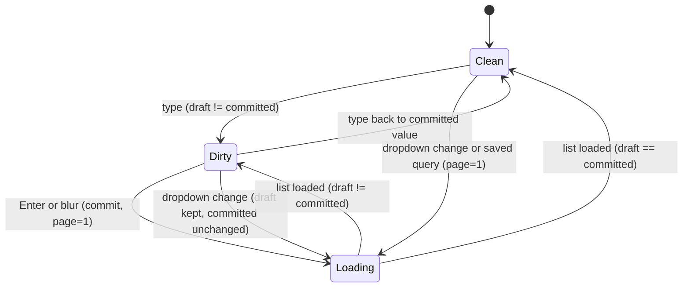
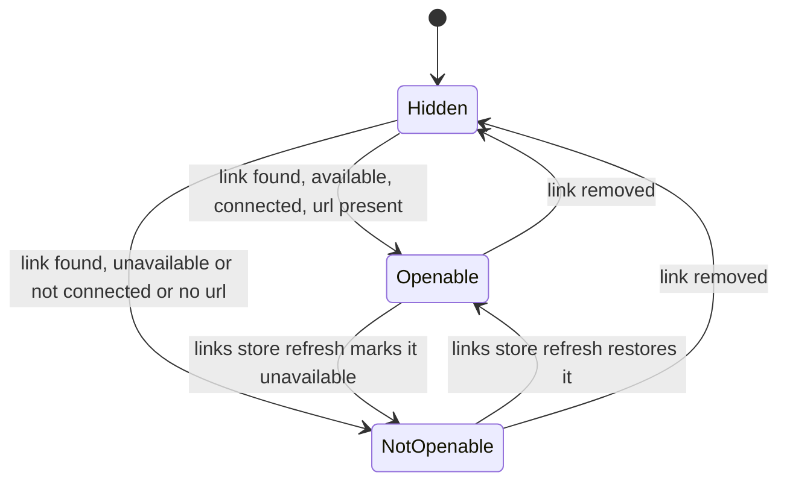
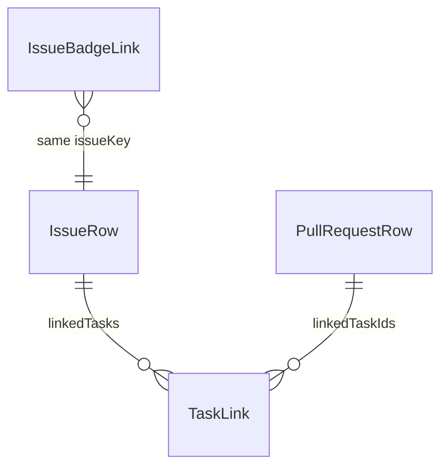

# Functional Specification — 261007-backlog-panel-retouch

Source of truth for workflows and state transitions. Data shape: [entities.md](entities.md). Decision logic: [rules.md](rules.md). Upstream: `inception/requirements-analysis/requirements.md` (FR1–FR5, NFR1–NFR5). Refactor scope: no units or domain design; the existing code structure in the code knowledge base is the de-facto domain design. Reference: Kandev v0.96.0 GitHub list (`apps/web/components/github/my-github/issue-list.tsx`, `apps/web/components/integrations/integration-list-toolbar.tsx`).

## Design Decisions

| # | Decision | Alternatives rejected | Why |
|---|---|---|---|
| D1 | Issue list uses host `IntegrationListToolbar` (BR4.1) | Own lookalike toolbar for issues | User chose "copy GitHub exactly" (requirements Q4 = A); host styling follows Kandev's theme (NFR1) |
| D2 | PR list keeps a plugin toolbar rebuilt to the same layout, without a query box (BR5.1) | Host toolbar with client-side title filter | Backlog's PR API has no keyword search; a box that filters only the loaded page would mislead (Q1 = A) |
| D3 | Filters use host `IntegrationRepositoryFilter` (BR4.4, BR5.2) | Host `Select` with labels (today) | It is the exact GitHub filter control (searchable, "All" choice, compact trigger) and is exported to plugins at v0.96.0 |
| D4 | PR status = one popover dropdown with checkboxes (BR5.3) | Single-choice dropdown | Keeps today's multi-status filtering (Q2 = A) |
| D5 | Linked tasks use host `TaskRowIndicator` (BR1.1) | Plugin anchors showing title | Same component GitHub uses; the host resolves titles and navigation |
| D6 | Kanban badge becomes an external link; detail moves to the tooltip (BR2.1–BR2.3) | Keep toggle, add separate open icon | User chose "click opens the issue" (requirements Q7 = A); a second control would crowd the card |
| D7 | No backend change (BR6.2) | Send task title from Go | Host resolves the title; fallback = task key/id is enough (R-02: PRs fall back to the task id) |

## Workflows

### W1 — Open a linked task from the issue list (FR1, BR1.1–BR1.5)

1. The issue list loads `issues.list` (unchanged) and renders one `ChangeRequestRow` per issue.
2. For each row, the UI maps `linkedTasks` to `{ id: taskId, taskId, fallbackTitle: taskKey ?? taskId }`.
3. If the list is empty, the task slot renders nothing (no `emptyLabel`).
4. If there is one task, the host shows a single task button (task title or fallback, checklist icon, tooltip with the workflow step).
5. If there are two or more, the host shows "Tasks (n)"; opening it lists each task.
6. The user clicks the button or a menu item; the host sets the active task and routes to the task page.

Unhappy path: the task was deleted or is not in the host store yet → the fallback title is shown; clicking still routes to the task page, where the host shows its own not-found state.

### W2 — Open a linked task from the PR list (FR5.1)

Same as W1, with `linkedTaskIds` mapped to `{ id, taskId: id, fallbackTitle: id }` (PRs carry no task key). Test id prefix differs (see [frontend-components.md](frontend-components.md)).

### W3 — Open the Backlog issue from a Kanban card (FR2, BR2.1–BR2.3)

1. The card renders; the badge looks up its link in the shared links store (unchanged load).
2. If no link exists, nothing renders.
3. The badge text is the existing `badgeText` (key · status, or the unavailable / not-connected variant). Its tooltip (`title`) is the existing `badgeDetail`.
4. If the link is openable (available, connected, has a URL), the badge is an anchor: `href = url`, `target="_blank"`, `rel="noopener noreferrer"`.
5. The user clicks or presses Enter; the browser opens the issue in a new tab; the click handler stops propagation so the card does not open.
6. If the link is not openable, the badge is plain text; a click only stops propagation.

### W4 — Search issues with the query box (FR4.2, BR4.2–BR4.3)

1. The user types; only `draftQuery` changes; a "Press Enter" hint appears inside the box (host behaviour) while draft ≠ committed.
2. The user presses Enter, or leaves the box while draft ≠ committed.
3. `committedQuery = trim(draftQuery)`. If it equals the previous committed value, nothing reloads.
4. Otherwise `page = 1` and `issues.list` reloads with `keyword = committedQuery`.
5. A blank commit clears the keyword and reloads the unfiltered list.

### W5 — Filter issues with dropdowns (FR4.3–FR4.4, BR4.4–BR4.5)

1. The toolbar's filter slot shows three searchable dropdowns: Project ("All projects" + projects), Status ("All statuses", "Not closed", + statuses), Assignee ("All assignees", "Me", + users). No visible field labels; each has its `ariaLabel`.
2. The user picks a value; the filter updates, `page = 1`, and the list reloads at once.
3. Status values map as today: All → `[]`, Not closed → open status ids, a status → `[id]`.

### W6 — Saved and default queries (FR4.5, BR4.6–BR4.7, BR5.4)

1. Selecting a saved or default query (scope bar / sidebar, unchanged) sets projectKey, status, assignee, and `draftQuery = committedQuery = keyword`, `page = 1`; one reload.
2. "Save query" (last item in the filter slot) saves the dropdown values and the committed query.

### W7 — Filter PRs (FR5.2, BR5.1–BR5.3)

1. The PR toolbar shows title + count, then Repository, Status, Assignee, Creator dropdowns and Save query, then last-updated and refresh at the right.
2. Until a repository is picked, the list shows the existing "choose a repository" empty state and refresh / Save query are disabled.
3. Status: the trigger reads "Status (n)"; its popover lists Open, Closed, Merged checkboxes. Toggling reloads from page 1. Clearing the last picked status is refused (the checkbox stays checked).
4. Assignee / Creator: "Anyone" (All) or "Me".

### W8 — Phone width (FR4.6, BR4.8)

Below the `md` breakpoint both toolbars stack: title row; each filter at full width; the query box (issues only) at full width; a row with result count, last-updated and refresh. No "Filters (n)" toggle. No horizontal page scroll at 360 px width.

## State Transitions

### Issue query state (IssueListQuery)

Text fallback: Clean means the draft equals the committed query. Typing makes it Dirty (no reload). Enter or blur commits and loads from page 1. A dropdown change or a saved query loads at once; a dropdown change keeps any uncommitted draft as draft.

### Kanban badge

Text fallback: the badge is hidden without a link; it is a link only when the issue can be opened, and switches between the two states as the shared links store refreshes.

## Entity-Relationship View (derived from entities.md)

Text fallback: an issue row and a PR row each have zero or more task links; a Kanban badge link refers to one issue by key.

## Rules Summary (derived from rules.md)

Linked tasks: host `TaskRowIndicator`, fallback key/id, menu for 2+, click opens task, nothing when empty (BR1.1–BR1.5). Kanban badge: key · status, detail in tooltip, link to the issue in a new tab only when openable (BR2.1–BR2.3). Issue title link unchanged (BR3.1). Issue toolbar: host `IntegrationListToolbar`, Enter/blur commit, empty commit clears, searchable dropdown filters, immediate reload on filter change, saved queries set everything at once (BR4.1–BR4.8). PR toolbar: lookalike without query box, searchable dropdowns, multi-select status dropdown (BR5.1–BR5.4). No plugin CSS, no backend change (BR6.1–BR6.2).

## Verification Notes

- jsdom tests use harness fakes for `TaskRowIndicator`, `IntegrationListToolbar` and `Popover*`, mirroring host props and test ids (see [frontend-components.md](frontend-components.md)).
- Rendering inside a real plugin route is proven by the packaged-host contract test on Kandev v0.96.0 and the manual check (NFR2).
