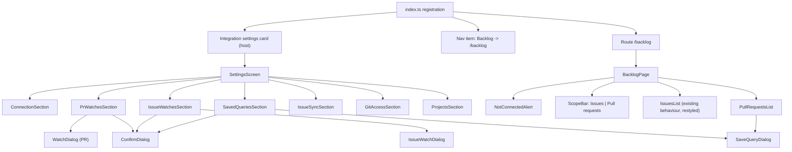

# Frontend Components — 261007-uiux-github-style

All components are built from `host.ui` (Kandev SDK v0.96.0); React and icons are never bundled. Behaviour: [functional-spec.md](functional-spec.md); rules: [rules.md](rules.md).

## Component Hierarchy

Text fallback: registration adds the settings card, one nav item and the `/backlog` route. SettingsScreen stacks seven sections; the PR watches, issue watches and saved queries sections open their dialogs and a shared confirm dialog. BacklogPage shows an alert when not connected, otherwise a scope bar switching between the existing issue list and the new PR list; the PR list opens the save-query dialog.

## Settings Screen

Layout follows GitHub's settings: the host already wraps the screen in an unframed section with the card's icon, title and enable switch, so the screen stacks framed `SettingsSection` blocks with `space-y-8`.

| Section | Content | Header actions | Visible to |
|---|---|---|---|
| ConnectionSection | Status line; connect form with `Select` sign-in method (BR1.4), `Input` space address and API key, `Button` Connect; connected view with Test, Change space, Disconnect | — | admins see forms; members see status (BR1.2) |
| PrWatchesSection | `Card` > `CardContent p-0` > `Table`: name, repository, filters, workflow, state, created/pending, last run; row actions in a `DropdownMenu` (Edit, Run now, Pause/Resume, Delete) | `Button size="sm"` Add watch | all members while connected |
| IssueWatchesSection | Same table shape: name, project, statuses, workflow, interval, state, created/pending, last run, last error badge | `Button size="sm"` Add watch | all members while connected |
| SavedQueriesSection | `Table`: name, repository, filters; row actions Edit, Delete | none (created from the PR list, BR2.5) | all members while connected |
| IssueSyncSection | Existing poll interval control restyled: `Input type=number` + `Button variant="outline"` Save | — | admins edit, members read |
| GitAccessSection | Existing Git credential form restyled | — | admins |
| ProjectsSection | Existing project picker with `Checkbox` rows instead of raw inputs | — | admins |

The "Review watches" restore notice becomes a `Button variant="link"` that scrolls to PrWatchesSection (BR1.5).

### IssueWatchDialog

| Field | Control | Validation (BR3.1) |
|---|---|---|
| Name | `Input` | 1–100 characters |
| Project | `Select` of selected projects | required |
| Statuses | `Checkbox` list of the project's statuses (from `issues.filters`, reloaded when project changes) | at least one, at most 20 |
| Assignee | `Select` anyone / me | required |
| Creator | `Select` anyone / me | required |
| Workflow, step | existing workflow picker restyled with `Select` | workflow required |
| Interval (minutes) | `Input type=number`, default 5 | whole number 1–1440 |

Footer: `Button variant="outline"` Cancel, `Button` Save (disabled while saving). Field errors from the service map to the named field.

### Shared props and state

- Each section owns its list state (`items`, `loading`, `error`) and reloads after a successful save/delete/run/pause/resume.
- Dialogs take `initial` (undefined for add), `onSaved`, `onClose`; they never call navigation.
- ConfirmDialog takes `title`, `description`, `confirmLabel`, `destructive: true`, `onConfirm`; built on `Dialog` (no `AlertDialog` in the SDK).

## Backlog Page (`/backlog`)

- **NotConnectedAlert**: `Alert` with title, description and `Button variant="link"` to `settingsHref()` (BR2.3).
- **ScopeBar**: host `Tabs` / `TabsList` / `TabsTrigger` with Issues and Pull requests, styled like GitHub's kind segment (small, bordered); scope kept in the URL (`?scope=prs`, BR2.2). `IntegrationScopeBar` is not used: in SDK v0.96.0 it always renders its saved-preset menu with delete, and Q3 keeps deletion in Settings (BR2.5).
- **IssuesList**: today's behaviour (FR2.4) inside `IntegrationListToolbar` (title, count, search, last fetched, refresh as `Button variant="ghost" size="icon"`), filters in the toolbar's `filter` slot with `Select`, `Table` rows, `Pagination`.
- **PullRequestsList**:
  - Toolbar: a plugin `PrToolbar` composed of host primitives laid out like `IntegrationListToolbar` (title and count on the left; filters; last fetched and refresh `Button variant="ghost" size="icon"` on the right). `IntegrationListToolbar` is not used here because in SDK v0.96.0 it always renders a free-text search box, and Backlog's PR API has no search. The filter area holds `IntegrationRepositoryFilter` (repositories from `git.repositories.list`), a `Select` "Saved query" listing saved queries (BR2.4), `Select` status (multi via `Checkbox` popover), `Select` assignee and creator (anyone / me), and `Button size="sm" variant="outline"` Save query (opens SaveQueryDialog with current filters).
  - Rows: `ChangeRequestList` / `ChangeRequestRow` showing number, title, `IntegrationChangeRequestStatus`, author, assignee, relative updated time (`host.utils.formatRelativeTime`), linked task chip; row opens the PR URL in a new tab.
  - Footer: `Pagination` with Previous/Next from `page`, `hasNext`, and "Showing a–b of total".
- Empty states use `Empty*` (BR7.1); errors use `Alert` with a retry `Button variant="outline"` (BR7.2).

## Button and Input Style (BR5.2)

| Use | Variant | Size |
|---|---|---|
| Primary submit (Connect, Save) | default | default |
| Section header action (Add watch) | default | `sm` |
| Secondary (Cancel, Test, Save query, Retry) | `outline` | default or `sm` in toolbars |
| Icon-only (refresh, row menu) | `ghost` | `icon` / `icon-sm`, with `aria-label` |
| Destructive (Disconnect, Delete) | `destructive` | default |
| Inline navigation (settings link, restore notice) | `link` | default |

Every `Button` gets `className="cursor-pointer"` like the GitHub integration. Text inputs use `host.ui.Input` with a `Label`.

## Plugin Icon (BR6.1)

`PLUGIN_ICON` becomes an original outline drawing: a 24×24 viewBox, `fill="none"`, `stroke="currentColor"`, `stroke-width="2"`, round caps and joins, showing a card with two text lines and a check mark (a ticket/board motif), sized by `className` (`h-4 w-4` nav, `h-5 w-5` settings, topbar default). It shares no paths or shapes with the Nulab mark. `docs/brand/backlog-logo.md` is updated to say the plugin no longer ships the Nulab mark.

## Test Harness Impact

The fake host in `ui/src/testing/harness.ts` must stub every newly used component (`SettingsSection`, `Card*`, `Table*`, `Dialog*`, `DropdownMenu*`, `Select*`, `Checkbox`, `Alert*`, `Empty*`, `Pagination*`, `Tabs*`, `IntegrationListToolbar`, `IntegrationRepositoryFilter`, `ChangeRequestList`, `ChangeRequestRow`, `IntegrationChangeRequestStatus`) as plain DOM with test ids; `variant`/`size` pass through as data attributes so BR5.2 is testable.
