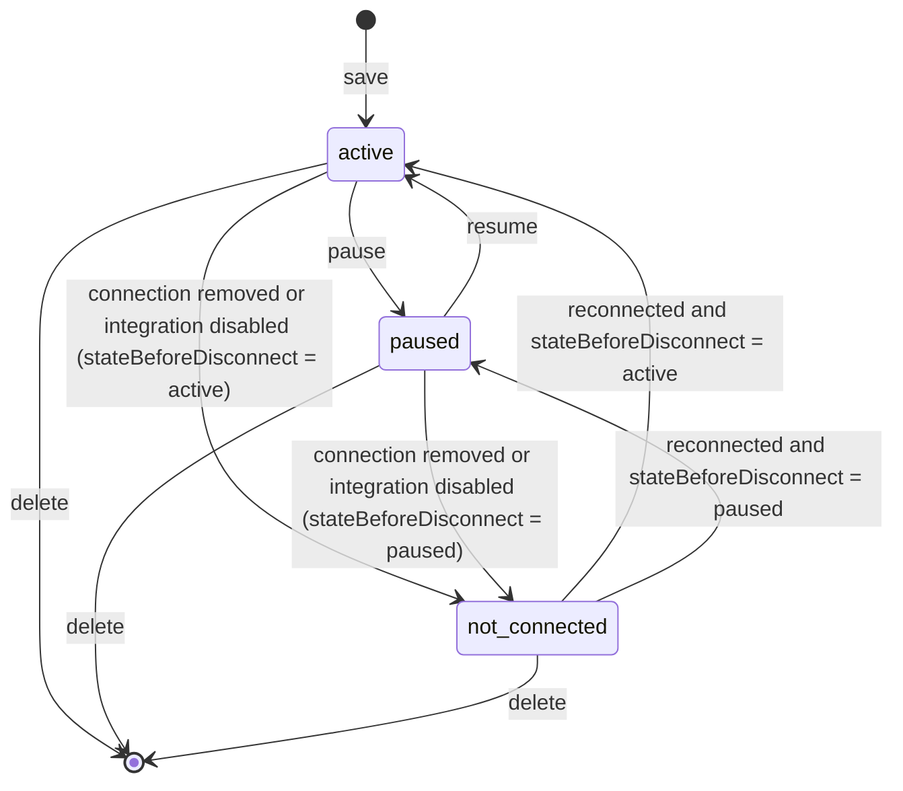
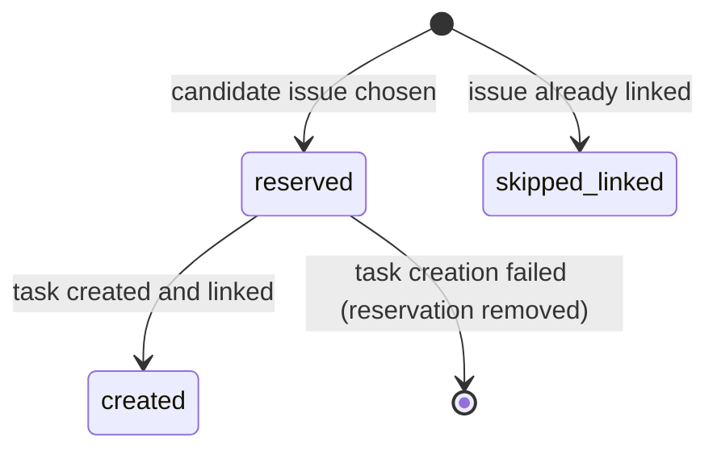
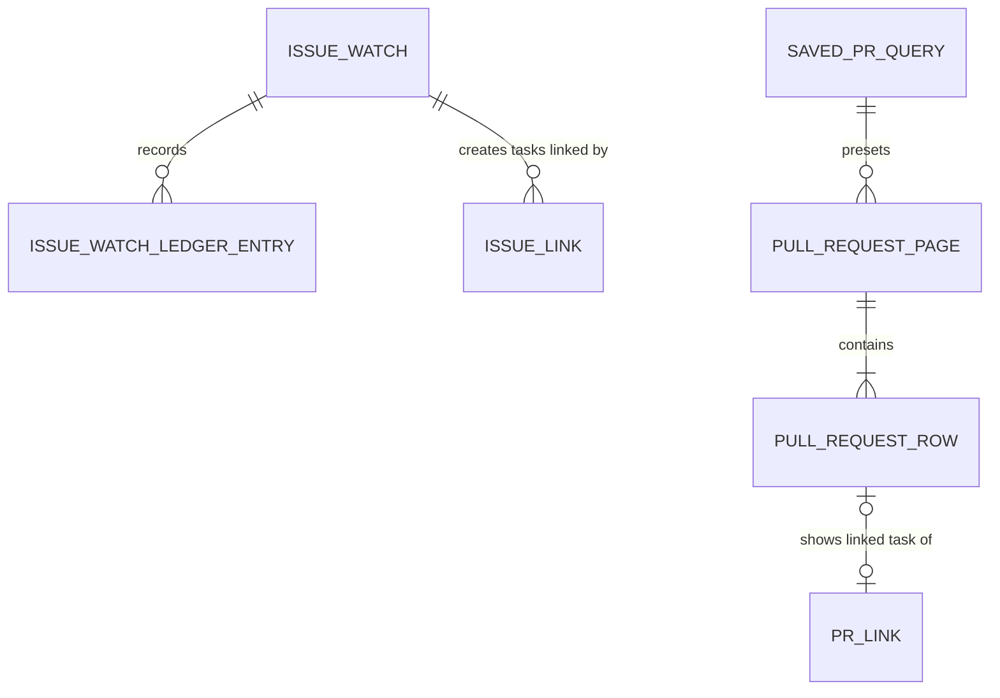

# Functional Specification — 261007-uiux-github-style

Source of truth for workflows and state machines. Data shapes: [entities.md](entities.md). Decision logic: [rules.md](rules.md). Screens: [frontend-components.md](frontend-components.md).

This intent has no Unit DAG (refactor scope), so the whole change is one design: the existing code structure from the code knowledge base is the de-facto domain design (Connection, Issues, Git, BacklogGateway, KandevAdapter, UI modules).

## Scope

| Requirement | Covered by |
|---|---|
| FR1 Watch settings in Settings | WF1, WF2, WF6; BR1.x |
| FR2 One Integrations entry with Issue / PR lists | WF3, WF4; BR2.x |
| FR3 Issue watch | WF5, SM1; BR3.x |
| FR4 PR list action | WF4; BR4.x |
| FR5 Host controls, GitHub style | frontend-components.md; BR5.x |
| FR6 Outline icon | frontend-components.md; BR6.1 |
| NFR1–NFR6 | Section "Non-functional handling" |

## Plugin Actions

New actions (all `authenticated`, workspace-scoped, keys match `^[a-z0-9][a-z0-9._-]*$`):

| Action | Input | Output | Rules |
|---|---|---|---|
| `issues.watches.list` | — | IssueWatch[] (no ledger) | BR1.3 |
| `issues.watches.save` | name, projectKey, statusIds, assignee, creator, workflowId, workflowStepId?, intervalMinutes?, id? | IssueWatch | BR3.1, BR3.2, BR3.8 |
| `issues.watches.delete` | id | — | BR3.10 |
| `issues.watches.run` | id | queued | BR3.9 |
| `issues.watches.pause` / `issues.watches.resume` | id | IssueWatch | BR3.9 |
| `git.prs.list` | projectKey, repoName, statuses, assignee, creator, page | PullRequestPage | BR4.1, BR4.2 |

Changed: `git.queries.save` accepts an optional `creator` (entities.md SavedPRQuery). Unchanged: every other action key and access level, and the manifest capabilities (no new host capability; workflow existence is handled per BR3.1 and BR3.14).

Gateway additions needed by these actions are listed in [entities.md](entities.md) ("Gateway Query Changes"): issue query creator, created-since and sort options, and a PR count call.

## Decisions Taken from the Q&A that Refine the Requirements

| Requirement | Refinement | Source |
|---|---|---|
| FR1.1 (six sections) | A seventh section, Saved PR queries, is added | Q3 = A |
| FR3.2 and its acceptance ("each open issue gets a task") | At most one task per run; every matching issue still gets exactly one task over successive runs | Q1 |
| FR3.6 (reject a workflow that does not exist) | The dialog offers only existing workflows; a later-removed workflow is reported at run time | BR3.1, BR3.14 |
| Requirements assumption "no status filter" | A watch always names at least one status | BR3.1 |
| FR2.3 (search where supported) | Pull requests have no free-text search | Backlog PR API |

## Workflows

### WF1 — Open Settings > Integrations > Backlog

1. The host renders the plugin's settings card (icon, title, enable switch) and mounts the settings screen.
2. The screen loads the connection (`connection.get`).
3. If not connected: show the Connection section only (BR1.1); admins see the connect form with the sign-in method dropdown (BR1.4).
4. If connected: load PR watches, issue watches and saved queries in parallel (`git.watches.list`, `issues.watches.list`, `git.queries.list`) and show the seven sections (BR1.1).
5. If an admin-only call returns forbidden, switch to the member view: hide admin-only controls, keep the watch and query sections (BR1.2).
6. A section whose load fails shows its own inline error with retry (BR7.2); the other sections still render.

### WF2 — Add or edit an issue watch

1. Member clicks "Add watch" in the Issue watches section header (or "Edit" on a row).
2. A dialog opens with: name, project (selected projects), statuses (statuses of the chosen project, loaded via `issues.filters`), assignee (anyone/me), creator (anyone/me), workflow and step, interval in minutes (default 5).
3. On save the UI calls `issues.watches.save`.
4. The service validates (BR3.1), resolves `me` to the connected user's id, applies the default interval (BR3.2), clears the cursor when a filter changed (BR3.8), and stores the watch.
5. On a validation error the dialog stays open and marks the named field; on success the dialog closes and the table refreshes.

PR watches use the same dialog pattern with their existing fields and `git.watches.save`; their loop and cap do not change.

### WF3 — Open /backlog (Issues scope)

1. Member clicks the single Backlog entry under Home > Integrations (BR2.1).
2. If not connected or disabled: show the alert with the settings link (BR2.3). Stop.
3. Show the scope bar with Issues (default) and Pull requests (BR2.2).
4. Issues scope keeps today's behaviour: toolbar with title, total, search, refresh; filters project/status/assignee; table of 20 rows; pagination; create task; link to task (FR2.4).
5. Empty and error states follow BR7.1 and BR7.2.

### WF4 — Browse pull requests

1. Member switches to Pull requests.
2. The scope bar shows saved queries as presets (`git.queries.list`) and a "Save query" action (BR2.5).
3. Member picks a repository (repository filter fed by `git.repositories.list`) or a preset (BR2.4). Without a repository the list shows "Choose a repository" (BR7.1).
4. The UI calls `git.prs.list` with the repository, filters and page.
5. The service validates, asks the gateway for the PR count and one page of 20 (offset `(page-1)*20`), joins stored PR links (BR4.1, BR4.2), and returns the page.
6. The list shows rows with number, title, status, author, assignee, updated time and the linked task; pagination uses `hasNext` and `total`.
7. "Save query" opens the save-query dialog with the current repository and filters and calls `git.queries.save`.

### WF5 — Issue watcher run

1. The issue watcher ticks every minute. For each workspace with issue watches, it loads the connection; disabled or disconnected workspaces mark their watches `not_connected` and are skipped (BR3.9).
2. For each active watch that is due (BR3.3), or queued by "run now":
   1. Resolve any reservation without a task (BR3.7). If the ledger is full, set `ledger_full` and stop (BR3.13).
   2. Query the project's issues matching statusIds, assignee and creator, sorted by creation ascending, with `createdSince` = the cursor's date, starting at offset `max(0, dayOffset - 5)`, pages of 100, at most 5 pages (BR3.5, BR3.12).
   3. For each issue in order whose (created, id) is after the cursor: if it has an active link, record `skipped_linked` and move the cursor (BR3.6); if the ledger already has it, move the cursor; otherwise reserve, create the Kandev task in the watch's workflow/step with the same title/description/priority as "create task from issue", store the issue link, mark the entry created, move the cursor, and stop (BR3.4, BR3.7). Moving the cursor records the issue's created time, id and its position in the day's list.
   4. Set `pendingCount` to the matching issues read after the cursor, `lastRunAt` to now, clear `lastError`.
3. On 401 or 429 set `lastError` and stop this watch's run without creating a task (BR3.11); a removed workflow sets `workflow_missing` (BR3.14); other watches continue.
4. Each cycle logs one line with counts (watches, created, skipped, errors) and no secrets (NFR2).

### WF6 — Manage saved PR queries in Settings

1. The Saved PR queries section lists queries in a table: name, repository, filters.
2. "Edit" opens the save-query dialog prefilled; save calls `git.queries.save` with the id.
3. "Delete" asks for confirmation in a dialog and calls `git.queries.delete`.
4. New queries are created only from the PR list (BR2.5); an empty table explains that (BR7.1).

## State Machines

### SM1 — IssueWatch.state

Text fallback: a new watch is active. Pause and resume toggle active and paused. Losing the connection or disabling the integration moves either state to not_connected; reconnecting restores the previous state. A watch can be deleted from any state.

### SM2 — IssueWatchLedgerEntry.outcome

Text fallback: an entry is reserved before task creation and becomes created when the task and link exist; a failed creation removes the reservation; an issue that already had a link is recorded as skipped_linked.

## Entity Relationships (derived from entities.md)

Text fallback: an issue watch owns ledger entries and creates tasks that use the existing issue link; a saved PR query presets the PR list; a PR page contains rows; a row may show the linked task of an existing PR link.

## Rules Summary (derived from rules.md)

- Settings: seven sections in fixed order; watch and query sections for every member; connection admin-only; sign-in dropdown (BR1.1–BR1.5).
- Integrations: one nav item; Issues / Pull requests scopes; alert when not connected; presets; save from list (BR2.1–BR2.5).
- Issue watch: validation, default 5 minutes, due by interval, one task per run, oldest first including existing issues, no duplicates, reserve-create-mark, filter change resets cursor, paused does not run, delete keeps tasks, 401/429 handling, bounded paging near the cursor, unpruned ledger, removed workflow (BR3.1–BR3.14).
- PR list: 20 per page with total and linked task (BR4.1–BR4.2).
- UI: host controls, GitHub button style, outline icon, empty and error states (BR5.1–BR7.2).

## Non-functional Handling

- **NFR1**: every rule above gets a failing test first (Go table tests with the `httptest` fake Backlog; Vitest for screens); coverage floor 80% stays.
- **NFR2**: watcher log lines and action errors go through `internal/redact`; the existing leak test covers the new actions.
- **NFR3**: the issue watcher uses the gateway's background call class and per-group limiter; 429 honours `Retry-After` (BR3.11).
- **NFR4**: icon-only buttons have names; tables have headers; axe checks on changed screens.
- **NFR5**: only components present in SDK v0.96.0's `host.ui` are used; the packaged-host contract test runs the new actions.
- **NFR6**: the issue watcher waits (bounded) for the host before its first tick, like the PR watcher.

## Assumptions and Limits

- Issues that enter a matching status after the cursor has passed them are not picked up; the watch follows creation order (BR3.5). A filter change resets the cursor (BR3.8).
- The PR list has no keyword search: Backlog's PR API has none.
- Removing `/backlog/watches` and `/backlog/dashboard` breaks old bookmarks (accepted, Q5 = B).
